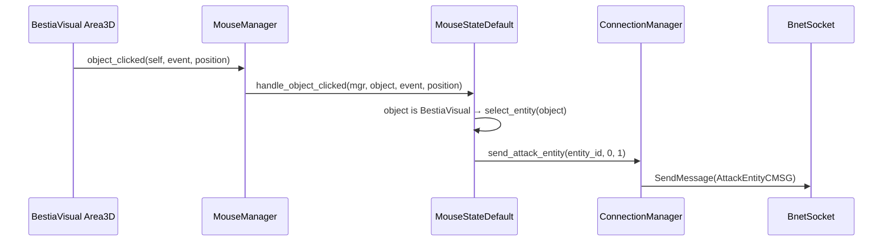

Objects in the world don't decide what a click means themselves — they just report input events
to `MouseManager`, which delegates to whichever `MouseState` is currently active. This keeps
"what does clicking the ground do right now" in one place instead of scattered across every
clickable node.

# MouseManager

`src/Manager/mouse_manager.gd` is an autoload holding `current_state: MouseState`. Clickable things report discrete events —
`object_clicked`, `on_object_hover`, `on_ground_input_event` — and any code that needs "what's
under the mouse right now" can call `get_floor_hit_at_mouse()` (a raycast filtered to the
`"floor"` group). It also owns entity selection (`select_entity`, `entity_selected` signal) and
swaps the OS cursor for the active targeting mode.

# MouseState subclasses

Defined under `src/Manager/MouseState/`, an abstract base (`mouse_state.gd`) defines `enter`/`exit`/`process_state`/`handle_object_clicked`/
`handle_ground_input_event`/`handle_right_click`/`handle_cancel`. Three concrete states exist:

- **`MouseStateDefault`** — the everyday state: click the ground to move, click a `BestiaVisual`
  to attack it, click an `ItemVisual` to loot it.
- **`MouseStateSkillTargeting`** — entered when the player picks a skill that needs a target.
  Branches on the skill's `target_type`: `GROUND`/`AOE_GROUND` shows a floor-following indicator
  sized to the skill's `aoe_radius`; `ENEMY`/`FRIENDLY` snaps to the closest matching `Entity`
  within `SettingsManager.skill_target_snap_distance` (holding Shift inverts the friend/enemy
  filter). Confirming calls `ConnectionManager.activate_skill(skill_id, level, position,
  [entity_id])`.
- **`MouseStateItemTargeting`** — the equivalent flow for a scripted item (`ItemUse.
  on_targeting_click`), entered from `ItemResource.use_item` when the item needs a target instead
  of firing immediately.

# Worked example: click to attack



1. **Input**: the target's `Area3D` picks up the click via Godot physics picking
   (`bestia_visual.gd`):
   ```gdscript
   func _on_area_3d_input_event(_camera, event, event_position, _normal, _shape_idx) -> void:
       MouseManager.object_clicked(self, event, event_position)
   ```
2. **Dispatch**: `MouseManager.object_clicked()` forwards to the active state's
   `handle_object_clicked`.
3. **Default-state handling** (`mouse_state_default.gd`): confirms the click was the
   `normal_action` input action, that the target isn't a plain `Interactable`, and if it's a
   `BestiaVisual`, selects it and fires the attack:
   ```gdscript
   if object is BestiaVisual:
       mgr.select_entity(object)
       ConnectionManager.send_attack_entity(object.get_bestia_entity_id(), 0, 1)
   ```
4. **Send**: `ConnectionManager.send_attack_entity()` builds an `AttackEntityCMSG` and sends it —
   see [Networking](/docs/client/networking) for how that reaches `zone-server`.

Skill-based attacks follow the same shape through `MouseStateSkillTargeting` instead of the
default state, ending in `ConnectionManager.activate_skill()` /`ActivateSkillCMSG` rather than
`send_attack_entity()`.

# MouseMarker

`src/Game/MouseMarker/mouse_marker.gd` is the always-visible ground-tile cursor, snapped to the 1m tile under the mouse. Only shown in the
default mouse state — targeting states replace it with their own indicator
(`AOECastIndicator`/`EntitySnapIndicator`, see [World & Terrain](/docs/client/world-terrain) for
how the underlying floor raycast works and [UI Overview](/docs/client/ui-overview) for VFX like
the AOE indicator).

# Camera

A third-person orbit camera under `src/Game/SpringArmCamera/`, split into two scripts:

- `camera_spring_arm.gd` rotates a `Node3D` (yaw/pitch, clamped) while the right mouse button is
  held and dragged past a small pixel threshold. A clean press-and-release *without* dragging past
  that threshold instead fires `MouseManager.right_clicked` (context menu) and cancels any active
  skill/item targeting rather than rotating the camera. Scroll wheel adjusts `SpringArm3D.
  spring_length` for zoom.
- `camera_follow.gd`, on the actual `Camera3D`, lerps its position toward the spring arm's
  position every frame — decoupling render-smoothing from the arm's own collision-driven length
  changes (the spring arm itself can snap shorter instantly when it hits geometry; the camera node
  smooths that out visually).
