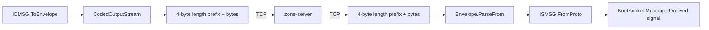
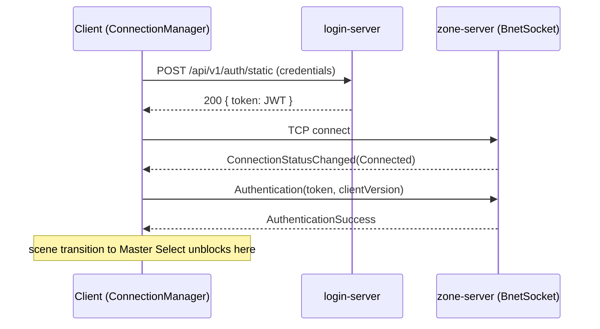

The client speaks to two backend services. Both use the same protobuf message contracts defined
in `bnet-messages` — see the [server architecture docs](/docs/server/architecture) for the
authoritative wire-format description. This page covers the client side of that same protocol.

| Service        | Protocol                                     | Purpose                                                                |
| -------------- | -------------------------------------------- | ---------------------------------------------------------------------- |
| `login-server` | HTTPS REST                                   | Exchanges credentials for a signed JWT. Contacted once per session.    |
| `zone-server`  | Raw TCP, length-prefixed protobuf `Envelope` | The actual game: entities, movement, combat, inventory, chat, terrain. |

# The Wire Format

Every message, in both directions, is one `Envelope` protobuf message (a big `oneof` covering
every leaf message type) wrapped in a 4-byte big-endian length prefix — the same framing
`zone-server`'s Netty pipeline uses. Naming convention: client → server messages are `*CMSG`,
server → client messages are `*SMSG`.



## BnetSocket

`BnetSocket` (`src/Bnet/BnetSocket.cs`) is a Godot `Node` (`[GlobalClass]`) that owns the actual TCP connection. Connecting
spins up a background thread (`SocketThreadWorker`) that reads raw bytes into a buffer, pulls out
complete length-prefixed frames (capped at `MaxFrameLength = 1_048_576`, matching the server's
`SocketServer.MAX_FRAME_LENGTH`), parses each as an `Envelope`, and pushes it onto a
`ConcurrentQueue<Envelope>`.

Godot's `_Process(double delta)` drains that queue **on the main thread** once per frame and
dispatches by checking each `oneof` field in turn:

```csharp
else if (envelope.DamageEntity != null)
{
  var msg = Entity.DamageEntitySMSG.FromProto(envelope.DamageEntity);
  EmitSignal(SignalName.MessageReceived, msg);
}
else if (envelope.ChunkData != null)
{
  // Converted but not decoded here — decoding a login's worth of chunks inline would
  // spike this one frame. ChunkStreamManager decodes a budgeted amount per frame instead.
  var msg = Map.ChunkDataSMSG.FromProto(envelope.ChunkData);
  EmitSignal(SignalName.MessageReceived, msg);
}
else
{
  GD.PrintErr($"BnetSocket: Envelope message '{envelope.MessageCase}' was not handled!");
}
```

Every incoming message — regardless of type — is re-emitted through **one** Godot signal,
`MessageReceived(ISMSG message)`. There's no per-message routing at this layer; every downstream
listener (GDScript's `ConnectionManager`, the C# `ChunkStreamManager`) filters the same signal for
what it cares about. A second signal, `ConnectionStatusChanged(ConnectionStatus status)`, fires
whenever the TCP connection state changes (`Disconnected` / `Connecting` / `Connected`).

Sending is synchronous from the calling thread:

```csharp
public void SendMessage(ICMSG message)
{
  var envelope = message.ToEnvelope();
  SendEnvelope(envelope); // CodedOutputStream, then 4-byte length prefix, then bytes
}
```

## Message Wrappers

Generated protobuf classes live under `src/Bnet/Proto/` (regenerated from `.proto` files by
`bnet-messages/gen-protobuf.bat` — see the server docs' protobuf notes). They're never touched
directly outside this wrapper layer. Every hand-written wrapper implements exactly one of:

- **`ICMSG`** (outgoing) — implements `ToEnvelope()`.
- **`ISMSG`** (incoming) — implements a static `FromProto(...)`.

```csharp
// AttackEntityCMSG.cs — client → server
public override Envelope ToEnvelope()
{
  var attackEntityCmsg = new global::Bnet.AttackEntityCMSG
  {
    EntityId = EntityId, UsedAttackId = UsedAttackId, SkillLevel = SkillLevel
  };
  return new Envelope { AttackEntity = attackEntityCmsg };
}
```

```csharp
// DamageEntitySMSG.cs — server → client
public static DamageEntitySMSG FromProto(global::Bnet.DamageEntitySMSG proto)
{
  return new DamageEntitySMSG {
    EntityId = proto.EntityId, SourceEntityId = proto.SourceEntityId,
    AttackId = proto.AttackId, Damage = proto.Damage, Div = proto.Div,
    SkillLevel = proto.SkillLevel, Type = MapDamageTypeFromProto(proto.Type)
  };
}
```

Domain subfolders mirror the server's proto layout: `Entity/`, `Inventory/`, `Map/`, `Master/`,
`System/`, plus flat top-level files (`Authentication`, `Ping`/`Pong`, `OperationSuccess`/
`OperationError`).

## ConnectionManager

`ConnectionManager` is an autoload singleton (`src/Manager/connection_manager.gd`) and the single point of contact between GDScript
gameplay code and the C# networking layer. It holds `BnetSocket` as a child node and exposes a
large API of outbound senders (`move_to`, `send_attack_entity`, `use_item`, `equip_item`,
`activate_skill`, `send_chat`, ...), each building the matching C# `ICMSG` class and calling
`_socket.SendMessage(...)`.

Notably, it instantiates C# message classes from GDScript by loading the `.cs` file as a resource:

```gdscript
func send_attack_entity(entity_id: int, attack_id: int, skill_level: int) -> void:
    assert(is_ready_to_send())
    var msg = AttackEntityCMSG.new()
    msg.EntityId = entity_id
    msg.UsedAttackId = attack_id
    msg.SkillLevel = skill_level
    _socket.SendMessage(msg)
```

On the inbound side, `ConnectionManager` is the sole listener that turns `BnetSocket`'s single
`MessageReceived` signal into many domain-specific GDScript signals (`entity_received`,
`self_received`, `master_info_received`, `chat_received`, `operation_success`/`operation_error`,
...) by type-checking the message:

```gdscript
func _on_bnet_socket_message_received(message: Object) -> void:
    if message is AuthenticationSuccess:
        ...
    elif message is EntitySMSG:
        entity_received.emit(message)
    elif message is SelfSMSG:
        self_received.emit(message)
    ...
```

`Game/World/ChunkStreamManager.cs` (see [World & Terrain](/docs/client/world-terrain)) listens to
the same `MessageReceived` signal independently for `ChunkData`/`ChunkManifest`/`ChunkPatch`
messages — `ConnectionManager` explicitly ignores those to avoid double-handling.

## Login → JWT → socket auth handshake

Authentication is a two-phase handshake, both phases owned by `ConnectionManager`:



1. **REST login**: `login()` POSTs credentials to `SettingsManager.login_server_url +
"/api/v1/auth/static"` via a child `HTTPRequest` node. On success it stores the returned JWT
   and starts a **blocking** scene transition to Master Select (see
   [Scenes & Menus](/docs/client/scenes-and-menus)) while calling `_socket.ConnectToServer()`.
2. **Socket auth**: once `BnetSocket` reports `Connected`, `ConnectionManager` sends an
   `Authentication(token, clientVersion)` CMSG as the _first_ message on the socket:

   ```gdscript
   if status == 1: # Connected
       if _connection_state == ConnectionState.DISCONNECTED:
           _connection_state = ConnectionState.CONNECTED_NOT_AUTHED
           var auth_msg = Authentication.new(_login_token, SettingsManager.version)
           _socket.SendMessage(auth_msg)
   ```

   The connection state machine (`DISCONNECTED` → `CONNECTED_NOT_AUTHED` → `CONNECTED_AUTHED`)
   only reaches "ready to send" once `zone-server` replies `AuthenticationSuccess` — that's also
   the signal `SceneManager` waits for before it finishes swapping into Master Select.

zone-server independently re-validates the JWT's signature — see the server docs' login↔zone
handoff section. The client never re-derives trust locally; it just carries the token across.

## Disconnects

There's no automatic reconnect. Any drop routes to `Menu/ConnectionLost`, keyed by an error enum
(`LOGIN_OFFLINE`, `LOGIN_ERROR`, `ZONE_CONNECTION_LOST`):

```gdscript
if status == 0: # Disconnected
    _connection_state = ConnectionState.DISCONNECTED
    if _intentional_disconnect:
        _intentional_disconnect = false
        SceneManager.goto_scene("res://Menu/Main/Main.tscn")
    else:
        _goto_connection_lost(ConnectionError.ZONE_CONNECTION_LOST)
```

The `_intentional_disconnect` flag distinguishes a deliberate client-side logout from an
unexpected server-side drop — only the latter shows the ConnectionLost screen. Confirming that
screen sends the player back to the main menu, which re-runs the whole handshake on the next
"Play" press.

A `Ping`/`Pong` keepalive exists (sent on a timer while authenticated) but — per a TODO in the
source — isn't yet used to actively detect a stalled connection; liveness currently relies on the
TCP stream erroring or closing on its own.

## Adding a new message type

Message contracts are shared with the server. If you're adding a new `CMSG`/`SMSG`, follow the
end-to-end recipe in the server's architecture docs (proto → Kotlin → regenerate → C# wrapper);
the client-side steps are:

1. Add the C# wrapper under `src/Bnet/Message/<Domain>/`, implementing `ICMSG.ToEnvelope()` or a
   static `ISMSG.FromProto(...)`, following `AttackEntityCMSG.cs` / `DamageEntitySMSG.cs` above as
   templates.
2. For an incoming message, add an `else if (envelope.Xyz != null) { ... }` branch to
   `BnetSocket`'s dispatch chain — messages that reach the final `else` just print an unhandled-
   envelope warning instead of failing loudly.
3. For an outgoing message, add a thin `send_xyz(...)` wrapper method to
   `connection_manager.gd` that instantiates the C# class and calls `_socket.SendMessage(...)`.
   Incoming `EntitySMSG` subclasses need no extra branch — they're already caught generically by
   the `entity_received` signal.
4. Regenerate the C# protobuf classes with `bnet-messages/gen-protobuf.bat` and commit them
   alongside the `.proto` change.
