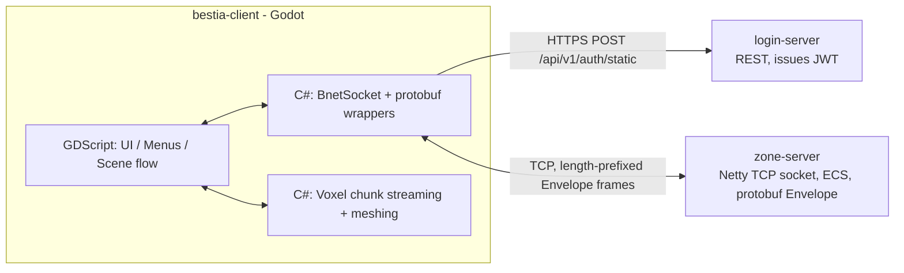

The client is a [Godot Engine](https://godotengine.org) (4.7, Forward+ renderer) project using
**both GDScript and C# (Mono)** in the same codebase, split cleanly by concern:

- **GDScript** owns UI, menus, scene/game-state orchestration, and most gameplay glue — anything
  that benefits from Godot's fast edit-reload cycle.
- **C#** owns the two performance- and correctness-critical layers: the network/protobuf stack
  and the voxel terrain engine.

Both sides interoperate natively through Godot's own scene tree, signals and `[GlobalClass]`
exports — there is no external interop shim. See [Networking](/docs/client/networking) for a
concrete example of a GDScript autoload driving a C# node.

The client talks to two independent backend services (see the
[server architecture docs](/docs/server/architecture) for their side of this):

`login-server` is only ever contacted once per session, to exchange credentials for a signed JWT.
`zone-server` is the actual game: entity state, movement, combat, inventory, chat and terrain all
flow over the same TCP socket as typed protobuf messages.

# Subsystems

| Page | Covers |
| --- | --- |
| [Networking](/docs/client/networking) | The `Envelope` wire format, `BnetSocket`, the CMSG/SMSG wrapper pattern, the login → JWT → socket-auth handshake, and disconnect handling |
| [Scenes & Menus](/docs/client/scenes-and-menus) | Autoload singletons, `SceneManager`'s scene-transition mechanism, and the full boot flow from the main menu to being in the game world |
| [Entity Sync](/docs/client/entity-sync) | How server entities become Godot nodes, client-side movement prediction, Master vs. Bestia, and the data-driven `Resource` + `*DB` pattern used across Items/Attacks/Bestia species |
| [World & Terrain](/docs/client/world-terrain) | The voxel chunk streaming, decoding and meshing pipeline |
| [Interaction](/docs/client/interaction) | The mouse state machine (move/attack/loot/targeting) and the orbit camera |
| [UI Overview](/docs/client/ui-overview) | A map of every HUD/window screen (inventory, equipment, skills, chat, ...) |
| [Shortcuts System](/docs/client/ui-shortcuts) | The hotbar/shortcut system in detail |

# Known rough edges

A few areas are intentionally incomplete or provisional — worth knowing before you go looking for
something that isn't there yet:

- Pet/owned-Bestia ownership isn't wired up: `EntityManager` only ever tracks one owned entity
  (the player's Master).
- The `Ping`/`Pong` keepalive exists but liveness detection isn't wired to it yet — a lost
  connection is currently only detected when the TCP stream itself errors or closes.
- The right-click **Context Menu** is a stub with no actions yet.
