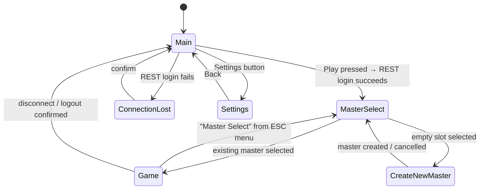

# Autoload singletons

Four GDScript autoloads are registered project-wide (`project.godot`), available from any script
by bare global name — no `get_node` lookup needed:

| Singleton | File | Responsibility |
| --- | --- | --- |
| `SceneManager` | `Manager/SceneManager.gd` | Scene transitions (loading screen, threaded loads, blocking transitions) |
| `SettingsManager` | `Manager/SettingsManager.gd` | Client version, dev login URL/credentials, gameplay tuning constants (e.g. skill-target snap distance) |
| `ConnectionManager` | `Manager/ConnectionManager.tscn` | Owns the network layer — see [Networking](/docs/client/networking) |
| `MouseManager` | `Manager/mouse_manager.gd` | Mouse interaction state machine — see [Interaction](/docs/client/interaction) |

There is deliberately **no** `GameManager` autoload — the game world itself is a plain scene
(`Game/Game.tscn`), loaded like any other, not a global singleton.

# SceneManager: scene transitions

Every scene change funnels through `SceneManager.goto_scene(path)`, which:

1. Instantiates `Menu/LoadingScreen/LoadingScreen.tscn` and fades to it.
2. Loads the target scene asynchronously via `ResourceLoader.load_threaded_request`.
3. Swaps it in and fades back.

It also supports a **blocking** mode: `goto_scene(path, true)` starts the transition but holds on
the loading screen until something else calls `unblock_transition()`. This is the mechanism that
makes Master Select wait for the zone-server authentication handshake — the scene load finishes
long before `AuthenticationSuccess` arrives, so `ConnectionManager` explicitly holds it open:

```gdscript
# connection_manager.gd — login() starts a *blocking* transition...
SceneManager.goto_scene("res://Menu/MasterSelect/MasterSelect.tscn", true)
_socket.ConnectToServer()

# ...and only once AuthenticationSuccess arrives does it release the scene:
func _on_bnet_socket_message_received(message: Object) -> void:
    if message is AuthenticationSuccess:
        _connection_state = ConnectionState.CONNECTED_AUTHED
        SceneManager.unblock_transition()
```

Without this, a player would land on Master Select before the socket had finished authenticating
and any request they made (e.g. listing their masters) would have nothing to talk to yet.

# Boot flow



## Menu/Main — main menu

`main.gd`'s `_ready()` defensively calls `ConnectionManager.disconnect_from_server()` and
re-enables the Play button (so returning here, e.g. after a disconnect, always resets to a clean
state). Pressing Play disables the button and kicks off the whole
[login handshake](/docs/client/networking#login--jwt--socket-auth-handshake):

```gdscript
func _on_play_button_pressed() -> void:
    _play_button.disabled = true
    ConnectionManager.login()
```

## Menu/MasterSelect — choose or create a character

Loaded blocking (see above), so by the time its `_ready()` runs the socket is authenticated.
It calls `ConnectionManager.list_bestia_master()`, which round-trips a request and renders the
result: one `MasterInfo` slot per existing master, `EmptyMasterSlot` for the remaining slots.

- Clicking an existing master → `ConnectionManager.select_bestia_master()` →
  `SceneManager.goto_scene("Game/Game.tscn")`.
- Clicking an empty slot → `SceneManager.goto_scene(CreateNewMaster.tscn)`.

## Menu/CreateNewMaster

Submits `ConnectionManager.create_master(...)` and listens for `operation_success`/
`operation_error` (see the server's [error message conventions](/docs/server/architecture) for
what those carry). On success (`OP_SUCCESS_MASTER_CREATED`) it returns to Master Select; Cancel
does the same without submitting.

## Menu/ConnectionLost

Shown whenever the socket drops unexpectedly, or the REST login itself fails — see
[Networking → Disconnects](/docs/client/networking#disconnects) for exactly what triggers it and
how it's distinguished from an intentional logout. Displays an error string keyed off
`ConnectionManager.last_connection_error` (`LOGIN_OFFLINE` / `LOGIN_ERROR` /
`ZONE_CONNECTION_LOST`); confirming returns to `Main.tscn`.

## Menu/Settings

Reachable from Main; currently just a Back button back to Main — no persisted settings UI yet
beyond what `SettingsManager` hardcodes.

## Once in the game

`Game/Game.tscn` hosts gameplay — see [Entity Sync](/docs/client/entity-sync),
[World & Terrain](/docs/client/world-terrain), [Interaction](/docs/client/interaction) and
[UI Overview](/docs/client/ui-overview). The in-game ESC menu (confusingly named `Options` in the
source, `Game/UI/Options/options.gd`) offers Continue / Master Select / Disconnect / Exit, all
funneled through a cancellable, server-confirmed logout countdown
(`ConnectionManager.request_logout()`/`cancel_logout()`, completing on the owned master's
`VanishEntitySMSG`).
