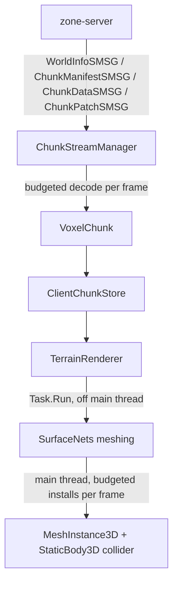

Terrain is streamed from `zone-server` as voxel chunks, decoded, meshed off the main thread, and
rendered incrementally with distance-limited collision. The whole pipeline lives in
`src/Game/World/` and is entirely C#.

# Streaming

`ChunkStreamManager.cs` is attached as a C# node listening on the same `BnetSocket.MessageReceived` signal used by
[Networking](/docs/client/networking), filtering for map-related messages
(`WorldInfoSMSG`/`ChunkManifestSMSG`/`ChunkDataSMSG`/`ChunkPatchSMSG`). Decoding is budgeted —
only `DecodesPerFrame` chunks are processed per frame — so a large batch of incoming chunks (e.g.
right after login) doesn't spike a single frame. Decoded chunks are pushed into `ClientChunkStore`
and `TerrainRenderer.Invalidate` is called to schedule a re-mesh.

`ChunkEngine.cs` holds a single `Version` constant that must match the server's world-generation
version; a mismatch is logged loudly (wrong materials/shape would otherwise render silently
wrong) rather than failing outright.

# Chunk data

A decoded `VoxelChunk` (`VoxelChunk.cs`) holds parallel `Blocks`/`Occupancy` byte arrays: a material id plus a
0–255 fill amount per voxel, so a surface at a fractional height renders smoothly instead of
stair-stepping. `RleCodec` and `ChunkPatchCodec` (`RleCodec.cs`, `ChunkPatchCodec.cs`) handle the wire (de)compression and incremental
patch application (a `ChunkPatchSMSG` updates part of an already-streamed chunk, e.g. after
terrain is dug or built on, without re-sending the whole chunk).

# Meshing

`Mesh/SurfaceNets.cs`, `Mesh/ChunkSurface.cs` and `Mesh/BlockAppearance.cs` implement
[Surface Nets](https://en.wikipedia.org/wiki/Marching_cubes#Related_algorithms), turning the raw
voxel grid plus a material-appearance palette into vertex/normal/color/index arrays — smooth
surfaces rather than blocky Minecraft-style cubes, while still being a per-voxel grid underneath.

# Rendering

`TerrainRenderer.cs` keeps one `MeshInstance3D` (plus an optional separate water mesh, and a `StaticBody3D` collider)
per chunk key. Meshing work runs on background `Task.Run` thread-pool workers, bounded by
`MeshJobs`; finished meshes are installed on the main thread, bounded by `InstallsPerFrame` — both
caps exist for the same reason `ChunkStreamManager`'s decode budget does: keep any single frame
from spiking. Colliders are only built within `CollisionRadiusChunks` of the player
(`SetCollisionAnchorAt`), since a `StaticBody3D` per distant, never-walked-on chunk would be
wasted physics-engine overhead.

# Ground & pathing

Scripts under `src/Game/Ground/`:

- `walkable_floor.gd` is attached to every collision body — both a placeholder flat ground used
  outside streamed areas and the code-built chunk colliders above — puts it in the `"floor"`
  group, and relays clicks to `MouseManager` (see [Interaction](/docs/client/interaction)).
- `path_calculator.gd` (`PathCalculator.calculate_tile_path`) generates a simple diagonal-then-
  straight tile path client-side from a single click, with no collision awareness — it's a
  client-side approximation for immediate visual feedback, not the authoritative path (movement
  is still driven by the server's `PathComponentSMSG`, see [Entity Sync](/docs/client/entity-sync)).
