In Bestia, there are two main types of magical actions:

1. **Skills** – Learned by a Bestia Master. Skills have levels and can be upgraded in a skill tree as the Master levels up. These are controlled by the player using skill points.
2. **Attacks** – Learned by a Bestia as it levels up, at fixed, predefined levels. These can be battle-related or utility magic.



Each skill or attack is characterized by its **level**, **magic school**, and **elemental aspect**.

# How Bestias Learn Attacks

Bestias can learn attacks in two ways:

1. **Level Up** – Each Bestia has an internal list of attacks it will learn as it gains levels. The same attack may be learned at different levels by different Bestias.
2. **Spell Scrolls** – Players can inscribe attacks onto spell scrolls (or find them as loot). These spells can be used directly from the scroll or taught to a Bestia.

General guidelines when Bestia are learning attacks from level ups:

* **From Lv. 1–100**, a Bestia should learn **about 25** attacks.
* Around **20 attacks** are learned between **Lv. 1–70**, the last 5 (most powerful) **between Lv. 71–100**.

# Magic Schools

All skills and attacks are divided into three schools of magic: **Arcane**, **Black**, and **White Magic**. These schools may affect spell effects, skill improvements, or equipment bonuses.

* **Arcane Magic** - Trickster magic: illusions, utility spells (e.g., generating food or shelter), transmutations, and other unusual effects. Rarely includes damaging spells.
* **Black Magic** - Damaging spells intended to inflict harm, reduce defenses, or apply negative status effects.
* **White Magic** - Healing, buffing, and protection spells. Includes detection and neutralization of magic, as well as all forms of healing and status improvement.

# Attack Enscription

If the player has the skill [Attack Enscription](/docs/mechanics/skills/#attack-enscription), attacks can be inscribed onto scrolls for single-use or to teach other Bestias.

After a spell is materialized and bound to a scroll, it can be used by the owner.

| Attack Level | Base Enscription Success |
| ------------ | ------------------------ |
| 1–20         | 100%                     |
| 21–40        | 80%                      |
| 41–60        | 70%                      |
| 61–80        | 60%                      |
| 81–90        | 30%                      |
| 91–100       | 10%                      |
| 101+         | -10%                     |

# Spell Binding

Many entities and objects in the game world have slots and triggers for attaching attacks. With the [Spell Binding](/docs/mechanics/skills/#spell-binding) skill, players can discover these slots and bind spells to entities—useful for traps or intelligence devices. The following are some potential triggers might be:

* Entity entering or leaving an area
* Trigger on pickup
* Specific entity (friendly or foe)
* Presence of magic
* Weather conditions
* Time
* Spell cast in the vicinity

# Detection of Magic

Detecting enchanted items or traps is possible with the [Detect Magic](/docs/mechanics/skills/#detect-magic) skill. Higher-level spells are easier to detect, but precautions can make detection harder. If multiple spells are attached to an object, weaker spells are more difficult to detect.

# Master Skilltree

The Master skill tree is divided into three main branches, each offering specialized paths for different playstyles:

* **War** - Offensive and Defensive skills useful in combat.
* **Research** - Skills that either supportive in nature but also useful for magic research.
* **Craft** - All skills which fall into the domain of extracting resources or crafting items or equipment.

```mermaid
graph TD
    Master[Master Skills] --> Battle[Battle Mastery]
    Master --> Support[Support & Research]
    Master --> Crafting[Crafting & Merchant]

    %% Battle Branch
    Battle --> CombatMastery[Combat Mastery 1-10]
    Battle --> WeaponSpec[Weapon Specialization]
    Battle --> TacticalCombat[Tactical Combat 1-10]
    Battle --> BerserkerRage[Berserker Rage 1-5]

    WeaponSpec --> SwordMastery[Sword Mastery 1-10]
    WeaponSpec --> BowMastery[Bow Mastery 1-10]
    WeaponSpec --> StaffMastery[Staff Mastery 1-10]
    WeaponSpec --> ShieldMastery[Shield Mastery 1-10]

    Battle --> DefensiveMastery[Defensive Mastery]
    DefensiveMastery --> ArmorProficiency[Armor Proficiency 1-10]
    DefensiveMastery --> DodgeRoll[Dodge Roll 1-10]
    DefensiveMastery --> Parry[Parry Master 1-10]

    Battle --> BattleMagic[Battle Magic]
    BattleMagic --> MindBreak[Mind Break 1-5]
    BattleMagic --> AmplifyMagic[Amplify Magic 1-10]
    BattleMagic --> BattleStance[Battle Stance 1-5]

    %% Support & Research Branch
    Support --> MagicResearch[Magic Research]
    MagicResearch --> SpellEnscription[Spell Enscription 1-10]
    MagicResearch --> SpellBinding[Spell Binding 1-10]
    MagicResearch --> DetectMagic[Detect Magic 1-10]
    MagicResearch --> ManaEfficiency[Mana Efficiency 1-10]

    Support --> BeastMastery[Beast Mastery]
    BeastMastery --> BeastTaming[Beast Taming 1-10]
    BeastMastery --> BeastCommunication[Beast Communication 1-5]
    BeastMastery --> PackLeadership[Pack Leadership 1-10]
    BeastMastery --> BeastHealing[Beast Healing 1-10]

    Support --> Exploration[Exploration & Survival]
    Exploration --> PathFinding[Path Finding 1-10]
    Exploration --> SurvivalInstinct[Survival Instinct 1-10]
    Exploration --> WeatherResistance[Weather Resistance 1-5]
    Exploration --> TreasureHunting[Treasure Hunting 1-10]

    Support --> Scholar[Scholar Mastery]
    Scholar --> AncientKnowledge[Ancient Knowledge 1-10]
    Scholar --> LanguageMastery[Language Mastery 1-5]
    Scholar --> MapMaking[Map Making 1-10]
    Scholar --> Negotiation[Negotiation 1-10]

    %% Crafting & Merchant Branch
    Crafting --> CraftingSpeed[Speedy Craftsmanship 1-10]
    Crafting --> BlacksmithBranch[Blacksmithing]
    BlacksmithBranch --> WeaponSmithing[Weapon Smithing 1-10]
    BlacksmithBranch --> ArmorSmithing[Armor Smithing 1-10]
    BlacksmithBranch --> OreRefinement[Ore Refinement 1-10]
    BlacksmithBranch --> ItemRestoration[Item Restoration 1-10]

    Crafting --> Alchemy[Alchemy & Brewing]
    Alchemy --> AlchemyMastery[Alchemy Mastery 1-10]
    Alchemy --> PotionBrewing[Potion Brewing 1-10]
    Alchemy --> PoisonCrafting[Poison Crafting 1-10]
    Alchemy --> Transmutation[Transmutation 1-5]

    Crafting --> Cooking[Culinary Arts]
    Cooking --> CookingMastery[Cooking Mastery 1-10]
    Cooking --> NutritionalValue[Nutritional Value 1-10]
    Cooking --> PreservationTech[Preservation Techniques 1-5]
    Cooking --> ExoticRecipes[Exotic Recipes 1-10]

    Crafting --> Engineering[Engineering & Tech]
    Engineering --> EngineeringMastery[Engineering Mastery 1-10]
    Engineering --> TrapCrafting[Trap Crafting 1-10]
    Engineering --> AutomationTech[Automation Technology 1-5]
    Engineering --> SiegeCrafting[Siege Crafting 1-5]

    Crafting --> ResourceMastery[Resource Mastery]
    ResourceMastery --> ResourceExtraction[Resource Extraction 1-10]
    ResourceMastery --> ResourceDetection[Resource Detection 1-10]
    ResourceMastery --> Packhorse[Packhorse 1-10]
    ResourceMastery --> StorageOptimization[Storage Optimization 1-5]

    Crafting --> MerchantSkills[Merchant Skills]
    MerchantSkills --> Appraisal[Appraisal 1-10]
    MerchantSkills --> Haggling[Haggling 1-10]
    MerchantSkills --> MarketAnalysis[Market Analysis 1-5]
    MerchantSkills --> TradeRoutes[Trade Routes 1-10]
```

## Battle Mastery Branch

### Combat Skills

Power Maximize - Weapons inflict always maximum damage.
Beast Bane - Increases damage against against Beast and Insect type bestia
Double Shot - Shoots two projectiles towards a target for ranged physical damage. Lv. 1- 100% damage lv. 10 190%.
Vulture's Eye - Increaes attack range and hit rate with ranged type weapons.
  | Level | HIT Bonus | Range Bonus |
  | ----- | --------- | ----------- |
  | 1     | 1         | 1           |
  | 2     | 2         | 2           |
  | 3     | 3         | 3           |
  | 4     | 4         | 4           |
  | 5     | 5         | 5           |
  | 6     | 6         | 6           |
  | 7     | 7         | 7           |
  | 8     | 8         | 8           |
  | 9     | 9         | 9           |
  | 10    | 10        | 10          |

Katar Mastery - Increases damage with Katar class weapons.

Level	ATK Bonus
1	3
2	6
3	9
4	12
5	15
6	18
7	21
8	24
9	27
10	30

Sword Mastery - Increases damage with Sword class weapons.

Mace Mastery - Increases damage with mace class weapons.
Spear Mastery - Increases damage with spear class weapons.
Staff Mastery - +10 MATK and -1% mana usage per level. 1-10
Hammer Fall - 30-70% chance of stunning enemies in a 5x5 area. Active
Adrenaline Rush - For 30~150 seconds, increase Attack Speed and hit rate of party members equipped with Axe and Mace class weapons (30% for Blacksmiths, 25% for other classes). 5 Level. Active.
Reflect Damage - Places a temporary buff on the user that reduces damage by reflecting damage to the attacker.

Level	Reflect Damage Reduction	Mana Cost
1	10%	30
2	20%	40
3	30%	50
4	40%	60
5	50%	70

* **Combat Mastery (1-10)** - Increases HP and critical hit chance by 2% per level
* **Staff Mastery (1-10)** - +3% magical damage and -1% mana usage per level
* **Shield Mastery (1-10)** - +3% block chance and +10 DEF per level
* **Berserker Rage (1-5)** - +5%/lv ASPD and +3%/lv ATK for 5s/lv.
* **Poison Coating (1-5)** - Allows you to apply poisons to your weapon to increase damage or add different effects.
* Skin Tempering +4-20% Fire resistance and 1-5% neutral resistance. Lv. 5. Passive.
* Weapon Perfection 10-50s, you and party member have no weapon size penalities. 5. Active.
* **Dodge Roll (1-10)** - Increases evasion chance and movement speed during combat
* **Parry Master (1-10)** - Improves parry timing and counterattack opportunities
* **Hide (1-5)** - Get invisible during combat. Higher levels reduce your mana drain and increase your movement speed while hidden.
  Level	1	2	3	4	5
Movement Speed (%)*	only usable on walls	50	75	100
SP drained per 1 second	6	5	4	3	2
* **Mind Break (1-5)** - Defense and Magic Defense halved, but MATK damage doubled
* **Amplify Magic (1-10)** - Increases all magical damage by 2% per level
* Strip Weapon - There is a chance to unequip the enemies weapon.

Level	Base Success Chance	Base Duration	SP Cost
1	6%	75s	22
2	12%	90s	26
3	18%	105s	30

`Success Rate (%) = Base_Success_Chance + (DEX - Enemy DEX) ÷ 5`
`Duration (s) = Base_Duration + (DEX - Enemy DEX) ÷ 2`

* Strip Armor - There is a chance to unequeip the enemies armor.

Level	Base Success Chance	Base Duration	SP Cost
1	6%	75s	22
2	12%	90s	26
3	18%	105s	30

`Success Rate (%) = Base_Success_Chance + (DEX - Enemy DEX) ÷ 5`
`Duration (s) = Base_Duration + (DEX - Enemy DEX) ÷ 2`

* Fire Bolt - Single target fire damage.
* Cold Bolt - Single target water damage.
* Lightning Bolt - Single target wind damage.
* Earth Spike - Single target earth damage.
* Soul Strike - Single target ghost damage.
* Heavens Drive - AoE Earth Damage
* Thunderstorm - AoE Wind Damage
* Stormguest - AoE water Damage
* Meteor - AoE Fire Damage
* Firewall - Creates a wall of fire which causes damage to anyone who walks into it and has a pushback effect.
* Icewall - Creates a wall of ice which can be attacked and damaged. It also blocks line of sight.
* Frost Diver - Single target water damage with high chance of freezing the target.
Level	Damage (MATK)	Frozen	SP Cost
Chance	Duration
1	110%	38%	3s	25
2	120%	41%	6s	24
3	130%	44%	9s	23
4	140%	47%	12s	22
5	150%	50%	15s	21
6	160%	53%	18s	20
7	170%	56%	21s	19
8	180%	59%	24s	18
9	190%	62%	27s	17
10	200%	65%	30s	16
* Shattering Strike - Bestows a chance of breaking enemies' equipped weapon or armor with each attack. Against monsters, this skill will decrease their physical damage or defense instead.

| Level | Weapon Break Chance | Armor Break Chance | Duration | Mana Cost |
| ----- | ------------------- | ------------------ | -------- | --------- |
| 1     | 1%                  | 0.7%               | 15s      | 50        |
| 2     | 2%                  | 1.4%               | 20s      |           |
| 3     | 3%                  | 2.1%               | 25s      | 60        |
| 4     | 4%                  | 2.8%               | 30s      |           |
| 5     | 5%                  | 3.5%               | 35s      | 70        |
| 6     | 6%                  | 4.2%               | 40s      |           |
| 7     | 7%                  | 4.9%               | 45s      | 80        |
| 8     | 8%                  | 5.6%               | 50s      |           |
| 9     | 9%                  | 6.3%               | 55s      | 90        |
| 10    | 10%                 | 7.0%               | 60s      |           |

## Support & Research Branch

* Impositio Manus

Level	ATK & MATK Boost	SP Cost
1	5	59
2	10	62
3	15	65
4	20	68
5	25	71
* Inspiration - Increases max. HP and Mana.

Level	All Stat	Base ATK/MATK Increase	Base HIT Increase	Max HP Increase	HP Drain	SP Drain	Duration
1	6	40	12	4%	3.0%	4.0%	60s
2	12	80	24	8%	2.5%	3.5%	90s
3	18	120	36	12%	2.0%	3.0%	120s
4	24	160	48	16%	1.5%	2.5%	155s
5	30	200	60	20%	1.0%	2.0%	180s

* Blessing - Increases all stats by 2 points/lv. HIT increase 4/lv. . Lv. 1-5. 60s 120s 240s. Removes Curse and Stone debuff. Mana 24 + (Skill Level × 4). Range 9.
* Clearance - Attempts to nullify many benefits (in PVP) and negative status effects of a single target.
Level	Success Rate	SP Cost
1	33%	54
2	66%	66
3	100%	78

* **Spell Enscription (1-10)** - Lesser chance of failing spell enscriptions (-5% failure per level)
* **Spell Binding (1-10)** - Ability to bind spells to objects and create magical traps
* **Detect Magic (1-10)** - Improved detection of magical auras and enchanted items
* **Mana Efficiency (1-3)** - Reduces mana costs for all spells by 8% per level
* Fog Field - Creates a field of fog in a 3x3 area which blocks ranged attacks.
* **Beast Taming (1-10)** - Increases chance to tame and control wild Bestias by 2% per level.
* **Beast Healing (1-10)** - Specialized healing techniques for Bestias. Increases HP, Mana and Stamina regeneration of Bestias by 2%/Lv.
* **Path Finding (1-10)** - Improved travel speed in wilderness by +3% per Lv.
* **Survival Instinct (1-10)** - Increased chance of resource gathering in the wild
* **Weather Resistance (1-5)** - Reduced environmental damage and resistance by 3% per level
* **Cartopgrapher (1-10)** - Higher chance of successfully copying and creating maps
* Enchanted Stonecraft - Allows you to bind magic power into crytals and stones which can be used as raw materials.
* Dispell - (1-3) Removes all buffs on target. 60% chance, 80% chance, 100% chance. Uses a Yellow Crystal.
* Magic Shield (1-5) - Absorbs certain amount of damage.
* Expiatio - Places a temporary buff on a single target that grants attacks to bypass a percentage of enemies' Physical Defense and Magical Defense.
Level	DEF & MDEF Bypass	Duration	SP Cost
1	5%	150s	35
2	10%	180s	40
3	15%	210s	45
4	20%	240s	50
5	25%	270s	55

## Crafting & Merchant Branch

* **Speedy Craftsmanship (1-10)** - Every level reduces crafting time by 5%
* **Weaponry Research (1-10)** - Raises the success rate of forging. This skill also raises Physical Attack (Weapon Mastery) and the accuracy with any weapon.
Level	Forging Rate Increase	ATK Increase	Accuracy Mod
1	1%	2	102%
2	2%	4	104%
3	3%	6	106%
4	4%	8	108%
5	5%	10	110%
6	6%	12	112%
7	7%	14	114%
8	8%	16	116%
9	9%	18	118%
10	10%	20	120%

* **Smithing (1-10)** - Allows you to create armor and weapons.
* Weapon Repair - Returns damaged equipment into a usable state. Lv. 1 active.
* **Ore Refinement (1-10)** - Extract more pure materials from raw ores
* **Item Restoration (1-10)** - Repair damaged equipment and restore its original properties
* Weapon Upgrade (1-5) - Increases chance of upgrading a weapon or equipment.
* Chemical Protection - Coats armor and weapons to make them immune to damage and removal by certain skills.
* Suffragium (1-3) - Reduces cast time for 10-30% for the next ability.

### Alchemy & Brewing

* **Alchemy Mastery (1-10)** - Create potions, elixirs, and magical substances
* **Potion Brewing (1-10)** - Specialized in healing and enhancement potions
* **Poison Crafting (1-10)** - Create toxins and antidotes for combat and utility
* **Transmutation (1-5)** - Convert base materials into more valuable substances

### Culinary Arts

* **Cooking Mastery (1-10)** - Prepare foods that provide temporary stat bonuses
* **Nutritional Value (1-10)** - Enhanced food effects and longer-lasting buffs
* **Preservation Techniques (1-5)** - Keep food fresh longer and reduce spoilage
* **Exotic Recipes (1-10)** - Access to rare and powerful food recipes

### Engineering & Technology

* **Engineering Mastery (1-10)** - Build complex mechanical devices and contraptions
* **Trap Crafting (1-10)** - Create mechanical and magical traps for defense
* **Automation Technology (1-5)** - Build self-operating devices and basic golems
* **Siege Crafting (1-5)** - Construct large-scale war machines and fortifications

### Resource Mastery

* **Resource Extraction (1-10)** - Quicker and more efficient resource gathering
* **Resource Detection (1-10)** - Higher chance of finding rare resources and materials
* **Scavenger (1-5)** - Higher chance of finding rare item drops from bestias. Increases drop chance of items by 100% per level.
* **Packhorse (1-10)** - +10% weight limit per level for carrying capacity

### Merchant Skills

* **Negotiation (1-10)** -  Get better prices when buying and selling with NPCs
