In Bestia, there are two main types of magical actions:

1. **Skills** – Learned by a Bestia Master. Skills have levels and can be upgraded in a skill tree as the Master levels up. These are controlled by the player using skill points.
2. **Attacks** (also called Abilities) – Learned by a Bestia as it levels up, at fixed, predefined levels. These can be battle-related or utility magic.



Each skill or attack is characterized by its **level**, **magic school**, and **elemental aspect**.

# How Bestias Learn Attacks

Bestias can learn attacks in two ways:

1. **Level Up** – Each Bestia has an internal list of attacks it will learn as it gains levels. The same attack may be learned at different levels by different Bestias.
2. **Spell Scrolls** – Players can inscribe attacks onto spell scrolls (or find them as loot). These spells can be used directly from the scroll or taught to a Bestia.

General guidelines when Bestia are learning attacks from level ups:

* **From Lv. 1–100**, a Bestia should learn **about 25** attacks.
* Around **20 attacks** are learned between **Lv. 1–70**, the last 5 (most powerful) **between Lv. 71–100**.

# Magic Schools

All skills and attacks are divided into three schools of magic: **Arcane**, **Black**, and **White Magic**. These schools may affect spell effects, skill improvements, or equipment bonuses.

* **Arcane Magic** - Trickster magic: illusions, utility spells (e.g., generating food or shelter), transmutations, and other unusual effects. Rarely includes damaging spells.
* **Black Magic** - Damaging spells intended to inflict harm, reduce defenses, or apply negative status effects.
* **White Magic** - Healing, buffing, and protection spells. Includes detection and neutralization of magic, as well as all forms of healing and status improvement.

# Attack Enscription

If the player has the skill [Attack Enscription](/docs/mechanics/skills/#attack-enscription), attacks can be inscribed onto scrolls for single-use or to teach other Bestias.

After a spell is materialized and bound to a scroll, it can be used by the owner.



| Attack Level | Base Enscription Success |
| ------------ | ------------------------ |
| 1–20         | 100%                     |
| 21–40        | 80%                      |
| 41–60        | 70%                      |
| 61–80        | 60%                      |
| 81–90        | 30%                      |
| 91–100       | 10%                      |
| 101+         | -10%                     |



# Spell Binding

Many entities and objects in the game world have slots and triggers for attaching attacks. With the [Spell Binding](/docs/mechanics/skills/#spell-binding) skill, players can discover these slots and bind spells to entities—useful for traps or intelligence devices. The following are some potential triggers might be:

* Entity entering or leaving an area
* Trigger on pickup
* Specific entity (friendly or foe)
* Presence of magic
* Weather conditions
* Time
* Spell cast in the vicinity

# Detection of Magic

Detecting enchanted items or traps is possible with the [Detect Magic](/docs/mechanics/skills/#detect-magic) skill. Higher-level spells are easier to detect, but precautions can make detection harder. If multiple spells are attached to an object, weaker spells are more difficult to detect.

# Master Skilltree

The Master skill tree is divided into three main branches, each offering specialized paths for different playstyles:

```mermaid
graph TD
    Master[Master Skills] --> Battle[Battle Mastery]
    Master --> Support[Support & Research]
    Master --> Crafting[Crafting & Merchant]

    %% Battle Branch
    Battle --> CombatMastery[Combat Mastery 1-10]
    Battle --> WeaponSpec[Weapon Specialization]
    Battle --> TacticalCombat[Tactical Combat 1-10]
    Battle --> BerserkerRage[Berserker Rage 1-5]

    WeaponSpec --> SwordMastery[Sword Mastery 1-10]
    WeaponSpec --> BowMastery[Bow Mastery 1-10]
    WeaponSpec --> StaffMastery[Staff Mastery 1-10]
    WeaponSpec --> ShieldMastery[Shield Mastery 1-10]

    Battle --> DefensiveMastery[Defensive Mastery]
    DefensiveMastery --> ArmorProficiency[Armor Proficiency 1-10]
    DefensiveMastery --> DodgeRoll[Dodge Roll 1-10]
    DefensiveMastery --> Parry[Parry Master 1-10]

    Battle --> BattleMagic[Battle Magic]
    BattleMagic --> MindBreak[Mind Break 1-5]
    BattleMagic --> AmplifyMagic[Amplify Magic 1-10]
    BattleMagic --> BattleStance[Battle Stance 1-5]

    %% Support & Research Branch
    Support --> MagicResearch[Magic Research]
    MagicResearch --> SpellEnscription[Spell Enscription 1-10]
    MagicResearch --> SpellBinding[Spell Binding 1-10]
    MagicResearch --> DetectMagic[Detect Magic 1-10]
    MagicResearch --> ManaEfficiency[Mana Efficiency 1-10]

    Support --> BeastMastery[Beast Mastery]
    BeastMastery --> BeastTaming[Beast Taming 1-10]
    BeastMastery --> BeastCommunication[Beast Communication 1-5]
    BeastMastery --> PackLeadership[Pack Leadership 1-10]
    BeastMastery --> BeastHealing[Beast Healing 1-10]

    Support --> Exploration[Exploration & Survival]
    Exploration --> PathFinding[Path Finding 1-10]
    Exploration --> SurvivalInstinct[Survival Instinct 1-10]
    Exploration --> WeatherResistance[Weather Resistance 1-5]
    Exploration --> TreasureHunting[Treasure Hunting 1-10]

    Support --> Scholar[Scholar Mastery]
    Scholar --> AncientKnowledge[Ancient Knowledge 1-10]
    Scholar --> LanguageMastery[Language Mastery 1-5]
    Scholar --> MapMaking[Map Making 1-10]
    Scholar --> Negotiation[Negotiation 1-10]

    %% Crafting & Merchant Branch
    Crafting --> CraftingSpeed[Speedy Craftsmanship 1-10]
    Crafting --> BlacksmithBranch[Blacksmithing]
    BlacksmithBranch --> WeaponSmithing[Weapon Smithing 1-10]
    BlacksmithBranch --> ArmorSmithing[Armor Smithing 1-10]
    BlacksmithBranch --> OreRefinement[Ore Refinement 1-10]
    BlacksmithBranch --> ItemRestoration[Item Restoration 1-10]

    Crafting --> Alchemy[Alchemy & Brewing]
    Alchemy --> AlchemyMastery[Alchemy Mastery 1-10]
    Alchemy --> PotionBrewing[Potion Brewing 1-10]
    Alchemy --> PoisonCrafting[Poison Crafting 1-10]
    Alchemy --> Transmutation[Transmutation 1-5]

    Crafting --> Cooking[Culinary Arts]
    Cooking --> CookingMastery[Cooking Mastery 1-10]
    Cooking --> NutritionalValue[Nutritional Value 1-10]
    Cooking --> PreservationTech[Preservation Techniques 1-5]
    Cooking --> ExoticRecipes[Exotic Recipes 1-10]

    Crafting --> Engineering[Engineering & Tech]
    Engineering --> EngineeringMastery[Engineering Mastery 1-10]
    Engineering --> TrapCrafting[Trap Crafting 1-10]
    Engineering --> AutomationTech[Automation Technology 1-5]
    Engineering --> SiegeCrafting[Siege Crafting 1-5]

    Crafting --> ResourceMastery[Resource Mastery]
    ResourceMastery --> ResourceExtraction[Resource Extraction 1-10]
    ResourceMastery --> ResourceDetection[Resource Detection 1-10]
    ResourceMastery --> Packhorse[Packhorse 1-10]
    ResourceMastery --> StorageOptimization[Storage Optimization 1-5]

    Crafting --> MerchantSkills[Merchant Skills]
    MerchantSkills --> Appraisal[Appraisal 1-10]
    MerchantSkills --> Haggling[Haggling 1-10]
    MerchantSkills --> MarketAnalysis[Market Analysis 1-5]
    MerchantSkills --> TradeRoutes[Trade Routes 1-10]
```

## Battle Mastery Branch

### Combat Skills

* **Combat Mastery (1-10)** - Increases HP and critical hit chance by 2% per level
* **Weapon Specialization** - Choose your preferred weapon type for enhanced damage and special techniques
  * **Sword Mastery (1-10)** - +5% sword damage and +1% parry chance per level
  * **Bow Mastery (1-10)** - +5% bow damage and +10 HIT per level
  * **Staff Mastery (1-10)** - +3% magical damage and -1% mana usage per level
  * **Shield Mastery (1-10)** - +3% block chance and +10 DEF per level
* **Berserker Rage (1-5)** - +5%/lv ASPD and +3%/lv ATK for 5s/lv.
* **Poison Coating (1-5)** - Allows you to apply poisons to your weapon to increase damage or add different effects.

### Defensive Mastery

* **Dodge Roll (1-10)** - Increases evasion chance and movement speed during combat
* **Parry Master (1-10)** - Improves parry timing and counterattack opportunities
* **Hide (1-10)** - Get invisible during combat. Higher levels reduce your mana drain and increase your movement speed while hidden.

### Battle Magic

* **Mind Break (1-5)** - Defense and Magic Defense halved, but MATK damage doubled
* **Amplify Magic (1-10)** - Increases all magical damage by 2% per level

## Support & Research Branch

### Magic Research

* **Spell Enscription (1-10)** - Lesser chance of failing spell enscriptions (-5% failure per level)
* **Spell Binding (1-10)** - Ability to bind spells to objects and create magical traps
* **Detect Magic (1-10)** - Improved detection of magical auras and enchanted items
* **Mana Efficiency (1-10)** - Reduces mana costs for all spells by 3% per level

### Beast Mastery

* **Beast Taming (1-10)** - Increases chance to tame and control wild Bestias by 2% per level.
* **Beast Healing (1-10)** - Specialized healing techniques for Bestias. Increases HP, Mana and Stamina regeneration of Bestias by 2%/Lv.

### Exploration & Survival

* **Path Finding (1-10)** - Improved travel speed in wilderness by +3% per Lv.
* **Survival Instinct (1-10)** - Increased chance of resource gathering in the wild
* **Weather Resistance (1-5)** - Reduced environmental damage and resistance by 3% per level
* **Cartopgrapher (1-10)** - Higher chance of successfully copying and creating maps

## Crafting & Merchant Branch

### Crafting Speed & Quality

* **Speedy Craftsmanship (1-10)** - Every level reduces crafting time by 5%

### Blacksmithing

* **Weapon Smithing (1-10)** - Craft and improve weapons with better stats and durability
* **Armor Smithing (1-10)** - Create protective gear with enhanced defensive properties
* **Ore Refinement (1-10)** - Extract more pure materials from raw ores
* **Item Restoration (1-10)** - Repair damaged equipment and restore its original properties

### Alchemy & Brewing

* **Alchemy Mastery (1-10)** - Create potions, elixirs, and magical substances
* **Potion Brewing (1-10)** - Specialized in healing and enhancement potions
* **Poison Crafting (1-10)** - Create toxins and antidotes for combat and utility
* **Transmutation (1-5)** - Convert base materials into more valuable substances

### Culinary Arts

* **Cooking Mastery (1-10)** - Prepare foods that provide temporary stat bonuses
* **Nutritional Value (1-10)** - Enhanced food effects and longer-lasting buffs
* **Preservation Techniques (1-5)** - Keep food fresh longer and reduce spoilage
* **Exotic Recipes (1-10)** - Access to rare and powerful food recipes

### Engineering & Technology

* **Engineering Mastery (1-10)** - Build complex mechanical devices and contraptions
* **Trap Crafting (1-10)** - Create mechanical and magical traps for defense
* **Automation Technology (1-5)** - Build self-operating devices and basic golems
* **Siege Crafting (1-5)** - Construct large-scale war machines and fortifications

### Resource Mastery

* **Resource Extraction (1-10)** - Quicker and more efficient resource gathering
* **Resource Detection (1-10)** - Higher chance of finding rare resources and materials
* **Scavenger (1-5)** - Higher chance of finding rare item drops from bestias. Increases drop chance of items by 100% per level.
* **Packhorse (1-10)** - +10% weight limit per level for carrying capacity

### Merchant Skills

* **Negotiation (1-10)** -  Get better prices when buying and selling with NPCs
