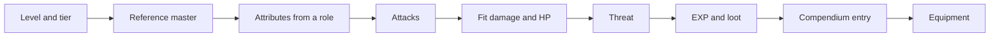



A new bestia needs about twenty numbers: six attributes, HP, mana, EXP, an attack list and drop chances. Picked by
hand, they drift apart. A bestia ends up too strong for its level, or worth too little EXP for the trouble.

This page gives one method for all of them. The idea is simple: **a Lv 10 bestia is measured against a Lv 10
master.** The method fits the bestia to a target fight, then pays for the fight it produces with EXP and loot. Each
step is a formula, so it can be run by hand or by the [Bestia Blueprint Calculator](#bestia-blueprint-calculator) at the end of this page.

The tables on this page are read from `data/bestia_blueprint.yaml`. Change a number there and this page follows.

# 1. Level and tier

**Pick the level from where the bestia should live.** The world generator places dens in four level bands, and a
species only fills dens close to its own level. A den spans its centre ±4 levels.



**Then pick a tier.** A tier says how many players the bestia is built for. It scales the targets of
[step 3](#3-the-target-fight), so a higher tier is a longer and harder fight, not a different formula.



- **Critter**: wildlife that fights back weakly. It is a lesson for new players, not a threat.
- **Normal**: the bestia a player fights alone. Everything else is defined relative to it.
- **Elite**: a pack leader or a rare spawn. About 30 swings, 10 to 15 for each player. A player alone loses to it.
- **Boss**: built for a group. About 500 swings, 100 for each of five players: a fight of about two minutes, like an
  MVP in Ragnarok Online. It sets `boss: true` in the mob YAML.

# 2. The reference master

Every check on this page is a fight against a **reference master of the same level**. It is built from the real
server rules, so it changes when they do:

- **Attribute points:** 84 at creation, plus `5 + floor(level / 2)` for every level reached.
- **Spending:** each point goes into the attribute that lags furthest behind. The cost of a point rises with the
  value, `max(1, next / 3)`, the same as for a player. At Lv 1 this gives the even 9/9/9/9/9/9 spread of a new master.
- **Gear:** the novice knife (weapon ATK 10) and the starter kit (hard DEF 5), the same pair `BlobBalanceTest` uses.
  Weapons and armour have no item level yet. So the method assumes +1 weapon ATK and +0.375 hard DEF per level until
  they do. Hard DEF is a percentage cut, so a Lv 90 master takes 38 % less damage. That is between a caster
  (about 27 %) and a melee in full armour (about 50 %).
- **HP and attack speed:** the master's own formulas, see [Status Values](/docs/mechanics/statusvalues/#health).

| Level | Attributes (STR/VIT/INT/AGI/DEX/WIL) |  HP | ATK | Soft DEF | FLEE | Weapon ATK | Hard DEF | Seconds per swing |
| ----: | :----------------------------------- | --: | --: | -------: | ---: | ---------: | -------: | ----------------: |
|     1 | 9/9/9/9/9/9                          |  18 |  13 |       11 |  111 |         10 |        5 |              1.34 |
|    10 | 13/13/12/12/12/12                    |  37 |  21 |       19 |  124 |         19 |        8 |              1.32 |
|    50 | 32/31/31/31/31/31                    | 137 |  60 |       55 |  187 |         59 |       23 |              1.18 |
|   100 | 56/56/56/56/56/55                    | 304 | 110 |      103 |  267 |        109 |       42 |              1.01 |

An even spread is a choice. A real player specialises and hits harder. But an even master is the fair middle: a
specialised player finds a normal bestia easy, and a crafter finds it hard.

# 3. The target fight

The method needs one definition of a fair fight. It uses the pace of Ragnarok Online's classic era: a same-level
monster takes a few swings to kill and hurts enough that two at once are a real risk.

| Measure                                             | Minimum | Target | Maximum |
| :-------------------------------------------------- | ------: | -----: | ------: |
| Swings the master needs to kill it, misses included |       5 |      6 |       8 |
| Share of the master's HP it takes in that fight     |    30 % |   45 % |    60 % |

At the target, a player can take two fights before resting. The two numbers become two targets for the bestia:

- **Defence:** HP so the master needs `6 × tier defence` swings.
- **Offence:** damage per second so that a normal fight costs 45 % of the master's HP. That is
  `0.45 × masterHP / (6 × masterSwingSeconds) × tier offence`.

Damage per second counts **everything the bestia does**: default attacks, spells, damage over time, buffs and the time
it spends casting. A bestia that casts a strong spell does not get a free default attack on top of it.

# 4. Attributes from a role

**The budget.** A bestia gets a share of the master's attribute total:

<!-- prettier-ignore -->

$$budget = \sum attributes_{master} \cdot tier_{budget}$$


**The role** splits the budget by weight, and decides which attacks the species learns.



**The default attack is then fitted.** STR and DEX are raised or lowered together until the default attack deals
its **default share** of the offence target. The other four attributes keep the role's split, so a caster keeps its INT.

Fitting is needed because defence is subtracted, not divided. Near the target's soft DEF a single point of STR can
add 25 % to the damage of a swing. A budget split alone would land anywhere between harmless and deadly.

At low levels the fit often ends at STR 1. The master's soft DEF absorbs every swing, and each hit does the minimum
of 1. That is fine: the attacks carry the damage instead.

# 5. Attacks

## The learnset

A species learns **20 attacks from Lv 1 to 100**, 15 of them by Lv 70, as [Bestias](/docs/mechanics/bestia/#attacks)
asks. Each of the 20 slots has a fixed learn level, and the role fills each slot with an **archetype**. The slot
then takes an attack of that archetype from the [Attack List](/docs/mechanics/attack-list/):

| Slot        |   1 |   2 |   3 |   4 |   5 |   6 |   7 |   8 |   9 |  10 |
| :---------- | --: | --: | --: | --: | --: | --: | --: | --: | --: | --: |
| Learn level |   1 |   6 |  11 |  16 |  21 |  26 |  31 |  36 |  41 |  46 |
| **Slot**    |  11 |  12 |  13 |  14 |  15 |  16 |  17 |  18 |  19 |  20 |
| Learn level |  51 |  56 |  61 |  66 |  70 |  76 |  82 |  88 |  94 | 100 |



- **Skill level:** an attack is locked at the level it was learned with, `1 + floor(learnLevel / 10)`, up to 10.
  This is the bestia side of the rule that a master levels a spell but a bestia does not.
- **Which attack:** the strongest one the slot's level can already learn. An attack that deals damage must have the
  species element or NORMAL, and one of the species element comes first. A species has exactly one element. Each
  attack is used once.
- **Only listed attacks:** a slot the Attack List has no attack for stays empty. To fill it, add an attack to the
  Attack List; the calculator reads it live.

## The active attacks

A wild bestia does not use all it knows. Its AI profile lists **a few active attacks**: the newest ones it
knows, one per archetype. The tier sets how many. Between them it uses its **default attack**, melee or ranged as the
role says. These are the attacks the fit and the fight below use.

The default attack is never in the AI profile. The mob YAML sets it with `default-attack`: `MELEE`, `RANGED` (six
tiles) or `BOTH`. It needs no skill. A bestia also falls back to it when it cannot use an attack skill.

How often it attacks is the species' **ASPD**, `aspd` in the mob YAML, 80 if it is not set. AGI and DEX shorten the
time between attacks, as they do for a master. At 80 a slow critter like the blob attacks every 2.3 s, close to
Ragnarok Online's Poring. An unarmed master has 130 and swings every 1.3 s; a quick hunter can be set closer to that.

## The AI profile

Behaviour lives in AI profiles, `zone-server/src/main/resources/ai/*.yml`. Most species share one of a handful:

- `passive_wanderer`: fights back when hit.
- `passiv_day_active`: passive by day, holds a grudge.
- `aggressive_melee`: attacks on sight.

The calculator offers this list from `data/bestia_blueprint.yaml`. It changes rarely, so it is kept by hand: a new
profile in bestia-behemoth gets a line there in the same change. A species that needs its own behaviour, such as a
pack hunter or a boss with phases, picks **custom** and describes the behaviour in words. The blueprint then asks
for a new profile named after the species, written while the mob is implemented, starting from the closest existing
one. Once a custom profile proves useful for more than one species, it joins the list.

## Attack power

Skill scripts scale with the attacker's level and skill level. Firebolt deals `(lv/4 + INT) · skillLv`, and the
skill level itself grows with the learn level. So spell damage grows with roughly the square of the level, while the
master's HP grows about linearly. No attribute can hold that back.

So the attacks get one shared **attack power** coefficient. It is solved so that the whole rotation meets the offence
target. The blueprint gives it per attack, and the script of a new attack uses it like this:

| Kind     | Damage of one use                                                     | Defence           |
| :------- | :-------------------------------------------------------------------- | :---------------- |
| physical | `2 · ATK · coef`, then like the default attack (ranged uses RATK)     | hard and soft DEF |
| magic    | `((lv/4 + INT) · skillLv + MATK) · coef − SoftMDEF`, never misses     | soft MDEF         |
| dot      | `(lv/8 + INT/2 + MATK/4) · skillLv · coef` per tick, 8 ticks of 1.2 s | none              |
| heal     | `(lv + INT)/8 · (4 + 8 · skillLv) · coef` on itself                   | —                 |

The magic row is Firebolt with the coefficient over the whole attack side. On Firebolt's MATK term alone, a high-INT
caster could not be tuned down.

# 6. HP, mana and the balance check

**HP is solved last.** It is set so the master needs the target number of swings. The fight includes the bestia's
heals and debuffs, so a bestia that heals itself gets less raw HP for the same fight length.

**Mana** uses the documented formula from [Status Values](/docs/mechanics/statusvalues/#mana), with the role's base
value and a wild IV of 50. Mana regenerates every 8 s. A caster that runs dry falls back to its default attack, and the
fight shows that.

**The fight is simulated** in steps of 50 ms, with expected values instead of dice: every swing deals its average
damage times its hit chance. The bestia heals below 50 % HP, keeps its buff and debuff up, and otherwise casts the
hardest-hitting attack that is ready. Hit chance, crits, attack speed and defence are the server's formulas, see
[Battle System](/docs/server/battle/).

**Threat** compares the result with a normal bestia of the same level, the way the D&D 5e monster rules average a
defensive and an offensive rating:

<!-- prettier-ignore -->

$$threat = \sqrt{\frac{swings}{6} \cdot \frac{dps}{dps_{normal}}}$$


A normal bestia that hits its targets has a threat of 1. An elite is near 2.5, a boss near 13. A bestia that was given
more HP or a stronger spell than the fit asked for shows it here, and is paid for in EXP.

# 7. Element, size and defences

**Element level** follows the level: 1 up to Lv 25, 2 up to Lv 50, 3 up to Lv 75 and 4 above. A boss gets one more,
up to 4. The element decides what the bestia takes from every attack element. The table is the server's
`ElementModifier`, which follows Ragnarok Online. An EARTH 1 bestia takes 150 % from fire and 50 % from wind.

The element changes the fight. A GHOST bestia takes 25 % from the master's NORMAL swings, and soft DEF is subtracted
after that. Only a few points get through, so the fit gives it about a tenth of the HP of a NORMAL one. A player
without an elemental weapon still needs the same six swings, but a player with one wins much faster.

**Size** is SMALL, MEDIUM or BIG. The server stores it but does not apply the Ragnarok Online size table yet: that
table weighs a weapon type against a size, and weapons have no type yet.

**Defences beyond attributes** are design intent for now:

- **Hard DEF and MDEF** come only from equipment, so every mob has 0. A shelled or armoured species should note a
  hard DEF in its blueprint for the day mobs get one.
- **Status immunities**: a boss should resist Stun, Freeze and Petrify, or a group can lock it down for the whole
  fight.

# 8. Rewards: EXP and loot

## EXP

The base comes from [Bestias](/docs/mechanics/bestia/#killing-enemies) and is scaled by the threat:

<!-- prettier-ignore -->

$$exp = (4 \cdot lv + 5) \cdot threat \cdot group \cdot loot_{factor}$$


This is the `experience` value of the mob YAML. The kill-time bonuses from [Bestias](/docs/mechanics/bestia/#killing-enemies)
(+200 % for a boss, +10 % per element level) come on top when the kill happens. They are not part of the YAML value.

**The group factor pays for a long fight, and rewards it.** Threat grows with the square root of the swings. On its
own, a boss that takes 85 times the swings would give only 13 times the EXP. So for an elite or a boss, the group
factor makes a kill at the tier's targets pay more EXP per swing than a normal bestia of the same element, kill-time
bonuses included. How much more is the tier's **EXP per swing** from [step 1](#1-level-and-tier): 1.75 for an elite
and 2.5 for a boss, so hunting them is worth the trouble.

<!-- prettier-ignore -->

$$group = perSwing \cdot \frac{defence}{\sqrt{defence \cdot offence}} \cdot \frac{1 + bonus_{element}}{1 + bonus_{tier} + bonus_{element}}$$


Defence and offence are the tier's too. The bonuses add up rather than multiply, which is why the element bonus
appears at all. The factor is about 3.4 for an elite and 5.4 to 6.7 for a boss. It is 1 for a critter and a normal
bestia.

**Worth in normal kills** compares one kill, bonuses included, with a normal bestia of the same level and element. At
its targets an elite is worth about 9 kills for 5 times the swings, and a boss about 210 kills for 85 times the swings.

## Loot

Loot is a second reward, so it is paid for like the first one. A kill has a **loot budget** in coins, worth about its
EXP:

<!-- prettier-ignore -->

$$budget_{loot} = 1\ coin \cdot (4 \cdot lv + 5) \cdot threat \cdot group$$


A Lv 1 kill is worth about one loaf of bread (9 coins).

A drop is an item from the [Items List](/docs/mechanics/item-list/) and a chance in percent. The item brings its
reference value, so nobody prices a drop by hand. The mob YAML stores the chance in basis points (60 % is 6000). The
expected value of a drop table is `Σ chance × value`, and the **loot score** is that value divided by the budget: 1
means the bestia drops what it should.

The chance also says what kind of item fits:



**Surplus loot is paid for.** A designer decides how, with one slider:

- **Less EXP:** `exp × 1 / (1 + 0.5 · surplus)`, never below half.
- **Tougher:** HP up by `15 % · surplus`, at most 30 %.

A score of 2 (twice the budget) costs a third of the EXP, or adds 15 % HP. A bestia that drops almost nothing gives up
to 10 % more EXP.

Three rules come before the numbers:

- **Loot must make sense.** A wolf drops fur and fangs, not iron ore, see [Resources](/docs/mechanics/natural-resources/).
- **Rare drops are rare.** A very rare drop with a huge value hides inside an average. Check the single item too: one
  drop worth more than 100 times the loot budget is a jackpot, and players will farm that bestia and nothing else.
- **Loot is money.** Players sell loot to NPCs, and NPC purses are finite, see [Money Supply](/docs/server/money-supply/).
  Monster loot is still an unbounded faucet of items, so the budget stays modest.

# 9. The compendium entry

Every bestia gets an entry for a future **Bestia Compendium**, the in-game book of known species. The
[Sense](/docs/mechanics/master/#skill-sense) skill already reveals status values, element, HP and mana. The compendium
is where a player keeps what they have learned.

| Field       | Content                                                                        |
| :---------- | :----------------------------------------------------------------------------- |
| Name        | `Burrow Boar`                                                                  |
| Kind        | What the species is, from the list below. Two bestias only breed within a kind |
| Description | 1 to 3 sentences, at most 300 characters                                       |
| Habitat     | [Biomes](/docs/server/world-generation/#biomes) and a temperature range        |
| Activity    | Day, night or any                                                              |
| Temperament | What its AI profile does: passive, fights back, attacks on sight               |



**The description is flavour that helps.** It says what the bestia looks like and how it behaves, and gives one hint
a player can use: a weakness, where it lives or what it drops. It contains no numbers, because numbers change and
flavour text does not get updated.

> _Burrow Boars root up whole fields overnight and sleep through the day in their burrows. Tanners prize their thick
> hides. They hate the wind, and a gust will send one bolting._

## Where the text lives

Players read the text in their own language, so it is translated in the client, not on the server. It is still
written next to the stats it describes, so it cannot drift away from them:

1. The mob YAML holds the English `name` and `description`.
2. `./gradlew :zone-server:syncBestiaDb` copies them into `bestia-client/src/Localization/bestias.csv`, under
   `BESTIA_<ID>` and `BESTIA_<ID>_DESC`. It also writes the keys and the kind into the species' `BestiaResource`.
   A kind's display name is the row `BESTIA_KIND_<KIND>`.
3. Translators fill the other language columns of `bestias.csv`. The sync only ever writes the `en` column.
4. `checkBestiaDb` runs in `./gradlew check` and fails when the CSV or a `BestiaResource` no longer matches the YAML.

This is the same workflow `skills.yml` descriptions use. The server reads none of the text.

# 10. Equipment

A tamed bestia wears equipment like its master, but only what its body allows. Two lists in the mob YAML say what
that is:

- **`equip-slots`**: which of the master's nine slots the species has. A blob has no head, so it has no head slots.
- **`armor-types`**: which [armor types](/docs/mechanics/items/#armor-type) it can wear. A blob keeps a cloth cape
  on, but plate slides off it.

The server refuses anything else. Weapons and accessories have no armor type, so for them only the slot counts. None
of this changes the numbers above. A wild bestia wears nothing, so the method measures it without gear.

The kind is the starting point. The calculator fills both lists from this table, and a species can differ from it: a
ghost is UNDEAD, but wears nothing.



# Worked example: a Lv 2 Burrow Boar

A starter-ring bestia that a new player should be able to fight alone. Lv 2, normal tier, brute, EARTH 1.

| Step       | Result                                                                                                  |
| :--------- | :------------------------------------------------------------------------------------------------------ |
| Master     | Lv 2: STR 10, VIT 10, rest 9; 20 HP; 1.34 s per swing                                                   |
| Targets    | 6 swings; 1.12 damage per second, so a fight of about 8 s costs 9 of the master's 20 HP                 |
| Attributes | STR 8, VIT 9, INT 2, AGI 6, DEX 2, WIL 3                                                                |
| Attacks    | default melee attack every 2.34 s (ASPD 80), plus Tackle (learned at Lv 1), attack power 0.83           |
| HP, mana   | 135 HP, 29 mana                                                                                         |
| Fight      | 6.0 swings, 35 % of the master's HP; 0.44 damage per second from melee, 0.64 from Tackle; threat 0.98   |
| Loot       | Raw Hide 60 % (6 coins), Raw Meat 30 % (4 coins), Medicinal Herb 2 % (5 coins): 4.9 coins against 13    |
| EXP        | `(4 · 2 + 5) · 0.98 · 1.06` = **14**, and 15 at kill time with the element bonus                        |
| Equipment  | BEAST preset: upper head, armor, garment and both accessories; any armor type                           |

If the boar also dropped a Rough Gemstone (400 coins) 5 % of the time, the loot score would rise to 1.95. With the
slider on _less EXP_ the boar gives 9 EXP. With the slider on _tougher_ it keeps 13 EXP and gets 154 HP.

**The blob, measured.** `mob/blob.yml` (Lv 3, 10 HP, STR 6) dies to less than half a swing from a Lv 3
master. Its threat sits at the floor of 0.25, and the method gives it **5 EXP**, the value its YAML already has. By
this method the blob is a critter, which is what it is meant to be.

# Server support

The `bestia/species-data-model` branch of bestia-behemoth gives the mob YAML what this method fills in:

- **`kind`**, from the list in [the compendium entry](#9-the-compendium-entry). Required.
- **`element`** with its level (`EARTH`, `EARTH_2`) and **`size`**. Every hit on a mob is weighed against its
  element.
- **`learnset`**, a list of `{ skill, level }` by `skills.yml` identifier. A bestia, wild or owned, knows each attack
  once it reaches the level.
- **`default-attack`**: `MELEE`, `RANGED` or `BOTH`, and **`aspd`**, how fast it is. The AI profile lists attack
  skills only.
- **`name` and `description`**, the English source of the text, see
  [Where the text lives](#where-the-text-lives).
- **`armor-types`** next to the older `equip-slots`, see [step 10](#10-equipment). Armor in `items.yml` has an
  `armor-type`.

The same branch makes a wild mob fight at its own level instead of Lv 1, gives it its authored mana, so casting can
run it dry, and switches the server's EXP curve to the one in [Bestias](/docs/mechanics/bestia/#experience).

Still open:

- **Size** is stored but not applied, see [step 7](#7-element-size-and-defences).
- **Hard DEF, hard MDEF and status immunities** for mobs have no field. Note them in the blueprint's defence notes.
- **Mob HP stays a number in the YAML** rather than the HP formula. That is on purpose: this method solves HP to the
  fight it wants.
- **There is no compendium window in the client yet.** The text and the kind are in its bestia DB, ready for one.
- **The client does not grey out armor a bestia cannot wear yet.** Both lists are in its bestia and item DBs, ready
  for a bestia equip window. Until then the server refuses it with a message.

# Prior art

- **D&D 5e**, _Dungeon Master's Guide_, "Creating a Monster": a monster gets a defensive and an offensive challenge
  rating from tables by level, and the two are averaged. The threat above is the same move. See also
  [Designing Monsters](https://www.a5e.tools/node/995).
- **Pokémon** base stats: a species has a fixed stat total split by its battle role, and the split stays while the
  total grows. Bestia's base values already copy this, see [Base stats](https://bulbapedia.bulbagarden.net/wiki/Base_stat).
- **Time to kill** as the one number that sets a game's pace, from the
  [Warhammer Online design diaries](https://gamebanshee.com/kpuw4) and Sara Jensen Schubert's
  [GDC 2011 talk on RPG math](https://www.engadget.com/2011-10-12-gdc-austin-2011-kingsisles-sara-jensen-schubert-talks-rpg-math.html).
- **Ragnarok Online**: fixed EXP per monster, drop chances in basis points, and the element and size tables the server
  already uses, see [iRO Wiki: EXP](https://irowiki.org/classic/EXP).

# Bestia Blueprint Calculator


