The small intro game tells players how they became a Bestia Master: They came into direct contact with an ephemeral mana crystal that changed their nature through magic and connected them to the mana flows of the universe. They are therefore receptive to the influence of mana and are able to communicate with the beings that emerge from this mythical energy: **the Bestia**.

The attachment to mana also explains why Bestia masters were able to survive the destruction of their world relatively unscathed and to pass on to the next incarnation of the world.

# Master Skills

The bestia master can learn a set of skills. These skills are freely chosen by the player and determine the job or profession of the master.

Some of this account skills can be used by every Bestia in posession of the master (or at least have an passive effect on them) others can only be used actively by the master itself.



- The number of total skil ranks inside a tree should **be between 70-80**
- The possible rank counts of a skill should be: **1, 3, 5 and 10**
- There should be some meaningful dependency of the skills forming a tree
- In each profession tree there should form 2-3 sub-trees which create a meaningful hierarchy
- There should be some kind of three tiers inside a tree to lead from low and basic skill to the much powerfull skills



Especially crafting skills should be, when possible, require some sort of minigame or meaningful player interaction. Their outcome should also be dependent on the status values of a player, on the skill level but also on environmental aspects. An example teleport could go as follows:

After the master Saferu has selected a few of his and friendly Bestia he prepares to teleport to a fairly distant location. While he is very skilled and has a maxed teleport skill, on the target location there is a manastorm causing some interference. Upon teleportation the group is set of course and spawns almost a kilometer off from their target in a very hostile environment.

Ultimately, it remains important to leave the outcome of skills open in some way. However, the result should remain understandable and influenceable by the player.

# Skill Progression

Every master starts as novice to get into the game. Here he can only learn a certain sets of skills from the Novice skill tree. After he became level 10 he can start to prepare a small ritual to become a full **Bestia Master** which will unlock the full skill tree. After he becomes a Bestia Master the player **can not** choose anymore novice skills anymore. However every novice skill he has learned so far he can take with him. It depends on the player how long he wants to stay a novice before progressing into a full blown master.

On each level up the master gains 1 skillpoint to put into the skills rank. This is permanent and means a player can spend about 100 points for improving the ranks of his skills.



The skilltrees are designed as such that to reach the highest professions in each tree the player needs to spend about **60 points**.

The player can decide to have mediocre profession in each tree or to max out one and have maybe half of the
meaningful professions of another tree. The skilltree is a hierarchical dependency of skills.

# Tree Mastery

Skillpoints spent within a subtree (e.g. Blacksmith, Priest, Wizard, ...) do more than unlock its skills - they also declare a profession to the world.

- As soon as **5 or more skillpoints** are invested into a single subtree, the master becomes a **Master** of that tree.
- Being a Master of a tree determines which of its associated items and weapons the master is able to use and equip.
- A Bestia Master can be a Master of **at most 3 trees**.
- Which trees count is decided by order of achievement: the first 3 subtrees in which a master reaches 5 or more skillpoints become their masteries. Reaching 5 or more skillpoints in any further subtree afterwards does **not** grant an additional mastery.



# Skill Trees

The following trees exist, they are organized in subtrees.



## Novice Tree

In order to learn how to interact with other player you need to invest your first skill points in this skill tree.



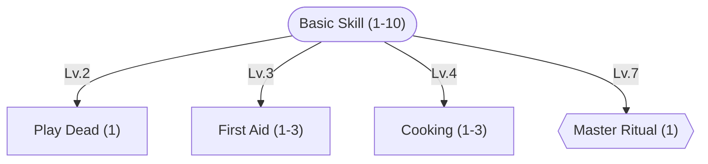

 

Allows to trade with other players.
Allows to chat with other players via public and whisper chat.
Allows to express emotes.
Allows sitting to double HP & Mana recovery.
Allows to join and create parties.
Allows to use trade posts.
Allows the user to perform the "Master Ritual".









`+20%/lv` HP healed or `+100 HP/lv` healed



Automatically enabled once Lv. 7 in Basic Skill is reached. Can only be used as long as you are a Novice. Converts 25 [Void Essence](item-list/#void-essence), 5 [Mana Dust](item-list/#mana-dust) and 3 [Clay](item-list#clay) into a [Seal of Mastery](item-list#seal-of-mastery).


## Craftsman Tree

The workbenches, forges and cauldrons of the tradesfolk turn raw ambition into things a player can actually use. Every blade, trinket and bottled miracle a master ever relies on started out as somebody's Craftsman skill paying off.

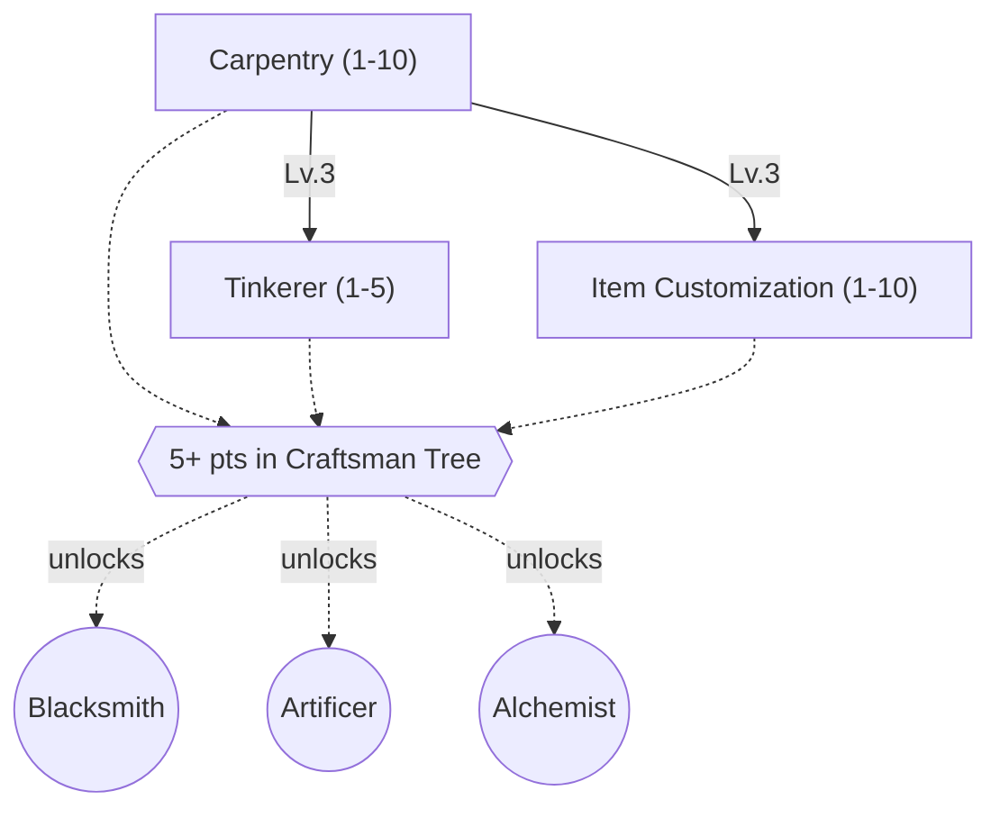

 

`+5%/lv` success chance 
`+10 item lv/lv` of items that can be produced, up to item level 100+ at max rank



You are very skilled in working with tools and raw material. Building structures in the world is very quick for you and the Bestia under your command. 
`Reduce construction time of structures by -10% / Lv`



You are able to rework items to put slots in them in which runes can be slottet. Requires an [Engraving Set](item-list/#engraving-set) which will be consumed in the process.


### Blacksmith

Steel remembers who beat it into shape. Blacksmiths turn raw ore into finest weaponry and armor which protects its carrier even in the mid of of a manastorm.



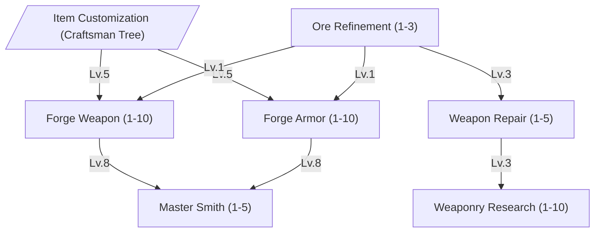

 

`+30 ore lv/lv` that can be refined, up to ore level 90+ at max rank









`+4%/lv` success chance when upgrading a weapon or armor 
`+1%/lv` success chance when forging 
`+2 ATK/lv` and `+2%/lv` accuracy while any forged weapon is wielded



`+20 item lv/lv` of equipment that can be repaired, up to item level 100+ at max rank



`+5%/lv` Weapon/Armor forging chance 
`+5%/lv` upgrade chance


### Artificer

Where Blacksmiths hammer steel, Artificers coax it into remembering spells. This path enscribes magic onto items, binds it to triggers, and crystalizes raw mana into shards other professions can build on.



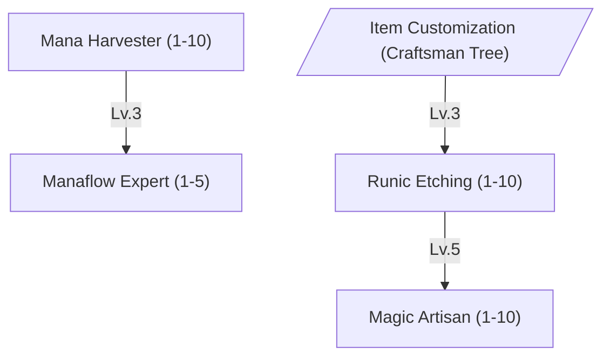

 

Level 1 enables you to place a Mana Harvester 
`-5%/lv` harvesting time 
`+3%/lv` crystal yield



`-4%/lv` chance a crystal shatters during refinement 
Higher levels unlock refining higher-grade crystals



`+5%/lv` chance of success 



`+4%/lv` enchantment chance 
`-7%/lv` chance to destroy the item if the binding fails


### Alchemist

Equal parts kitchen and laboratory. Alchemists turn raw ingredients - mundane or mana-soaked - into food, tonics and reagents nobody else can replicate twice. Some carry the first bandages they ever learned to wrap as a Novice all the way into a healer's toolkit.



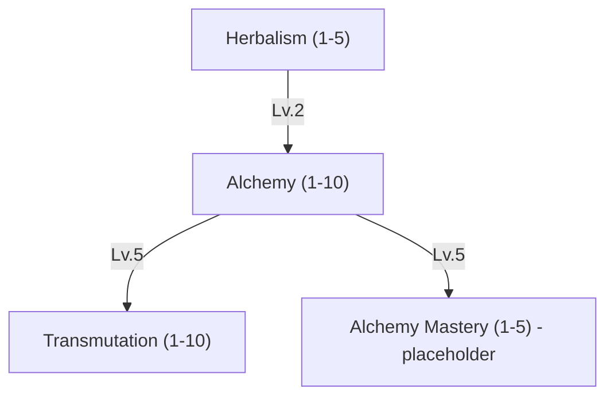

 

Can collect herbs up to level 20
Can collect herbs up to level 40
Can collect herbs up to level 60
Can collect herbs up to level 80
Can collect herbs up to level 100+



Can craft basic potions and elixirs up to level 10. Allows you to install Alchemist Workbenches.
Can craft potions and elixirs up to level 20.
Can craft potions and elixirs up to level 30.
Can craft potions and elixirs up to level 40.
Can craft potions and elixirs up to level 50.
Can craft potions and elixirs up to level 60.
Can craft potions and elixirs up to level 70.
Can craft potions and elixirs up to level 80.
Can craft potions and elixirs up to level 90.
Can craft potions and elixirs up to level 100+.



Higher levels unlock transmuting higher-grade infused resources.

Can transmute items up to Lv. 20. Allows you to install Transmutation Workbenches.
Can transmute items up to Lv. 40.
Can transmute items up to Lv. 60.
Can transmute items up to Lv. 80.
Can transmute items up to Lv. 100+.



`+10% / Lv` and `+5% yield / Lv`



`+10% / Speed`


## Survival Tree

Skills which allow the player to keep exploring the world and stay active longer far away from settlements are placed in this skill tree. Foresters live off the land, Prospectors chart what nobody has mapped yet, and Miners dig for what the land is hiding.

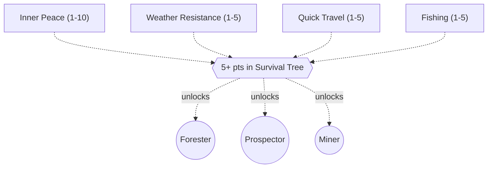

 

`+3%` higher tolerance/lv



`+3%` higher movement speed/lv



`+3% effect/lv`



`+20 fish lv/lv` that can be caught, up to fish level 100+ at max rank


### Forester

At home wherever the trees outnumber the people. Foresters live off the land - felling timber, landing the catch of the day, and striking up a bond with Bestia most masters would call unapproachable.



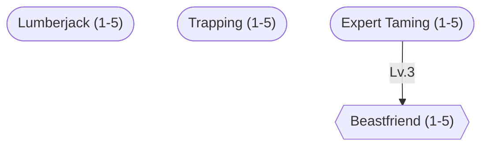

 

Level 1 allows you to install a woodworker cabin. 
`-10% / Lv.` wood gathering time 
`+20% / Lv.` resource drop chance



Level 1 allows you to place a trap. 
`+6% / Lv` chance a snare yields a catch 



Level 1 allows you to place a special Bestia trap. 
`+6% / Lv` chance a snare yields a catch 



`+5%/lv` EXP gain 
`-2%/lv` stamina loss



`+5%/lv` chance to tame


### Prospector

Half surveyor, half treasure hunter. Prospectors chart unclaimed land, feel out resources long before anyone else arrives, and travel heavier and further than sense would recommend.



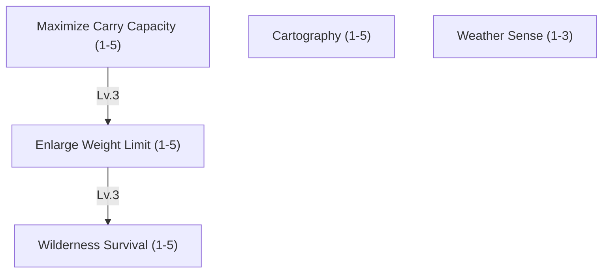

 

`+10%/lv` weight limit



`+10%/lv` weight limit



`-10%/lv` stamina drain in hostile terrain 
`-10%/lv` environmental hazard damage



`+5min/lv` how far ahead upcoming weather changes can be sensed. Level 1 shows you the current wind direction and speed.



Each level reduces the difficulty of surveying unexplored land.


### Miner

If it's buried, a Miner will find a way to it. Equal parts pickaxe and stubbornness, this path turns raw earth - literally - into opportunity.



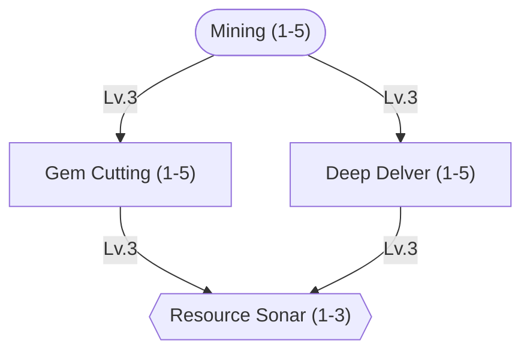

 

Level 1 enables you to place a mining shaft 
`-10%/lv` mining time 
`+20 resource lv/lv` that can be mined, up to resource level 100+ at max rank



Higher levels unlock cutting higher-grade gems 
`-8%/lv` chance to shatter a gem while cutting



`+10% more resources/lv`



Can sense ore and gem deposits through solid rock within 5m / Lv.


## Scholar Tree

The Scholar tree contains skills which help with sensing the world's events and performing rituals to shape the face of the Bestia world itself. Traders keep the gears of commerce turning while Sages chase magic to its source - enscribing, discovering, and eventually bending distance itself.

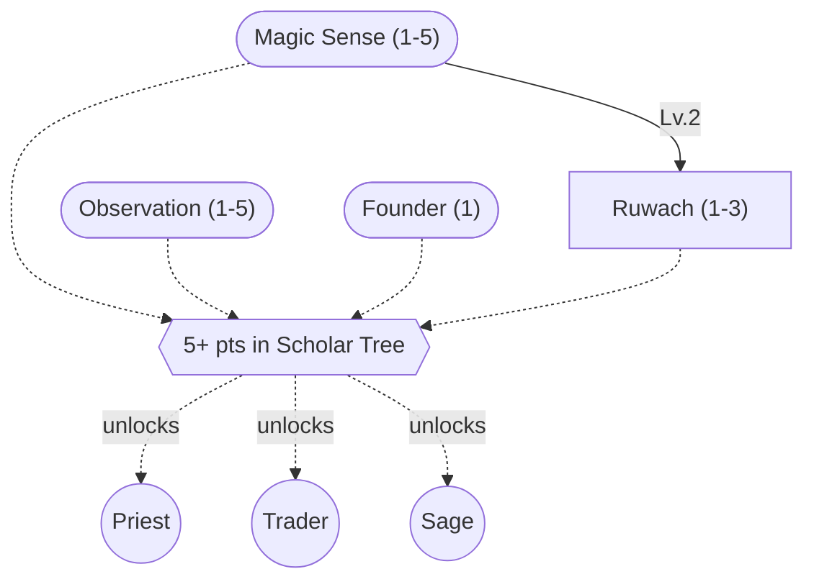

 




You can detect the direction and distance of nearby world events like mana rifts which open, spawned bosses or other world changing events.
Level 1 let you place an observatory. `1km/Lv detection distance`.






`+3m/lv` detection range 
Higher levels shorten how long a concealed target needs to hold still before being revealed


### Priest

Priests channel mana into blessings that keep a party alive - restoring health, lifting curses, and bolstering the vitality of Bestia out in the field.



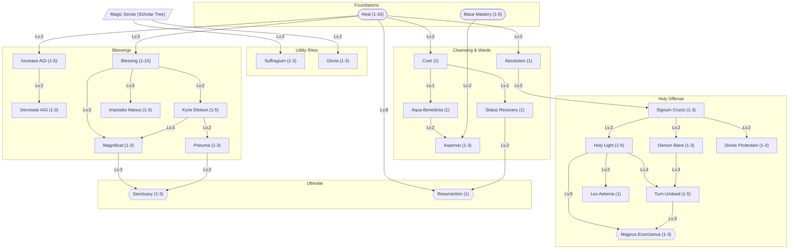

 

`+8%/lv` HP healed 
`-0.2s/lv` cast time



`-10% / Lv` cast time to a target ally for the next spell in `30s`



`+5 WILL / Lv` to party members within range for `30s / Lv`









`+2 ATK/lv` while a mace or similar blunt weapon is equipped






`+1 STR/INT/DEX per Lv` for `60s + 20s / Lv`



`3 + 1 / Lv AGI`, `15% Movement Speed`, `+1% ASPD / Lv`, Duration `60s + 20s / Lv`



`-4%/lv` movement and attack speed to the target for a short duration



`+1 hit absorbed/lv` 
`+5%/lv` damage absorbed per hit



`-5%/lv` DEF to undead and demon-type enemies within range for a short duration



`+1m radius/lv` 
Higher levels extend how long the veil holds



`+10%/lv` MATK



`+4%/lv` damage against demon and undead-type enemies



`-5%/lv` damage taken from demon and undead-type enemies



`+5 ATK and MATK/lv` to the target for a short duration






Higher levels extend the duration and allow higher-grade Holy Water to be used for a stronger imbue



`+8%/lv` damage against undead-type enemies 
Higher levels raise the chance of an instant kill against sufficiently weak undead






`+10%/lv` HP and Mana regeneration to party members within range for a short duration



`+15%/lv` MATK 
`+10%/lv` additional damage against demon and undead-type enemies



`+5%/lv` max HP healed per tick to allies standing within 
Deals equivalent holy damage per tick to undead and demon-type enemies standing within





### Trader

Coin has its own kind of magic. Traders read markets instead of mana flows, linking auction houses together, minting the coin everyone else trades in, and looking out for goods that might otherwise walk off on their own.




You can identify an item. 
+20 Item Lv / Lv



`+5%/lv` chance of recycling items 



`+10% yield/ Lv` amount minted per batch



`+1 / Lv.` total trading posts that can be created by this Master 
`+5% / Lv.` maximum fee that can be set



`+1 / Lv` players that can be linked. To get linked from other players at least level 1 in this skill is required.



`+20% / Lv` honor penalty for robbers


### Sage

Books, wards and long nights spent staring into scrying bowls. Sages study magic itself - discovering it, enscribing it, binding it, and eventually learning to fold distance in on itself with teleportation and portals.



- Elemental Fields _(placeholder)_
- Free Cast - move while casting _(placeholder)_
- Endow Weapons elemental (3 level) _(placeholder)_
- Read Enemy _(placeholder)_
- Mana Drain _(placeholder)_
- Mana Transfer _(placeholder)_
- Weather Control _(placeholder)_








The base success chance depends on the level of the attack being enscribed and is further modified by skill level, equipment and intelligence (`INT / 2 + WIL / 4`):

| Attack Level | Base Success |
| ------------ | ------------ |
| 1–20         | 80%          |
| 21–40        | 70%          |
| 41–60        | 60%          |
| 61–80        | 50%          |
| 81–90        | 10%          |
| 91–100       | -20%         |
| 101+         | -40%         |

A negative base means the extraction is impossible on raw talent alone and only becomes viable with strong bonuses from intelligence, skill level and equipment.





{{< skill name="Teleport" maxLevel="5" requires="Spell Binding Lv. 3"
    description="Can teleport own bestias over a distance. To teleport somewhere one needs to setup Teleport Runes which form some kind of magical anchor - the same kind of anchor a Spell Binder learns to set for alarms and traps. They can be used as targets when trying to teleport. The teleportation gets harder and more error prone the longer distances are tried to travel. The teleported entity also gets a debuff which will prevent it from teleporting again for some time." >}}



1 person/lv can use the portal


## Warrior Tree

Where the other trees build, gather and study, the Warrior tree is built to fight. Wizards burn the battlefield down with elemental and arcane fury, Brawlers shrug off punishment nobody should be able to shrug off, Hunters strike up a bond with wild Bestia most people just run from, Assassins vanish before the first drop of blood even hits the ground, Knights plant themselves between danger and everyone else, and Bards and Dancers turn a battlefield into something worth listening to.





`-2%/lv` reduced physical damage



`-2%/level` reduced damage


### Wizard

Fire, water, wind, earth, and the deeper currents of holy and dark magic - Wizards bend all of it into a weapon, at the cost of the armor most masters would rather keep.



- Spell Breaker _(placeholder)_


60% chance to remove all buffs.
80% chance to remove all buffs.
100% chance to remove all buffs.



`+3% damage/lv`



`+5% damage/lv`



`+3% damage/lv`



`+3% damage/lv`



`+3% damage/lv`



`+3% damage/lv`



`+20% MATK/level` 
`-20% MDEF/level`


### Brawler

No fancy footwork, no elemental theatrics - just the kind of toughness that keeps going long after everyone else has called it quits.




`-10%/lv` reduced stamina reduction 
`+10%/lv` increased stamina regeneration



Once every few minutes, can trigger a burst that restores a portion of Stamina immediately.
The burst also restores a small portion of HP.
Cooldown between bursts is reduced.



Once per cooldown, an otherwise lethal hit instead leaves the Bestia at 1 HP.
Stagger and knockback effects are greatly reduced while above 50% HP.
Cooldown of the lethal-hit save is reduced.


### Hunter

Neither predator nor prey, exactly. Hunters move like the terrain isn't there and build the kind of bond with wild Bestia that makes taming look almost effortless.




`-10%/lv` detection range of wild Bestia 
`+8%/lv` damage on an ambushing first strike



`-20%/level` reduced movement reduction



Can follow the trail of any Bestia across long distances, even hours after it passed.
Gains a critical strike bonus against a tracked target.
Trail-tracking range and duration are both doubled.


### Assassin

Masters of hidden infiltration. They can deal high amount of single target damage and know a lot about poisons to coat their weapons.



- Strip Weapons _(placeholder)_
- Dual Wield _(placeholder)_
- Hide _(placeholder)_
- Cloak _(placeholder)_
- Poison Research _(placeholder)_
- Enchant Poison _(placeholder)_




### Knight

Where a Brawler trusts bare knuckles and a Wizard trusts raw mana, a Knight trusts steel - a lot of it, worn on the body and swung in the hand. This is the tree for masters who would rather stand at the front of a fight than avoid it.




`+3 ATK/lv` with heavy melee weapons 
`-10%/lv` weapon size accuracy penalty



`+2 DEF/lv` while wearing heavy armor 
`-5%/lv` movement and attack speed penalty from heavy armor weight



`+10%/lv` chance-to-target bonus against the Knight 
Higher levels extend the duration and the range at which enemies can be provoked



`-15%` incoming physical damage, `-50%` movement speed while active.
Damage reduction improves to `-25%` and the movement penalty eases to `-30%`.
Damage reduction improves to `-35%` and a portion of blocked damage is returned to the attacker.



`+20%/lv` damage compared to a normal attack 
`+5%/lv` chance to stagger the target on hit



`+4%/lv` chance to fully block a physical hit while a shield is equipped



`-0.5s/lv` cooldown 
Deals damage and applies a short [Provoke](#skill-provoke) effect on impact



Once activated, gains `+20%` DEF and `+20%` ATK for a short duration.
Duration is extended and the Knight becomes immune to stagger and knockback while active.
Cooldown is reduced and a fully blocked hit (via [Auto Guard](#skill-auto-guard)) refreshes the remaining duration.


### Bard

Where a Sage studies magic to bend it, a Bard studies it to sing along with it. Every note carried on the wind can steady an ally's arm or unstring an enemy's nerve. A Bard alone can hearten a party; a Bard standing next to a [Dancer](#dancer) can do quite a lot more.




`+2 ATK/lv` while an instrument is equipped 
`+3%/lv` range and effect strength of songs



`+1 tile/lv` area of effect for songs 
`+10%/lv` duration of song effects



`+2%/lv` ATK and MATK to party members within range while the song plays



`+2%/lv` movement and attack speed to party members within range while the song plays



`-3%/lv` HIT and ASPD to enemies within range while the song plays



`+2%/lv` mana drain per tick to enemies within range while the song plays



Small chance per tick to put an enemy in range to sleep.
Sleep chance and range are increased.
Sleep chance is increased further and the effect ignores a portion of the target's status resistance.



`+3%/lv` chance per tick to grant a party member within range a small heal or cleanse a negative status



While performing near a master with Dancer skills active, active songs and dances gain `+15%` effect strength for both performers' parties.
The bonus increases to `+25%` and the combined range is extended.
The bonus increases to `+40%` and a single additional song or dance from each performer can be active at the same time.


### Dancer

Where a Bard leans on breath and instrument, a Dancer leans on footwork and nerve - closing the distance, reading an enemy's weak step, and turning a whip into an argument nobody wins. A Dancer alone can unravel a fight from the inside; a Dancer standing next to a [Bard](#bard) can do quite a lot more.




`+2 ATK/lv` while a whip is equipped 
`+3%/lv` effective reach



`+2%/lv` FLEE while wearing light armor or no armor



`-3%/lv` movement and attack speed to the struck target for a short duration



`-3%/lv` DEF and SDEF to the struck target for a short duration



`+2%/lv` chance per hit to apply a poison dealing damage over time



`+2%/lv` FLEE to party members within range while the dance plays



`+2%/lv` movement speed and `-2%/lv` stamina drain to party members within range while the dance plays



Small chance to force the target to attack a random nearby enemy instead of the Dancer's party for a short duration.
Chance and duration are increased.
Chance is increased further and the effect ignores a portion of the target's status resistance.



While performing near a master with Bard skills active, active songs and dances gain `+15%` effect strength for both performers' parties.
The bonus increases to `+25%` and the combined range is extended.
The bonus increases to `+40%` and a single additional song or dance from each performer can be active at the same time.

