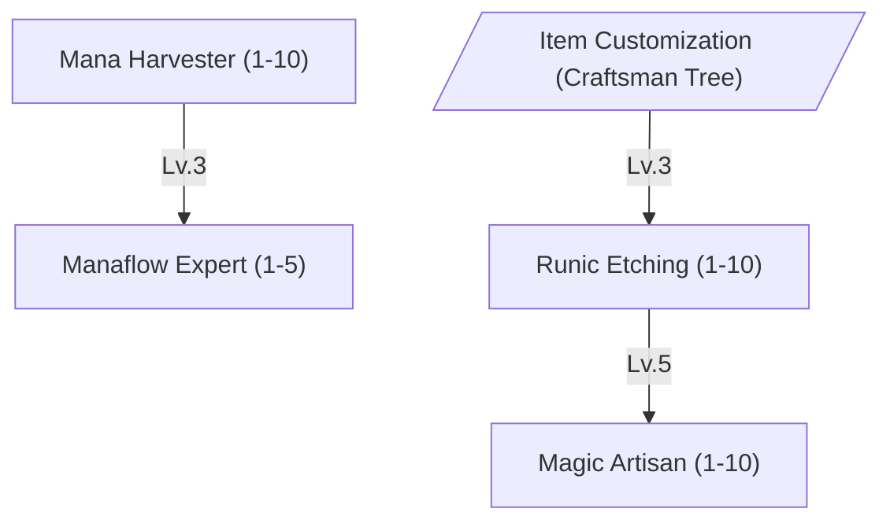
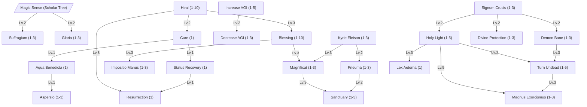
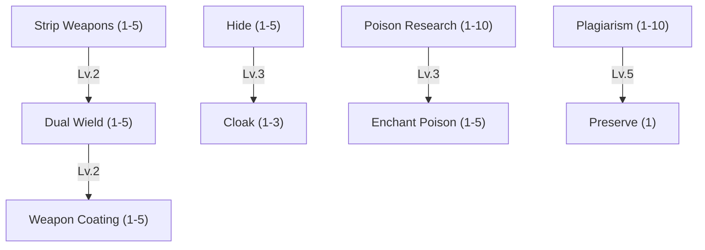
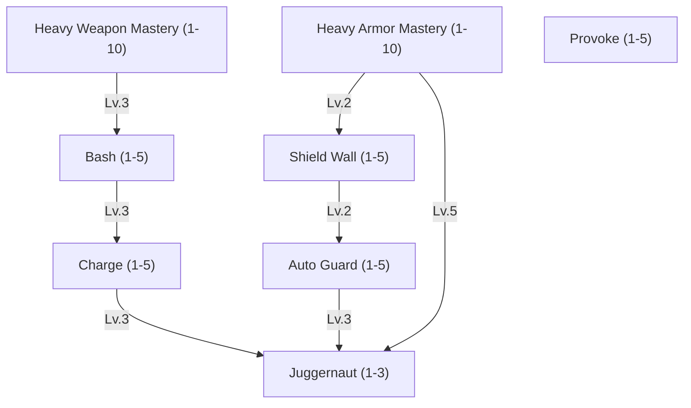

These sub-trees were cut from the [Bestia Master](/docs/mechanics/master/) page to reduce the scope of the initial
release. This page is never rendered. Each section below is the original text, unchanged, so it can be pasted back as is.

To unpark a sub-tree:

1. Paste its section back into `master.md` at the place given in the table.
2. Un-comment its node and its `Gate -.->|unlocks|` arrow in the parent tree diagram (marked `%% parked`).
3. Restore its mention in the parent tree's intro text.

| Sub-tree  | Parent tree    | Paste after   |
| --------- | -------------- | ------------- |
| Artificer | Craftsman Tree | `### Blacksmith` |
| Priest    | Scholar Tree   | the Scholar base skills, before `### Trader` |
| Assassin  | Warrior Tree   | `### Wizard` and the parked Brawler/Hunter comment |
| Knight    | Warrior Tree   | `### Assassin` |

Anchors inside these sections (`#skill-...`, `#craftsman-tree`, ...) point into `master.md` and only resolve once the
section is back there.

### Artificer

Where Blacksmiths hammer steel, Artificers coax it into remembering spells. This path inscribes magic onto items, binds it to triggers, and crystalizes raw mana into shards other professions can build on.





<br>


Level 1 enables you to craft, place and use a Mana Harvester.

| Lv. | Harvesting Time Reduction | Crystal Yield | Total Active Harvesters |
| --- | ------------------------- | ------------- | ----------------------- |
| 1   | 5%                        | +3%           | 1                       |
| 2   | 10%                       | +6%           | 1                       |
| 3   | 15%                       | +9%           | 1                       |
| 4   | 20%                       | +12%          | 2                       |
| 5   | 25%                       | +15%          | 2                       |
| 6   | 30%                       | +18%          | 2                       |
| 7   | 35%                       | +21%          | 3                       |
| 8   | 40%                       | +24%          | 3                       |
| 9   | 45%                       | +27%          | 3                       |
| 10  | 50%                       | +30%          | 4                       |




Level 1 enables you to craft, place and use a Crystal Lathe. Cast time depends on the processed material.

| Lv. | Success Chance |
| --- | -------------- |
| 1   | 4%             |
| 2   | 8%             |
| 3   | 12%            |
| 4   | 16%            |
| 5   | 20%            |





Cast time depends on the level of the Bestia. Level 1 allows you to create a Carving Table.

| Lv. | Success Chance |
| --- | -------------- |
| 1   | +5%            |
| 2   | +10%           |
| 3   | +15%           |
| 4   | +20%           |
| 5   | +25%           |
| 6   | +30%           |
| 7   | +35%           |
| 8   | +40%           |
| 9   | +45%           |
| 10  | +50%           |





Level 1 allows you to create an Enchantment Altar. Cast time depends on the item level and the enchantment you want to use.

| Lv. | Enchantment Chance | Destroy Chance on Failed Bind |
| --- | ------------------ | ----------------------------- |
| 1   | +4%                | 40%                           |
| 2   | +8%                | 37%                           |
| 3   | +12%               | 34%                           |
| 4   | +16%               | 31%                           |
| 5   | +20%               | 28%                           |
| 6   | +24%               | 25%                           |
| 7   | +28%               | 22%                           |
| 8   | +32%               | 19%                           |
| 9   | +36%               | 16%                           |
| 10  | +40%               | 13%                           |



### Priest

Priests channel mana into blessings that keep a party alive - restoring health, lifting curses, and bolstering the vitality of Bestia out in the field.





<br>


Heals a target's HP for `[(BaseLV+INT)/8]*(4+8*SkillLV)`. When used against Undead property monsters, it is a holy attack that ignores SMDEF and INT, but deals only half damage - that is,
`HealValue * ElementModifier / 2`. Targeting a monster with a healing spell has to be deliberate, so the client asks
for a modifier key rather than a plain click.

| Lv. | Mana Cost |
| --- | --------- |
| 1   | 13        |
| 2   | 16        |
| 3   | 19        |
| 4   | 22        |
| 5   | 25        |
| 6   | 28        |
| 7   | 31        |
| 8   | 34        |
| 9   | 37        |
| 10  | 40        |




Applies to the next spell cast by the target ally within `30s`.

| Lv. | Cast Time Reduction |
| --- | ------------------- |
| 1   | 10%                 |
| 2   | 20%                 |
| 3   | 30%                 |





| Lv. | WIL Bonus | Duration |
| --- | --------- | -------- |
| 1   | +5        | 30s      |
| 2   | +10       | 60s      |
| 3   | +15       | 90s      |











| Lv. | STR/INT/DEX | Duration |
| --- | ----------- | -------- |
| 1   | +1          | 80s      |
| 2   | +2          | 100s     |
| 3   | +3          | 120s     |
| 4   | +4          | 140s     |
| 5   | +5          | 160s     |
| 6   | +6          | 180s     |
| 7   | +7          | 200s     |
| 8   | +8          | 220s     |
| 9   | +9          | 240s     |
| 10  | +10         | 260s     |




Grants a flat `+15%` Movement Speed at any level, plus the table below. The movement bonus **stacks** with a
Prospector's [Quick Travel](#skill-quick-travel), so a well-buffed traveller adds both.

| Lv. | AGI | ASPD | Duration |
| --- | --- | ---- | -------- |
| 1   | +4  | +1%  | 80s      |
| 2   | +5  | +2%  | 100s     |
| 3   | +6  | +3%  | 120s     |
| 4   | +7  | +4%  | 140s     |
| 5   | +8  | +5%  | 160s     |





| Lv. | Movement/Attack Speed Reduction |
| --- | ------------------------------- |
| 1   | 4%                              |
| 2   | 8%                              |
| 3   | 12%                             |





| Lv. | Hits Absorbed | Damage Absorbed per Hit |
| --- | ------------- | ----------------------- |
| 1   | 1             | +10% of HP              |
| 2   | 2             | +20% of HP              |
| 3   | 3             | +30% of HP              |




Higher levels extend how long the veil holds.

| Lv. | Radius |
| --- | ------ |
| 1   | +1m    |
| 2   | +2m    |
| 3   | +3m    |





| Lv. | DEF Reduction | Extra vs Demon/Undead | Duration |
| --- | ------------- | --------------------- | -------- |
| 1   | 10%           | 10%                   | 30s      |
| 2   | 20%           | 20%                   | 45s      |
| 3   | 30%           | 30%                   | 60s      |





| Lv. | MATK |
| --- | ---- |
| 1   | +10% |
| 2   | +20% |
| 3   | +30% |
| 4   | +40% |
| 5   | +50% |





| Lv. | Damage vs Demon/Undead |
| --- | ---------------------- |
| 1   | +8%                    |
| 2   | +16%                   |
| 3   | +24%                   |





| Lv. | Damage Taken Reduction from Demon/Undead |
| --- | ---------------------------------------- |
| 1   | 10%                                      |
| 2   | 20%                                      |
| 3   | 30%                                      |





| Lv. | ATK and MATK |
| --- | ------------ |
| 1   | +5           |
| 2   | +10          |
| 3   | +15          |







Higher levels extend the duration and allow higher-grade Holy Water to be used for a stronger imbue.



Higher levels raise the chance of an instant kill against sufficiently weak undead.

Inflicts single target Holy, armor piercing damage. If the target is an Undead property monster, this spell has a chance of immediately ending its existence.

| Lv. | Base Chance of Effect |
| --- | --------------------- |
| 1   | 8%                    |
| 2   | 16%                   |
| 3   | 24%                   |
| 4   | 32%                   |
| 5   | 40%                   |

```text
Chance of Effect = [Base_Chance_of_Effect + (Lv ÷ 10) + (INT ÷ 10) + (WIL ÷ 10) + {1 − (Target_HP ÷ Target_MaxHP)} × 20]%
Damage = Base_Damage + Base_Lv + INT
```








| Lv. | HP/Mana Regeneration |
| --- | -------------------- |
| 1   | +10%                 |
| 2   | +20%                 |
| 3   | +30%                 |





| Lv. | MATK | Bonus Damage vs Demon/Undead |
| --- | ---- | ---------------------------- |
| 1   | +15% | +10%                         |
| 2   | +30% | +20%                         |
| 3   | +45% | +30%                         |




Deals equivalent holy damage per tick to undead and demon-type enemies standing within.

| Lv. | Max HP Healed per Tick |
| --- | ---------------------- |
| 1   | +5%                    |
| 2   | +10%                   |
| 3   | +15%                   |






### Assassin

Masters of hidden infiltration. They can deal high amount of single target damage and know a lot about poisons to coat their weapons.





<br>


Fails outright against a target protected by [Weapon Coating](#skill-weapon-coating).

| Lv. | Strip Chance | Re-equip Blocked |
| --- | ------------ | ---------------- |
| 1   | 20%          | 5s               |
| 2   | 30%          | 10s              |
| 3   | 40%          | 15s              |
| 4   | 50%          | 20s              |
| 5   | 60%          | 25s              |





The off-hand weapon always swings for less than the main hand. Rank buys that gap back.

| Lv. | Off-Hand Damage | Attack Speed Penalty |
| --- | --------------- | -------------------- |
| 1   | 30%             | 25%                  |
| 2   | 40%             | 20%                  |
| 3   | 50%             | 15%                  |
| 4   | 60%             | 10%                  |
| 5   | 70%             | 5%                   |





Protects both hands at once. While it holds, [Strip Weapons](#skill-strip-weapons) cannot take either weapon.

| Lv. | Equipment Damage Reduction | Strip Resistance |
| --- | -------------------------- | ---------------- |
| 1   | 20%                        | 100%             |
| 2   | 40%                        | 100%             |
| 3   | 60%                        | 100%             |
| 4   | 80%                        | 100%             |
| 5   | 100%                       | 100%             |





Breaks the moment the Assassin moves or attacks. Revealed by [Ruwach](#skill-ruwach) and by a [Sense](#skill-sense) cast in range.

| Lv. | Mana Drain per Second | Detection Resistance |
| --- | --------------------- | -------------------- |
| 1   | 3                     | 10%                  |
| 2   | 2.5                   | 20%                  |
| 3   | 2                     | 30%                  |
| 4   | 1.5                   | 40%                  |
| 5   | 1                     | 50%                  |





Still breaks on attacking. A Priest's [Ruwach](#skill-ruwach) strips it outright.

| Lv. | Movement Speed | Mana Drain per Second |
| --- | -------------- | --------------------- |
| 1   | 50%            | 6                     |
| 2   | 70%            | 5                     |
| 3   | 90%            | 4                     |





The poisons themselves are not made here - they are ordinary Alchemist goods, brewed with
[Alchemy](#skill-alchemy) and bought like any other reagent. This skill only governs what an Assassin gets out of them.

| Lv. | Poison Damage | Poison Resistance |
| --- | ------------- | ----------------- |
| 1   | +10%          | +5%               |
| 2   | +20%          | +10%              |
| 3   | +30%          | +15%              |
| 4   | +40%          | +20%              |
| 5   | +50%          | +25%              |
| 6   | +60%          | +30%              |
| 7   | +70%          | +35%              |
| 8   | +80%          | +40%              |
| 9   | +90%          | +45%              |
| 10  | +100%         | +50%              |





Applies the [Poison](/docs/mechanics/statusvalues/#status-effects) status effect on hit. The poison item decides how hard it
bites; this skill decides how often it lands.

| Lv. | Poison Chance per Hit |
| --- | --------------------- |
| 1   | 5%                    |
| 2   | 10%                   |
| 3   | 15%                   |
| 4   | 20%                   |
| 5   | 25%                   |





| Lv. | Copy Chance | Max Spell Level Copied |
| --- | ----------- | ---------------------- |
| 1   | 5%          | 10                     |
| 2   | 10%         | 20                     |
| 3   | 15%         | 30                     |
| 4   | 20%         | 40                     |
| 5   | 25%         | 50                     |
| 6   | 30%         | 60                     |
| 7   | 35%         | 70                     |
| 8   | 40%         | 80                     |
| 9   | 45%         | 90                     |
| 10  | 50%         | 100+                   |






### Knight

Where a Brawler trusts bare knuckles and a Wizard trusts raw mana, a Knight trusts steel - a lot of it, worn on the body and swung in the hand. This is the tree for masters who would rather stand at the front of a fight than avoid it.





<br>


| Lv. | ATK (heavy melee weapons) | Accuracy Penalty Reduction |
| --- | ------------------------- | -------------------------- |
| 1   | +3                        | 10%                        |
| 2   | +6                        | 20%                        |
| 3   | +9                        | 30%                        |
| 4   | +12                       | 40%                        |
| 5   | +15                       | 50%                        |
| 6   | +18                       | 60%                        |
| 7   | +21                       | 70%                        |
| 8   | +24                       | 80%                        |
| 9   | +27                       | 90%                        |
| 10  | +30                       | 100%                       |





| Lv. | Hard DEF (heavy armor) | Speed Penalty Reduction |
| --- | ---------------------- | ----------------------- |
| 1   | +2                     | 5%                      |
| 2   | +4                     | 10%                     |
| 3   | +6                     | 15%                     |
| 4   | +8                     | 20%                     |
| 5   | +10                    | 25%                     |
| 6   | +12                    | 30%                     |
| 7   | +14                    | 35%                     |
| 8   | +16                    | 40%                     |
| 9   | +18                    | 45%                     |
| 10  | +20                    | 50%                     |




Higher levels extend the duration and the range at which enemies can be provoked.

| Lv. | Chance-to-Target Bonus |
| --- | ---------------------- |
| 1   | +10%                   |
| 2   | +20%                   |
| 3   | +30%                   |
| 4   | +40%                   |
| 5   | +50%                   |




Reduces incoming physical damage by `15%` and movement speed by `50%` while active.
Damage reduction improves to `25%` and the movement penalty eases to `30%`.
Damage reduction improves to `35%` and a portion of blocked damage is returned to the attacker.




| Lv. | Bonus Damage | Stagger Chance |
| --- | ------------ | -------------- |
| 1   | +20%         | +5%            |
| 2   | +40%         | +10%           |
| 3   | +60%         | +15%           |
| 4   | +80%         | +20%           |
| 5   | +100%        | +25%           |





| Lv. | Full Block Chance |
| --- | ----------------- |
| 1   | +4%               |
| 2   | +8%               |
| 3   | +12%              |
| 4   | +16%              |
| 5   | +20%              |




Deals damage and applies a short [Provoke](#skill-provoke) effect on impact.

| Lv. | Cooldown Reduction |
| --- | ------------------ |
| 1   | 0.5s               |
| 2   | 1.0s               |
| 3   | 1.5s               |
| 4   | 2.0s               |
| 5   | 2.5s               |




Once activated, gains `+20%` DEF and `+20%` ATK for a short duration.
Duration is extended and the Knight becomes immune to stagger and knockback while active.
Cooldown is reduced and a fully blocked hit (via [Auto Guard](#skill-auto-guard)) refreshes the remaining duration.

