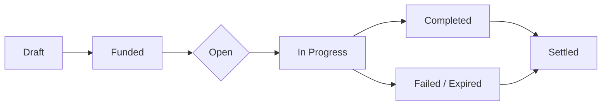

# Questing

Questing in **Bestia** is primarily **player-driven**. Players write out rewards for tasks they need done — gathering
resources, transporting goods from A to B, hunting a troublesome Bestia and other players pick them up. The world
itself only rarely steps in, when the simulation produces a genuine emergency such as a [mana rift](/docs/mechanics/factions)
tearing open next to a settlement.

Whether a quest is written by a player or born from the world, it is always the same underlying thing: a **contract**.
There are no magical quest markers or interfaces that teleport you to your objective — a quest is an agreement in the
world, and you complete it by acting in the world. This keeps questing aligned with the
[consistent fantasy simulation](/docs/mechanics/overview#consistent-fantasy-simulation) principle.



# Player Commissions

The vast majority of quests are **commissions** written by players. The loop is:

## Funding and Escrow

Before a commission is ever visible to other players, the issuer must **fund it up front**. The reward — gold and/or
items — is handed to a broker NPC (this can also be a blackboard in a town). No funded contract means no quest.

This single rule is the backbone of trust in the system: **every commission a player sees on a board is already paid
for.** The broker keeps a `5%` cut of the reward for managing the contract, consistent with the
[reward calculation](/docs/server/quests#reward-calculation).

Rewards are bounded by the server-wide reward formula (which factors in available money and the issuer's wealth) so that
commissions cannot be used to distort the [economy](/docs/mechanics/economy-trade). A commission may offer _more_ than the
formula's baseline, but never a trivial amount for a hard task.

## Objective Types

Every objective is verifiable from **physical world state** — never from self-reporting. The world simulation already
emits the events needed to confirm completion (an item delivered, a Bestia deactivated, a location reached).



| Type          | Description                                                                                          |
| ------------- | ---------------------------------------------------------------------------------------------------- |
| **Gather**    | Deliver _N_ units of a resource (optionally of a minimum quality) to a location or postbox.          |
| **Transport** | Move a sealed cargo item from A to B. Weight and perishability make this a genuine logistics puzzle. |
| **Bounty**    | Deactivate a specific Bestia guardian or clear a named threat.                                       |
| **Escort**    | Accompany an NPC or player-Bestia safely to a destination.                                           |



## Open vs. Assigned

The fulfilment model depends on the objective type:

- **Open commissions** (used for **Gather**): anyone may work the task, and the **first valid delivery wins** the pot.
  This suits stockpiling goals where many hands help and racing is harmless.
- **Assigned commissions** (used for **Transport** and **Escort**): the contract **locks to a single accepter** on
  acceptance, with a deadline. To make this trustworthy, the accepter posts **collateral** — a small stake that is
  forfeited to the issuer if they fail or abandon the task. This protects time-critical deliveries from being blocked by
  someone who accepts and then stalls.

**Bounty** commissions may be posted either way depending on the issuer's preference.

## Level Range

The suitable level range for a commission is **derived automatically** from the objective's difficulty, rather than set
by the issuer. This keeps rewards honest and prevents luring under-levelled players into lethal tasks.

## Rewards, Experience and Settlement

Rewards are delivered through the [postal system](/docs/mechanics/economy-trade#postal-system) — you do not report back to
a magical quest-giver. On failure or expiry, escrow returns to the issuer minus fees, and any collateral posted by a
failed accepter is paid to the issuer as compensation.

Experience deserves special care. Player commissions **do not let issuers mint experience**. Instead, any XP reward is
drawn from a **capped NPC/world pool** scaled to the automatically-derived difficulty of the task.



## Discovery

Finding commissions stays physical and range-limited, matching the postal system's locality rules:

- **Bulletin boards** at settlements
- **Town-crier NPCs** and tavern chatter announcing local needs
- **Classical NPC interaction**
- The **offline mobile companion**, to browse commissions and pre-stage your Bestia team before logging in

There is deliberately no global, world-spanning "quest finder." If you want to know what is needed far away, you travel,
send word, or own the [maps](/docs/mechanics/economy-trade#sending-and-receiving) to see distant boards.

# World Events

Occasionally the world itself generates a quest. These are **rare and emergent** — never on a fixed timer. A lightweight
regional **Director** watches aggregate simulation state (mana density, threat level, unattended rift activity), and when
a threshold is crossed it instantiates a **public contract** open to everyone and scored by contribution.



Mana in a region has built up past a safe limit and a rift tears open, pouring hostile Bestias toward a nearby
settlement. The whole area is called to close the rift - players are rewarded by their contribution (damage dealt,
seals placed, time held), paid from a settlement, faction or world treasury rather than any single issuer.


Sustained rift activity leaves the surroundings of a large city crawling with high-level Bestias. Players who help thin
them out rise in the city's favor and gain access to better trade, experience and gold.



## Faction-Contested by Design

World events are **not purely cooperative** — they hook directly into the [factions](/docs/mechanics/factions):

- **The Chaos** _wants_ rifts open and may have caused the mana build-up in the first place; they can defend or even
  widen a rift.
- **The Order** profits from sealing it.
- **The Harmony** seeks to stabilise the region without fully suppressing the mana flow. Rather putting it into a stasis.

So the same rift is a defend-quest for one faction and a sabotage opportunity for another. This turns world events into
emergent PvPvE flashpoints instead of scripted set-pieces.

Crucially, the **frequency of these events is itself player-driven**: because Chaos players opening rifts is what raises
the regional mana that trips the Director's threshold, world events stay rare _by design_ - gated behind accumulated
player behaviour rather than a hardcoded cooldown.

# How Completion Is Verified

Both player commissions and world events run on the same top-level machinery, which fits the event-based
[server architecture](/docs/server/ai):

1. A contract is a small **state machine** (`Draft → Funded → Open/Assigned → In Progress → Completed | Failed | Expired
→ Settled`).
2. Objectives are expressed as **composable predicates** over events the simulation already emits — for example
   `ItemDelivered(to, type, qty)`, `EntityDeactivated(id)`, or `EntityReached(region)`. The contract subscribes to the
   event bus and evaluates its predicates.
3. World events reuse the identical predicate/state-machine system; only the **funding source** (a treasury pool) and the
   **many-contributor scoring** differ from a single-accepter commission.

This shared foundation also connects naturally to the server's [automatic quest generation and Petri-net / graph-based
objective modelling](/docs/server/quests#automatic-quest-generation).
