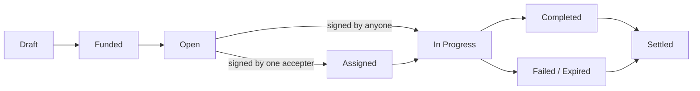

Questing in **Bestia** is primarily **player-driven**. Players post rewards for tasks they need done — gathering
resources, transporting goods from A to B, hunting a troublesome Bestia — and other players pick those tasks up.
Alongside those, NPCs hand out work of their own, and very rarely the world itself intervenes when the simulation
produces a genuine emergency such as a [mana rift](/docs/mechanics/environment/#mana-concentration) tearing open next to
a settlement.

Whether a quest is written by a player, offered by an NPC or born from the world, it is always the same underlying
thing: a **contract**. There are no magical quest markers or interfaces that teleport you to your objective — a quest is
an agreement in the world, and you complete it by acting in the world. This keeps questing aligned with the
[consistent fantasy simulation](/docs/mechanics/overview/#consistent-fantasy-simulation) principle.



# Player Commissions

The vast majority of quests are **commissions** written by players. The loop is:


```mermaid
graph LR
    A[Draft] --> B[Funded]
    B --> C[Open]
    C -->|"signed by one accepter"| D[Assigned]
    C -->|"signed by anyone"| E[In Progress]
    D --> E
    E --> F[Completed]
    E --> G[Failed / Expired]
    F --> H[Settled]
    G --> H
```

## Funding and Escrow

Before a commission is ever visible to other players, the issuer must **fund it up front**. The reward — gold and/or
items — is handed to a broker NPC (this can also be a blackboard in a town). No funded contract means no quest.

This single rule is the backbone of trust in the system: **every commission a player sees on a board is already paid
for.** Two charges are taken at the moment the contract is funded:



| Charge          | Amount                     | Where it goes                                                             |
| --------------- | -------------------------- | ------------------------------------------------------------------------- |
| **Broker cut**  | `5%` of the reward's value | Income for the broker NPC, and from there back into the NPC gold pool     |
| **Posting tax** | `2%` of the reward's value | **Burned** — removed from the economy entirely                            |



Both are always paid in **gold**, even when the reward itself is items, and both follow the rounding rule from the
[economy page](/docs/mechanics/economy-trade/): rounded up to the next whole gold, minimum `1`. The broker cut is the fee
for the service, consistent with the [reward calculation](/docs/server/quests/#reward-calculation). The posting tax is a
sink in the same spirit as [auction listing fees](/docs/mechanics/economy-trade/#how-auctions-work) — small enough to
ignore for a serious contract, large enough that papering the boards with dozens of trivial ones has a running cost.

Rewards are bounded by the server-wide reward formula (which factors in available money and the issuer's wealth) so that
commissions cannot be used to distort the [economy](/docs/mechanics/economy-trade/). A commission may offer _more_ than
the formula's baseline, but never a trivial amount for a hard task. The same
[World Treasury Director](/docs/server/economy/) that keeps NPC payouts backed by NPC earnings supervises these bounds.

## Objective Types

Every objective is verifiable from **physical world state** — never from self-reporting. The world simulation already
emits the events needed to confirm completion (an item delivered, a Bestia deactivated, a location reached). Gather
commissions ask for [natural resources](/docs/mechanics/natural-resources/) or crafted
[items](/docs/mechanics/items/), and transport commissions are bounded by the carrier's
[weight limit](/docs/mechanics/items/#weight-limit).



| Type          | Description                                                                                         |
| ------------- | --------------------------------------------------------------------------------------------------- |
| **Gather**    | Deliver _N_ units of a resource (optionally of a minimum quality) to a location or postbox.         |
| **Transport** | Move a sealed cargo item from A to B. Weight and the deadline make this a genuine logistics puzzle. |
| **Bounty**    | Deactivate a specific Bestia guardian or clear a named threat.                                      |
| **Escort**    | Accompany an NPC or player-Bestia safely to a destination.                                          |



## Difficulty and Level Range

The difficulty of a commission is **derived by the server** from the objective, never declared by the issuer. This keeps
rewards honest and stops issuers from luring under-levelled players into lethal tasks. Difficulty is measured along two
separate axes, because "dangerous" and "long" are not the same problem:

- **Danger** is expressed as a **Contract Danger Level (CDL)**, on the same scale as player levels. It decides **who is
  allowed to sign** the contract.
- **Effort** measures how much work the task is. It decides **how large the reward and the experience** may be, and has
  no influence on who may accept.

Danger comes from the world, not from the wording of the contract. Every region carries a **threat level** — the average
level of the hostile Bestia the simulation currently sustains there, which rises with the region's
[mana concentration](/docs/mechanics/environment/#mana-concentration) because that is what
[Bestia spawn from](/docs/mechanics/bestia/):

```text
CDL(bounty)    = target_level + 5 (if boss) + 2 per elemental level of the target
CDL(gather)    = threat_level of the region holding the nearest viable deposit
CDL(transport) = highest threat_level along the shortest viable route
CDL(escort)    = highest threat_level along the route, +5 if the escortee is more
                 than 10 levels below that threat level
```

The `+5 / +2` terms on a bounty mirror the boss and elemental modifiers used in the
[experience calculation](/docs/mechanics/bestia/#killing-enemies), so a contract's danger and the experience the fight
actually yields cannot drift apart.

Effort reuses formulas the game already has, so a commission's baseline reward stays anchored to what the same work
costs through other systems:

```text
effort(gather)    = N * resource_level
effort(transport) = distance_km * weight_kg   (the same term as the postal freight fee)
effort(escort)    = distance_km
effort(bounty)    = 4 * target_level + 5      (the base experience of the kill)
```

Every commission shows its derived CDL as a **level band** of `CDL - 5` to `CDL + 10`. The lower bound is **enforced**: a
master below `CDL - 5` cannot sign the contract at all, on any board, no matter how the reward tempts them. A five-level
reach upward is deliberately allowed — a well-prepared team punching slightly above its weight is good play, walking a
Lv. 12 master into a Lv. 60 rift valley for someone else's ore is not.



## Open vs. Assigned

Before your work counts, you **sign** the commission at the board or with the broker. Signing is what enforces the level
floor, and it is what lets escrow know who is owed what. The fulfilment model then depends on the objective type:

- **Open commissions** (used for **Gather**): any number of players may sign, and the reward is **paid out pro rata per
  unit delivered** until _N_ units are reached, at which point the contract closes. Five players who each haul a fifth
  of the order each earn a fifth of the pot. This is what makes "many hands help" true rather than a slogan — nobody
  who did real work goes home with nothing because somebody else arrived first.
- **Assigned commissions** (used for **Transport** and **Escort**): the contract **locks to a single accepter** on
  signing, with a deadline, and the accepter posts [collateral](#collateral). Sealed cargo and a named escortee cannot be
  split across several couriers, and time-critical deliveries must not be blocked by someone who signs and then stalls.

**Bounty** commissions may be posted either way. An assigned bounty pays its single accepter. An **open bounty splits the
pot in proportion to damage dealt** to the target, exactly as [kill experience](/docs/mechanics/bestia/#killing-enemies)
is already distributed among damage dealers, and the kill itself is credited to whoever dealt the most damage. Because
both the experience and the gold follow the same proportional rule, there is nothing for a last-hit thief to steal:
sniping the killing blow off a Bestia somebody else ground down earns a proportional sliver and nothing more.

## Collateral

An assigned contract is a promise to be somewhere with something. To make that promise cost something, the accepter
posts **collateral** in gold when they sign:

```text
collateral = max(20 * subject_level, 25% of the reward's value)
```

where `subject_level` is the [item level](/docs/mechanics/items/#item-level) of the cargo for a **Transport**, the level
of the escortee for an **Escort**, and the resource level for an assigned **Gather**. Hauling a Legendary crate is
therefore a serious financial commitment, and the stake is meant to be felt: walking away from the job must be the
expensive option, not the convenient one.

This does mean a fresh player cannot immediately take the high-value hauls, and that is intended. Those contracts are
trusted work, and the trust is bought with gold you already have.

On settlement:

- **Completed on time** — collateral is returned in full, on top of the reward.
- **Failed after a genuine attempt** (the courier was killed en route, the escortee died to something that outmatched
  the team) — **half** the collateral goes to the issuer as compensation, half returns to the accepter. This mirrors the
  [postal insurance](/docs/mechanics/economy-trade/#insurance) logic, which already accepts "the courier died" as a real
  outcome of the world rather than as cheating.
- **Abandoned** — the accepter drops the contract, lets it expire without a serious attempt, or dumps the cargo — the
  **full** collateral goes to the issuer, **and the accepter loses honor**. Brokers keep a ledger and they talk: an
  abandoned contract costs `-5` global honor and `-20` local honor with the broker who held it, on the same scale as the
  other breaches of trust in the [honor system](/docs/mechanics/pvp/#negative-honor). Repeat offenders find the boards
  of a whole town closed to them long before their gold runs out.

## Withdrawing a Commission

A **Draft** can be discarded freely and a **Funded** contract can be withdrawn before it goes on a board, refunding the
escrow minus the charges already taken. Once a commission is **Open**, escrow-as-trust would be worthless if the issuer
could pull it out from under people mid-haul, so withdrawal follows a notice rule:

- Withdrawal takes effect only after a **notice window of 3 [Bestia](/docs/mechanics/environment/#in-game-time) hours**
  (1 real-time hour).
- During the window the commission is flagged as **closing** on every board, but **deliveries still settle normally**.
  The issuer must leave the escrow fully funded until the window closes, so work already in flight is always paid for.
- Whatever escrow is unspent when the window closes returns to the issuer. The broker cut and posting tax are **not**
  refunded — the broker did the work of advertising the contract.

For an **Assigned** contract, the issuer may only cancel with the accepter's agreement, or by paying out the reward in
full. Somebody is already on the road.

## Rewards, Experience and Settlement

Rewards are delivered through the [postal system](/docs/mechanics/economy-trade/#postal-system) — you do not report back
to a magical quest-giver. On failure or expiry, escrow returns to the issuer minus fees, and any collateral forfeited by
a failed accepter is paid to the issuer as compensation.

Experience deserves special care. Player commissions **do not let issuers mint experience**. The server decides the
whole experience reward from the derived difficulty of the task, and it is drawn from a **capped NPC/world pool**:

- The **accepter** earns experience scaled to the contract's CDL and effort, in the same order of magnitude as doing the
  equivalent work uncommissioned — a haul is worth roughly what
  [gathering that resource](/docs/mechanics/bestia/#environment-interaction) is worth, a bounty roughly what
  [the kill](/docs/mechanics/bestia/#killing-enemies) is worth.
- The **issuer** earns a flat `5` experience for posting a funded commission, plus `10%` of the experience paid to the
  accepter once the contract settles successfully. Writing good work into the world is worth rewarding — but a flat
  posting bonus is insignificant to anyone past the first few levels, and the completion share only ever arrives if a
  real player really did the job.



### Why Big Contracts Beat Many Small Ones

Gold and items only ever move between players, so trading favours back and forth costs both sides the broker cut and the
posting tax and gains nobody anything. Experience is the part worth protecting, because it comes from the world pool
rather than from a player's pocket. Three rules make a wall of tiny contracts strictly worse than one real one:

1. **Experience follows the objective, not the paperwork.** Splitting a 500-unit order into ten 50-unit orders yields
   the same total effort and therefore the same total experience, minus ten posting taxes instead of one.
2. **Diminishing returns per role, per day.** For the `n`-th contract a player settles within a
   [Bestia day](/docs/mechanics/environment/#in-game-time), counted separately as issuer and as accepter, the world-pool
   experience is multiplied by `1 / (1 + 0.5 * n)`. The first contract of the day pays full, the third about half, the
   tenth barely registers. Gold and items are untouched — a dedicated hauler can run all day for pay, they simply cannot
   grind levels off the contract board.
3. **The same two names, again and again, stop paying.** Contracts between the same issuer–accepter pair decay much
   harder: `1 / (1 + n_pair)` over a rolling 7 Bestia days. A guild's regular courier is mildly affected. Two accounts
   cycling ten-metre escort contracts at each other are earning nothing within minutes.

On top of that, a contract whose CDL and effort both fall below the trivial floor pays **no** world experience at all —
only the gold its issuer chose to attach. Work has to be work.



## Discovery

Finding commissions stays physical and range-limited, matching the postal system's locality rules:

- **Bulletin boards** at settlements
- **Town-crier NPCs** and tavern chatter announcing local needs
- **Classical NPC interaction**

There is deliberately no global, world-spanning "quest finder." If you want to know what is needed far away, you travel,
send word, or own a [map](/docs/mechanics/economy-trade/#sending-and-receiving) that reveals the distant postboxes you can
reach — the same locality rules that govern parcels govern how far your reach extends.

# NPC Commissions

NPCs also generate work of their own: a farmer who cannot bring in a harvest before it spoils, a merchant who needs an
escort, a village that wants a guardian Bestia dealt with. These use the same contract machinery as player commissions,
funded from the NPC side rather than from a player's purse, and they are the reason a quiet corner of the world still has
something to do in it.



# World Events

Occasionally the world itself generates a quest. These are **rare and emergent** — never on a fixed timer. A lightweight
regional **Director** watches aggregate simulation state ([mana density](/docs/mechanics/environment/#mana-concentration),
threat level, unattended rift activity), and when a threshold is crossed it instantiates a **public contract** open to
everyone and scored by contribution.



Mana in a region has built up past a safe limit and a rift tears open, pouring hostile Bestias toward a nearby
settlement. The whole area is called to close the rift — players are rewarded by their contribution (damage dealt,
seals placed, time held), paid from a settlement, faction or world treasury rather than any single issuer.


Sustained rift activity leaves the surroundings of a large city crawling with high-level Bestias. Players who help thin
them out rise in the city's favor and gain access to better trade, experience and gold.



## Contribution Scoring

A world event is scored along **several independent axes**, not one summed number, and each axis pays from its own share
of the pot:

- **Damage dealt** to the event's Bestia and bosses
- **Objective work** — seals placed, wards raised, rituals performed, cargo brought to the front
- **Time held** — presence and survival inside the contested area while it mattered

Scoring each axis separately is what keeps a world event from being a high-level damage party. A Scholar who located
the rift with [Observation](/docs/mechanics/master/#skill-observation), an Eternity player placing seals and a fighter
tanking the wave bosses all earn from the axis they actually contributed to, and none of them has to out-damage anyone
to be paid.

## Funding and Repeat Events

World-event rewards come from a **treasury pool** — a settlement's, a faction's or the world's — never from a single
issuer. That pool is real gold that NPCs earned, tracked by the [World Treasury Director](/docs/server/economy/), so a
world event **recirculates** money rather than minting it.

Which also means a treasury can be farmed, if opening rifts and then being paid to close them is profitable enough to
industrialise. So payouts in a region **decay with repetition**:

```text
payout_share = 1 / (1 + events_in_region_within_last_7_bestia_days)
```

A first rift in a quiet region pays in full. The fourth rift in the same valley inside a week pays a quarter. The
intended rhythm — mana builds slowly, the response is a genuine event — survives contact with organised players, and a
region that has just been through a crisis needs time before another one is worth the same effort.

## Faction-Contested by Design

World events are **not purely cooperative** — they hook directly into the [factions](/docs/mechanics/factions/) and their
[spheres of influence](/docs/mechanics/factions/#sphere-of-influence):

- **The Order of Chaos** _wants_ rifts open and may have caused the mana build-up in the first place; they can defend or
  even widen a rift.
- **The Order of Eternity** profits from sealing it.
- **The Order of the Circle** seeks to stabilize the region without suppressing the mana flow entirely, holding the rift
  in a controlled stasis instead of closing or feeding it.

So the same rift is a defend-quest for one Order and a sabotage opportunity for another, and how it ends shifts the
region's influence scores. This turns world events into emergent PvPvE flashpoints instead of scripted set-pieces.

Crucially, the **frequency of these events is itself player-driven**: because Chaos players opening rifts is what raises
the regional mana that trips the Director's threshold, world events stay rare _by design_ — gated behind accumulated
player behaviour rather than a hardcoded cooldown.

# How Completion Is Verified

Player commissions, NPC commissions and world events all run on the same top-level machinery, which fits the event-based
[server architecture](/docs/server/architecture/):

1. A contract is a small **state machine**:
   `Draft → Funded → Open/Assigned → In Progress → Completed | Failed | Expired → Settled`.
2. Objectives are expressed as **composable predicates** over events the simulation already emits — for example
   `ItemDelivered(to, type, qty)`, `EntityDeactivated(id)`, or `EntityReached(region)`. The contract subscribes to the
   server's event messages and evaluates its predicates.
3. Signatures and partial progress are part of the contract's state, so an open Gather knows how many of its _N_ units
   each signer has delivered, and an open Bounty knows how much damage each signer dealt. Pro-rata settlement is
   bookkeeping over events, not a separate system.
4. World events reuse the identical predicate/state-machine system; only the **funding source** (a treasury pool) and
   the **many-contributor scoring** differ from a single-accepter commission.

This shared foundation also connects naturally to the server's [automatic quest generation and Petri-net / graph-based
objective modelling](/docs/server/quests/#automatic-quest-generation).
