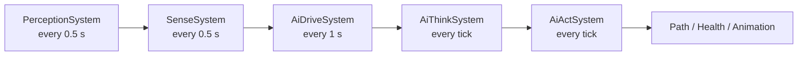

NPC AI lives in `zone-server/.../ai/` and rests on one sentence:

> **GOAP chooses and sequences goals; behaviour trees carry each step out.**

Planning answers *what to do and in what order*. A behaviour tree answers *how to actually do this
one step* — walk there, swing, wait, lie down. Neither is asked to do the other's job, which is what
keeps both small.

The package is layered so the bottom is domain-agnostic. `ai/core` knows nothing about creatures,
towns or combat; a **domain** supplies the vocabulary.



| Package                          | Contents                                                                                             |
| -------------------------------- | ------------------------------------------------------------------------------------------------------ |
| `ai/core/state`                  | `StateKey` (typed, with a memory scope and an *observed* flag), immutable `WorldState`, live `Blackboard` with per-fact expiry |
| `ai/core/behavior`               | The execution contract: `BtNode`, `Status`, `BtContext`                                                |
| `ai/core/{action,precondition,effect,goal}` | Grounded `Action` (preconditions, effects, cost, a behaviour tree and a posture), `ActionTemplate`, `Goal`, and the priority DSL |
| `ai/core/planner`                | Forward-A\* `Planner`, `Plan`, and `EffectWriteBack`                                                   |
| `ai/bt`                          | The tree library — sequence/selector/parallel, inverter/succeeder/repeat/cooldown, a Kotlin DSL, `Locomotion`, and parameterised leaves (`MoveTo`, `FleeFrom`, `Wander`, `UseSkill`, `Wait`, `Sleep`) |
| `ai/perception`                  | `PerceptionSystem`, plus a pluggable `Sense` mechanism and `SenseSystem`                                |
| `ai/ecs`                         | The `AiAgent` component, the four systems that drive it, the agent factory and shared memory            |
| `ai/domain/bestia`               | `BestiaDomain` — the keys, goals and action templates for creatures, plus `ActivityCycle`                |
| `ai/profile`                     | Archetype YAML under `resources/ai/*.yml`, and the player-facing standing order                         |



# The agent

`AiAgent` is one ECS component holding everything per-NPC: which archetype it came from, its goal
list, its action resolver, its `Blackboard` memory, an optional shared pack memory, and the plan it
is currently carrying out.

It deliberately does **not** sync to clients. AI internals never go on the wire; what a player sees
is the ordinary `Path`, `Position` and `Health` components the behaviour trees mutate, which
broadcast normally.

Two guards on it are load-bearing:

- **`hasPerceived`** — nothing plans before it has looked at the world. An empty memory is not a
  neutral starting point for a search; it is a set of unknowns the planner will happily resolve by
  *assuming* an action's effects. A creature that did not know where it was would plan a journey home
  purely because arriving somewhere is the only way it could learn a position at all.
- **`nextThinkTick`** — planning is the expensive half, so agents are spread across ticks rather than
  all replanning on the same one.

# The pipeline

Five ECS systems, each in its own scheduler wave. They conflict deliberately — every one of them
declares the agent component as written — and a test pins that arrangement.



**Perception** is the only writer of observations — position, health, whether an enemy is in sight,
who and where the target is, whether it is night. It may also *clear* a belief its observations
contradict, but it never asserts one.

**Senses** are the extension point. A sense is a Spring component with its own interval; the sense
system collects every one, folds their component reads into its own, and runs each on its own
cadence. Adding one costs no new ECS system and no new scheduler wave. The one that exists today is
foraging, which turns the world's biome raster into remembered feeding grounds.

**Drives** move the appetites that make a creature want anything at all — hunger, tiredness and
restlessness — integrating over real elapsed time, with sub-integer carry so a slow rate still
accumulates instead of rounding away to nothing. Tiredness runs *backwards* while asleep, and
continuously rather than in one jump on waking, which is what makes an interrupted night mean
something: a creature woken halfway through wakes half-rested.

**Think** selects a goal every run, but only re-plans when the goal changed or the plan is spent.

**Act** ticks the current step's behaviour tree. On success it applies *that one action's* effects
and advances; on failure it clears the plan so the next think cycle starts over. It also derives the
`Animation` component from the current step's posture and whether the entity is moving.

# Four rules worth knowing before touching any of it

1. **Perception owns observations; effects own beliefs.** A key marked *observed* may be **simulated**
   during the A\* search — a walk action has to be able to imagine arriving — but the write-back
   refuses to persist it afterwards. That distinction is what stops an agent believing what it merely
   planned.
2. **Effects apply on observed success**, one action at a time, not for a whole plan at plan time.
3. **Nothing plans before it has perceived.** See `hasPerceived` above.
4. **A goal whose desired state already holds is skipped.** So a behaviour that should *persist* while
   some condition lasts needs a belief key that stays unsatisfied throughout it. A tiredness ceiling
   alone is already met by a well-rested animal, so without such a key a diurnal creature would amble
   about all night; a `RESTED` latch, cleared by perception for as long as the resting phase lasts,
   is what makes it sleep instead.

# Restlessness, and why idling is an ordinary goal

Wandering has no naturally unsatisfiable state: its desired state either holds before any step is
taken — so the planner, which only selects goals that are *not* already satisfied, would never pick
it — or holds forever after one step, so it would never run again. Earlier code worked around that
with a reflexive fallback outside the goal system entirely.

Modelling boredom as just another rising drive removes the special case. Restlessness climbs while
the creature has nothing better to do, the wander goal becomes available and genuinely unsatisfied, a
bout of ambling spends it, and it climbs again. Any domain that needs a floor behaviour should reach
for the same trick.

# Profiles

`resources/ai/*.yml` holds one archetype per file, loaded and **fail-fast validated** at boot — a typo
in a goal or action id surfaces as a boot failure, not as a creature that stands still in production.

YAML **selects and tunes**; it cannot express behaviour:

```yaml
identifier: passiv_day_active
faction: critters
activity_cycle: diurnal        # sleeps at night
perception:
  sight_radius: 7
  aggro_memory_seconds: 30     # how long it keeps chasing whoever hit it
wander_radius: 10
hunger_threshold: 60
aggression: 60
goals:
  - { name: KillAttacker }
  - { name: Sleep }
  - { name: EatVegetation }
  - { name: Wander }
actions: [approachTarget, attack, walkToVegetation, eatVegetation, sleep, wander]
attacks:
  - { id: bite, range: 1, cooldown_seconds: 2.0 }
```

A goal's *priority formula* — the considerations and response curves that scale it with hunger,
health or aggression — lives in Kotlin next to the goal, in a small DSL. That is a deliberate
narrowing of an older format which let YAML assemble considerations out of input/curve/weight triples
resolved through two bean registries. It costs a rebuild to retune a curve and buys type safety, one
fewer indirection when a mob misbehaves, and a much smaller surface to validate — which matters most
for player-supplied configuration, where the only thing a player can move is a base priority and
every value has to be clamped.

A profile's numbers are written into the agent's memory as permanent facts when it is attached, so
goal availability and priority read them exactly the way they read hunger or position. There is one
place each number lives.

Three archetypes ship today: an aggressive melee hunter that flees when hurt, a passive grazer that
runs early, and a day-active grazer that never flees but comes after anyone who hits it. The absence
of a goal *is* the temperament — a creature cannot want what its profile does not list.

# Player-owned creatures

A player's own bestia carries a standing order alongside its archetype: an idle stance plus two
clamped knobs. A stance **narrows** the archetype's goals and never widens them — it can switch off
foraging, but it cannot teach a creature to hunt if its species never could. Player-controlled
entities are skipped by the think system entirely.

# Adding to it

**A sense** (something creatures notice): implement the interface as a Spring component, give it an
interval, and declare the components it reads. Write facts through the sense context, which routes to
the individual, pack or world board according to the key's memory scope.

**A behaviour**: add a state key, a goal with its priority formula, and an action template that
grounds concrete actions *together with their behaviour trees*; then name the goal and action ids in a
profile.

**A whole new kind of NPC**: that is a second *domain*, not a second pipeline. See
[Townsfolk & Settlement Simulation](/docs/server/townsfolk/), which adds one for town inhabitants and
describes the small seam in the agent factory, the drive system and the profile registry that lets two
domains coexist.
