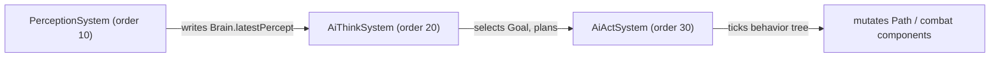

NPC AI (`zone-server/.../ai/`) is three ECS systems layered on top of a per-entity `Brain`
component, run in a fixed order via `@Order`:



All three run on `Schedule.EverySeconds(0.5f)` for perception/think and `EveryTick` for act — NPCs
re-evaluate what to do twice a second, but execute the chosen action every tick.

# Brain

`Brain` is the per-NPC component everything hangs off: `profileId` (which `AiProfile` archetype this
NPC uses), `homePosition`/`wanderRadius`, `latestPercept`, current `targetId`, the active `Goal` and
`Plan`, and the behavior-tree node currently executing. It deliberately does **not** implement
`Dirtyable` — AI internals never sync to clients directly; they become visible only through the
`Path`/`Position`/`Health` components the behavior tree's leaves mutate.

# Stage 1 — Perception

`PerceptionSystem` queries `EntityAOIService` for everything within the profile's sight radius,
builds a list of `Percept`s (position, hostility, health%), and writes a `PerceptionSnapshot` onto
the `Brain`. It also updates `IndividualMemory` (an `ENEMY_SIGHTING` entry with a 5-second TTL) and
pushes `AiEvent`s (`ENEMY_SEEN`/`ENEMY_LOST`) that `AiThinkSystem` drains next cycle.

# Stage 2 — Think: Utility AI → GOAP

`AiThinkSystem` distills the latest percept into a `DecisionContext` (own health %, whether an enemy
is in sight, distance to the nearest one), then:

1. **`UtilityScorer.selectGoal(context)`** scores every goal the NPC's profile lists
   (`FleeGoal`, `KillEnemyGoal`, `WanderGoal`) against its considerations and response curves, and
   picks the winner.
2. If the winning goal changed (or there's no active plan), the **GOAP planner** (`ai/planner/`)
   is asked for a plan: `planner.plan(worldState, goal.desiredState, actions)`, where `actions` are
   resolved from the profile's `actionIds` via `GoapActionRegistry`.

A goal is just a name plus a desired world state:

```kotlin
@Component
class KillEnemyGoal : Goal {
  override val name = "kill_enemy"
  override val desiredState = WorldState.of(StateKey.TARGET_DEAD to true)
}
```

The resulting `Plan` is a sequence of GOAP actions (`ApproachTargetAction`, `MeleeAttackAction`,
`FleeToSafetyAction`, `WanderAction`); each action supplies its own small behavior tree via
`.behaviorTree()`.

# Stage 3 — Act: behavior tree execution

`AiActSystem` ticks the current plan action's behavior tree every tick:

```kotlin
interface BtNode {
  fun tick(context: BtContext): Status // SUCCESS | FAILURE | RUNNING
}
```

Composite nodes (`Selector`, `Sequence`) and leaves (`MeleeAttackLeaf`, `FleeLeaf`, `WanderLeaf`,
`MoveToTargetLeaf`, `InMeleeRangeLeaf`) live under `ai/behavior/`. `SUCCESS` advances
`Brain.currentPlan` to the next action (or clears the plan if it was the last one); `FAILURE` clears
the plan outright so the next think cycle replans from scratch; `RUNNING` just keeps executing.
Leaves are what actually move the needle for players — they mutate the `Path`/combat components
that are `Dirtyable` and broadcast normally.

# AI profiles

`AiProfileRegistry` loads every `classpath:ai/*.yml` archetype at boot (`@PostConstruct`) and
**fail-fast validates** that every referenced goal, action, consideration input and response curve
resolves to an actually-registered Spring bean — a typo in a profile YAML surfaces at boot, not at
runtime:

```yaml
# zone-server/src/main/resources/ai/aggressive-melee.yml (shape, not verbatim)
identifier: aggressive-melee
perception:
  sightRadius: 12
goals:
  - name: kill_enemy
    considerations: [...]
actionIds: [approach_target, melee_attack, flee_to_safety, wander]
```

# `ai/goap2`: an experimental framework, not shipped behavior

`ai/goap2/` is a **second**, more generic GOAP implementation living alongside the pipeline above —
its own `Planner`, `Action`/`ActionTemplate`, `Precondition`/`Effect`, `Blackboard`/`WorldState`, plus
a bestia-specific domain (`goap2/bestia/BestiaDomain.kt`) with action templates for wandering,
eating vegetation, sleeping, returning home and attacking.

It is **deliberately kept Spring-free** — `BestiaAiProfileLoader`'s doc comment says so explicitly,
unlike `AiProfileRegistry`, which is `@Service` + `@PostConstruct` — and none of its classes are
Spring beans referenced by `AiThinkSystem`, `AiActSystem`, or `EcsConfiguration`. It's exercised only
by scenario tests (`ai/goap2/bestia/AggroScenarioTest`, `NonAggroScenarioTest`, `SharedMemoryTest`)
plus a sibling test-only `ai/goap/MarketDomain.kt` that simulates a villager buying food at a market
purely to validate the generic planner — **not** a player-facing economy feature, despite the name.

**Don't confuse the two**: NPCs in the running game are driven entirely by
`AiThinkSystem`/`AiActSystem` and the profile-driven pipeline above. `goap2` is in-progress design
work for a more reusable planner, worth knowing about so you don't go looking for its bestia domain
in a live world and wonder why nothing uses it.
