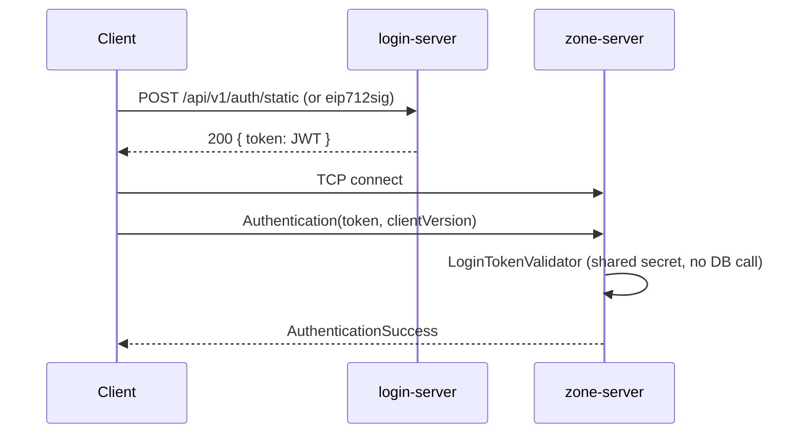

`login-server` and `zone-server` never call each other. There is no shared database and no service
discovery — the entire trust relationship between them is a signed JWT that the client carries from
one to the other.



# login-server: two login paths

`login-server` is a stateless Spring Boot REST service — `spring-boot-starter-web`, no sockets, no
game state. It exposes three endpoints:

| Endpoint | Purpose |
| --- | --- |
| `POST /api/v1/auth/static` | Dev-only username + static token login. Returns a **zone-audience login token directly.** |
| `POST /api/v1/auth/eip712sig` | Production path: verifies an EIP-712 wallet signature + NFT ownership. Returns a long-lived **refresh token.** |
| `POST /api/v1/login` | Exchanges a refresh token for a fresh, short-lived zone login token. |

**Static login** (`StaticLoginController` → `StaticLoginService`) looks up a
`StaticTokenLoginMethod` by username, compares the plaintext token, and — on match — issues a login
token immediately. This is what the actual Godot client uses today
(`connection_manager.gd` only ever calls `/api/v1/auth/static`); the two-step NFT flow exists and is
tested at the login-server level, but no client code currently drives it end-to-end.

**EIP-712 / NFT login** (`Eip712AuthenticationController` → `Eip712AuthenticationService`) is the
intended production path:

1. `Eip712Verifier` manually hashes and recovers the signer address from an EIP-712 typed-data
   signature (domain `Login(address wallet, uint256 tokenIndex)`, via web3j `Sign`/`Hash`/`Keys`)
   and checks it matches the claimed wallet.
2. `EthereumService` verifies the wallet actually owns the claimed NFT (`ownerOf` ERC-721 call via
   `RpcEthereumService`) — or is a no-op `AlwaysSuccessEthereumService`, which is the **default**
   (`ethereum.enable-nft-verification: false` in `application.yml`).
3. On success, `Account` + `NftLoginMethod` are found-or-created (new wallets auto-register on
   first login), and a refresh token is issued.
4. The client later exchanges that refresh token for a zone login token via
   `LoginController`/`LoginService` — which **re-verifies** NFT ownership at exchange time, so a
   revoked/transferred NFT is caught close to the moment the client actually connects to a zone.

# JWTs

Both tokens are signed with the same `jwt.secret` (`JwtService.kt`, `io.jsonwebtoken`/jjwt, HMAC):

```kotlin
fun createRefreshToken(accountId: Long, walletAddress: String, tokenId: Long): RefreshToken {
  // issuer("login"), audience("refresh"), claims: tokenId, wallet
  // expiry: jwt.expiration-days (5 in dev)
}

fun createLoginToken(accountId: Long, role: Role): String {
  // issuer("login"), audience("zone"), claim: role
  // expiry: jwt.login-token-minutes (60 in dev)
}
```

The **login token** (`audience = "zone"`) is what actually crosses into zone-server — as the payload
of the socket's first `Authentication` message, sent as `Authentication(token, clientVersion)`.

# zone-server: independent re-validation

`zone-server` never contacts `login-server`. Instead, `LoginTokenValidator` (identical HMAC
verification, using `zone.jwt-auth-secret-key` — configured separately, but currently the same
placeholder string as login-server's `jwt.secret` in both `application.yml` files) checks the
token itself:

```kotlin
val claims = Jwts.parser().verifyWith(secretKey).build().parseSignedClaims(token).payload
require(claims.issuer == "login")
require(claims.audience.contains("zone"))
val role = Role.valueOf(claims.get("role", String::class.java))
// accountId = claims.subject.toLong(); authorities = role.authorities
```

`Role` and `Authority` (`shared/src/main/kotlin/net/bestia/account/`) are the one piece of code
genuinely shared between the two servers — everything else about an account is duplicated
independently (each server has its own JPA `Account` entity, linked only by convention via a
`loginAccountId: Long`, never a shared table):

```kotlin
enum class Role(val authorities: Set<Authority>) {
  USER(setOf(Authority.ITEM, Authority.MAP_MOVE)),
  GM(setOf(Authority.ITEM, Authority.MAP_MOVE, Authority.KILL, Authority.EXP, Authority.SPAWN, Authority.TERRAIN)),
  SUPER_GM(Authority.entries.toSet())
}
```

`JwtAuthenticationProcessor` wraps `LoginTokenValidator` behind the generic
`AuthenticationProcessor` interface that `ClientMessageHandler.authenticateChannel` calls on a
connection's first message. On success:

1. The zone gates on its own readiness (`ZoneReadinessService.isReady()`) — a login arriving before
   world generation/entity reload has finished is rejected with `SERVER_NOT_READY`, not accepted
   into a half-loaded world.
2. The channel is registered in `ChannelRegistry` keyed by account id, and the server replies with
   `AuthenticationSuccess`.
3. An `AccountConnectedEvent` is published, which registers the account's authorities into
   `ConnectionInfoService` (an `InactiveConnection` at this point — no master selected yet).

Auth success does **not** spawn a game entity. That happens later, once the client sends
`SelectMasterCMSG` and `ConnectionInfoService.activateSession` turns the inactive session into an
active one carrying a selected master and its owned entities. See
[Networking](/docs/server/networking) for what happens to messages after this point.

# Known gaps

- `AccountStatus` (`ACTIVE` / `PERMA_BANNED` / `BANNED_UNTIL`) and `Account.bannedUntil` are modeled
  on `login-server` but **never checked** during login — ban enforcement doesn't exist yet.
- `AuthenticationSuccess.permissions` is defined in the protobuf schema but zone-server never
  populates it (`// TODO Send the available permissions to the client` in `ClientMessageHandler`).
- `Eip712Verifier`'s `verifyingContract` is hardcoded to `"0x0"` rather than read from config.
- NFT ownership verification is disabled by default, and both servers' JWT secrets plus
  login-server's Ethereum RPC URL/contract address are still the development placeholder values in
  `application.yml` — fine for local dev, not something to carry into a real deployment unexamined.
- There's no rate limiting, CORS policy, or Spring Security filter chain in front of `login-server`'s
  REST endpoints.
