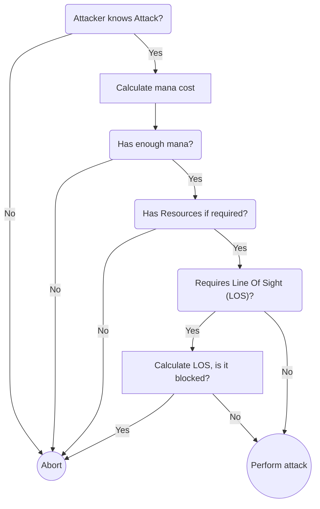

The battle system is quite complex to allow almost any entity to get damaged in the game. Usually a battle context is established before damage calculation takes place and then used throughout the damage calculation. The attack outcome is then calculated with a strategy which is chosen depending on the type of attack used (melee, ranged or magic).

Attacks can also be defined by a script alone and thus sidestepping the damage calculation completly to do script controlled effects (e.g. reduce enemy health by 50%).

## Attack Pre-Check

The stages of a battle are visualized in the following flow diagram, first a check is done to see if the attack actually was a hit.



## Damage Calculation

The damage calculation is roughly based on the system used by Ragnarök Online. In certain areas it is refined in order to better express the design philosophy of Bestia as well as be extensible. Modifier (MOD suffix) are float values representing percentage values (e.g. 0.25). Bonus mods are bigger than 1 (bonus 5% is 1.05) while reduction modifier are less than 1.

The damage at the end is rounded down but the damage is capped at 0. The calculation of the BASE_ATK is rather complex and is explained inside a own section. The parts written in pink are variables provided by bonuses from equips, stats, buffs etc.

```kotlin
val damage = floor(BASE_ATK * ATK_MOD * HARD_DEF_MOD * CRIT_MOD - SOFT_DEF)
```

### Value: BASE_ATK

The base attack represents the attack strength of an entity. This attack strength is based on the status values important to perform the attack as well as the properties of the currently equipped weapon. Equipment might also alter the status values by which the base attack is indirectly influenced.

The base attack is capped at a minimum of 1. Default formula is:

```kotlin
val BASE_ATK = (2 * STATUS_ATK * VAR_MOD + WEAPON_ATK * VAR_MOD_RED + SKILL_ATK + BONUS_ATK + AMMO_ATK) * ELEMENT_MOD * ELEMENT_BONUS_MOD
```

### Value: STATUS_ATK

The status attack value is determined by the capabilities of the character to attack and inflict damage. The formula is different for magic and physical based attacks.

For **physical melee** attacks:

```kotlin
val STATUS_ATK = LV / 4 + STR + DEX / 5
```

For **physical ranged** attacks:

```kotlin
val STATUS_ATK = LV / 4 + DEX + STR / 5
```

For **magical attacks** (both melee and ranged):

```kotlin
val STATUS_ATK = LV / 4 + INT + WILL / 5
```

### Value: VAR_MOD

Is a variable status modifier. The variance is reduced as the `DEX` value rises. It is defined as:

```kotlin
val VAR_MOD = 1 - RAND(1,0) * 0.15
```

### Value: WEAPON_ATK

The weapon attack value for **physical** attacks is given by:

```kotlin
val WEAPON_ATK = (BASE_ATK * QUALY_MOD + REFINE_BONUS) * SIZE_MOD * RACE_MOD * WEAPON_BONUS_MOD
```

Where as the `WEAPON_ATK` value for **magical** attacks is given by:

```kotlin
val WEAPON_ATK = (BASE_ATK * QUALY_MOD + REFINE_BONUS) * RACE_MOD
```

### Value: QUALY_MOD

The QUALY_MOD is a modification depending of the durability of the weapon. The max quali damage mod should converge to +15% at maximum.

From this rating the mod damage is calculated as follow

```kotlin
val QUALI_MOD = if(DURABILITY > 30) {
  1.15
} else {
  1.15 - 0.15 + DURABILITY / 200
}
```

### Value: SIZE_MOD

The attack is physically based.

<table>
  <tr>
    <td>Weapon size</td>
    <td>Enemy size</td>
    <td>Modifier</td>
  </tr>
  <tr>
    <td>Small</td>
    <td>Small</td>
    <td>1.3</td>
  </tr>
  <tr>
    <td>Medium</td>
    <td>Small</td>
    <td>1</td>
  </tr>
  <tr>
    <td>Big</td>
    <td>Small</td>
    <td>0.75</td>
  </tr>
  <tr>
    <td>Small</td>
    <td>Medium</td>
    <td>1</td>
  </tr>
  <tr>
    <td>Medium</td>
    <td>Medium</td>
    <td>1.15</td>
  </tr>
  <tr>
    <td>Big</td>
    <td>Medium</td>
    <td>1</td>
  </tr>
  <tr>
    <td>Small</td>
    <td>Big</td>
    <td>0.70</td>
  </tr>
  <tr>
    <td>Medium</td>
    <td>Big</td>
    <td>1.1</td>
  </tr>
  <tr>
    <td>Big</td>
    <td>Big</td>
    <td>1.3</td>
  </tr>
</table>

### Value: VAR_MOD_RED

This is the reduced variance mod.

```kotlin
val VAR_MOD_RED = VAR_MOD - VAR_MOD / 2 + 1/2
```

### Value: AMMO_ATK

If special ammunition is used this value is used. Only ranged physical attacks can make use of ammunition.

### Value: BONUS_AMMO

This value is determined by the equipment and status effects applied to an entity.

### Value: ATK_MOD

The `ATK_MOD` is calculated depending which type the attack was. If it was a ranged physical attack, ranged magic attack or a melee physical or a melee magic based attack. The attack mod is capped to a minimum of 0.05.

If attack is physical melee:

```kotlin
val ATK_MOD = bonus_physical_melee
```

If attack is physical ranged:

```kotlin
val ATK_MOD = bonus_physical_ranged
```

If attack is magical melee:

```kotlin
val ATK_MOD = bonus_magical_melee
```

If attack is physical melee:

```kotlin
val ATK_MOD = bonus_physical_melee
```

### Value: HARD_DEF

Hard defense represents mostly the damage reduction via armor and other natural defenses. It can of course modified by scripts. The hard defense is capped between 0 and 95%. Depending of the nature of the attack (physical or magical) either the normal armor or magic armor (magic resist) is used.

If normal attack (ranged or melee):

```kotlin
val HARD_DEF = 100 - (TOTAL_ARMOR_MOD + PHYSICAL_DEF_MOD) / 100
```

If magic attack (ranged or melee):

```kotlin
val HARD_DEF = 100 - (TOTAL_MAGIC_RESIST_MOD + MAGIC_DEF_MOD) / 100
```

### Value: SOFT_DEF

Soft defense represents the natural defense of entities against damage of a specific domain. Soft def is a natural number and NO modifier. Its minimum value is capped to 0.

If attack is physical based (regardless if melee or ranged):

```kotlin
val SOFT_DEF = LV / 2 + VIT + STR / 3
```

If the attack is magic based (regardless if melee or ranged):

```kotlin
val SOFT_DEF= LV / 2 + VIT + WILL / 4 + INT / 5
```

### Value: CRIT_MOD

The base crit mod is set so 1.4 (bonus of 40% damage) if a critical hit has occurred. The chance to land a critical hit is determined before the actual damage is calculated. If no critical hit has occurred the crit mod is hardcoded set to 1. Magic based attacks can not land a critical hit (they also are hitting a target easier).

The crit mod is capped at 1.

CRIT_MOD = BASE_CRIT_MOD * CRIT_DAMAGE_MOD

## Damage Variables

Total damage calculation modifiers which are gathered from equipment and status effects. They are re-calculated upon change of the entities properties and then stored. The variables are feed into the attack scripts so their values can be accessed and altered via scripts on a per attack basis. These values are called damage variables.

<table>
  <tr>
    <th>Variable Name</th>
    <th>Description</th>
  </tr>
  <tr>
    <td>bonusAttackPhysicalMelee</td>
    <td>Bonus damage on physical melee attacks.</td>
  </tr>
  <tr>
    <td>bonusAttackPhysicalRanged</td>
    <td>Bonus damage on physical ranged attacks.</td>
  </tr>
  <tr>
    <td>bonusAttackMagicMelee</td>
    <td>Bonus damage on magical melee attacks.</td>
  </tr>
  <tr>
    <td>bonusAttackMagicRanged</td>
    <td>Bonus damage on magical ranged attacks.</td>
  </tr>
  <tr>
    <td>physicalDefMod</td>
    <td>Bonus or reduction on armor.</td>
  </tr>
  <tr>
    <td>magicDefMod</td>
    <td>Bonus or reduction on magic resist.</td>
  </tr>
  <tr>
    <td>criticalChanceMod</td>
    <td>Bonus or Reduction to critical hit chance.</td>
  </tr>
  <tr>
    <td>criticalDamageMod</td>
    <td>Bonus or reduction in critical damage.</td>
  </tr>
</table>
