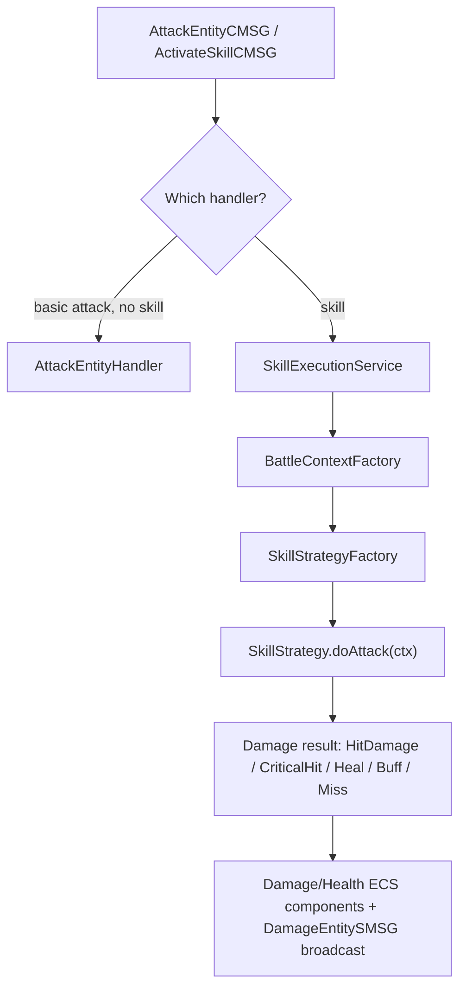

This page replaces an older version that documented a full Ragnarök-Online-style damage formula
(`BASE_ATK`, `HARD_DEF`, `CRIT_MOD`, ...) as if it were live. It isn't: the **pipeline** around
combat is real and working, but the actual physical/magic damage formulas it's meant to plug into
are, today, unimplemented stubs. This page describes what actually runs.

# The real flow


```mermaid
graph TD
  A["AttackEntityCMSG / ActivateSkillCMSG"] --> B{Which handler?}
  B -->|basic attack, no skill| C[AttackEntityHandler]
  B -->|skill| D[SkillExecutionService]
  D --> E[BattleContextFactory]
  E --> F[SkillStrategyFactory]
  F --> G["SkillStrategy.doAttack(ctx)"]
  G --> H["Damage result: HitDamage / CriticalHit / Heal / Buff / Miss"]
  H --> I["Damage/Health ECS components + DamageEntitySMSG broadcast"]
```

`SkillExecutionService.execute()` is the single chokepoint for every activated skill: it builds a
`BattleContext` via `BattleContextFactory`, resolves a `SkillStrategy` for the skill's `SkillType`,
checks range/line-of-sight (`strategy.isAttackPossible`), consumes mana, then applies whatever
`Damage` the strategy returns — `HitDamage`/`CriticalHit` stage a `Damage` ECS component that
`ReceivedDamageSystem` (order 50) drains into `Health` next tick (also handling death, interrupting
casts, and combat-timeout tracking); `Heal` applies directly; `Buff` calls
`StatusEffectService.applyEffect` instead of touching health at all.

`BattleContextFactory` builds real data from live ECS state — position, level, `StatusValues`,
and `DefenseValues` (a genuinely implemented soft-defense formula, `VIT + STR/5 + AGI/5 + lvl/4` for
physical, `INT + VIT/5 + DEX/5 + lvl/4` for magic, matching [Status Values](/docs/mechanics/statusvalues)).
Two things it deliberately fakes today, called out inline in its own source: **every entity is
`Element.NORMAL`** (no per-entity element component exists yet), and **every entity fights
bare-handed** (`Weapon(atk = 0, matk = 0, upgradeLevel = 0)` — no equipment system feeds real weapon
stats in yet).

# Skill strategies, by type

`SkillStrategyFactory.getSkillStrategy(ctx)` dispatches on `SkillType`:

| `SkillType` | Strategy | Status |
| --- | --- | --- |
| `MELEE_PHYSICAL` / `RANGED_PHYSICAL` | `MeleePhysicalSkillStrategy` / `RangedPhysicalSkillStrategy`, both backed by `MeleePhysicalDamageCalculator` | **Not implemented** — `calculateDamage`, `getStatusAttack`, `getSoftDefense` and `getHardDefenseModifier` are all `TODO("Not yet implemented")`. A skill of this type throws if actually cast. |
| `MAGIC` | — | `SkillStrategyFactory` itself hits `TODO()` for this branch; `MagicDamageCalculator` exists but is in the same unimplemented state as the physical one. |
| `NO_DAMAGE` | Whatever `SkillScriptRegistry` resolves for the skill's `script` name | **This is what actually works today** — see below. |
| `PASSIVE` | — | Always-on, never resolved through a strategy; activating one throws `IllegalStateException`. |

`BaseDamageCalculator` (the shared parent of the physical/magic calculators) still carries the
original Ragnarök-derived formula as commented-out code — `BASE_ATK`, variance mod, element
modifiers — with every real method replaced by a `TODO`. `ElementModifier` is a complete,
standalone RO-style elemental multiplier table (10 elements × 4 levels), fully implemented and
unit-testable, but currently unreachable: nothing calls it, since `assumedElement` is hardcoded to
`NORMAL` and the calculator methods that would consult it are the same `TODO` stubs above.

# What actually deals damage today

Two paths work:

**Basic attack** (no skill — `AttackEntityCMSG`, `usedAttackId == 0`): handled directly by
`AttackEntityHandler`, which is explicit in its own comment that this is a **"hacky test
implementation"** — `Random.nextInt(1, 7)` damage, no range/line-of-sight check, no formula at all.

**Script-based skills** (`SkillType.NO_DAMAGE`): each is a small `@Component` implementing
`SkillStrategy` directly, resolved by name via `SkillScriptRegistry`. Only three exist today:

```kotlin
// Firebolt.kt — a channelled single-target bolt (skills.yml id 5)
private fun firebolt(ctx: EntityBattleContext): Damage {
  val base = (attacker.level / 4 + attacker.statusValues.intelligence) * ctx.usedAttack.level
  val matk = attacker.derivedStatusValues.matk + ctx.weapon.matk
  val mitigated = base + matk - ctx.defender.defense.magicDefense
  return HitDamage(mitigated.coerceAtLeast(1))
}
```

The other two are `Heal` (skill id 4, a similar small formula returning a `Heal` result) and
`Blessing` (skill id 1, a `Buff` that hands off to `StatusEffectService` — no damage number at all).
Each is its own bespoke formula, not an instance of the shared RO-style calculator.

`skills.yml` catalogs **43 skills**, but the overwhelming majority are `PASSIVE` or `NO_DAMAGE`
profession/crafting skills for the master skill tree (forging, alchemy, mining, cartography, ...)
whose `script:` name has **no matching Kotlin class** — e.g. `Cooking`, `ForgeWeapon`,
`MasterRitual`. `SkillScriptBootValidator` checks this at boot (on `ApplicationReadyEvent`, after
`SkillImporterBootRunner` has populated the table) and logs a warning rather than failing the boot,
since a hard failure would make the server unbootable against real catalog data; activating one of
the missing skills fails at cast time instead. The two Bestia-side attack skills (`ember`,
`NO_DAMAGE`; `tackle`, `MELEE_PHYSICAL`) are in the same boat — `ember` has no matching script, and
`tackle` would hit the unimplemented melee calculator.

# Status effects

A separate, working system from damage: `StatusEffectService.applyEffect()` resolves a
`StatusEffectDefinition` (`status_effects.yml`) and its `StatusEffectScript`, applies stacking rules
via the `StatusEffects` ECS component, and flags the entity for a status-value recalc. Four scripts
exist: `Swiftness` (buff), `Cripple` (a flat -15% speed debuff), `BlessingStatusEffect` (applied by
the `BLESSING` skill), and `ResistedOnceMarker` (internal bookkeeping only, never synced to the
client — tracks that an entity already resisted a debuff once this encounter). This mirrors the
skill-script pattern one level down — see [Scripting](/docs/server/scripting) for the shared
registry/boot-validation mechanism both use.

# Summary

The **plumbing** (context building, strategy dispatch, mana cost, range/LoS gating, staged damage
→ `ReceivedDamageSystem` → death, status effect stacking) is solid, production-shaped code. The
**formulas** the old docs described in detail — the full `BASE_ATK`/`HARD_DEF`/`CRIT_MOD` chain,
weapon quality, size modifiers — exist only as commented-out reference code inside
`BaseDamageCalculator` and are not callable. If you're extending combat today, the working pattern
to copy is a `NO_DAMAGE` script like `Firebolt`, not the physical/magic calculator classes.
