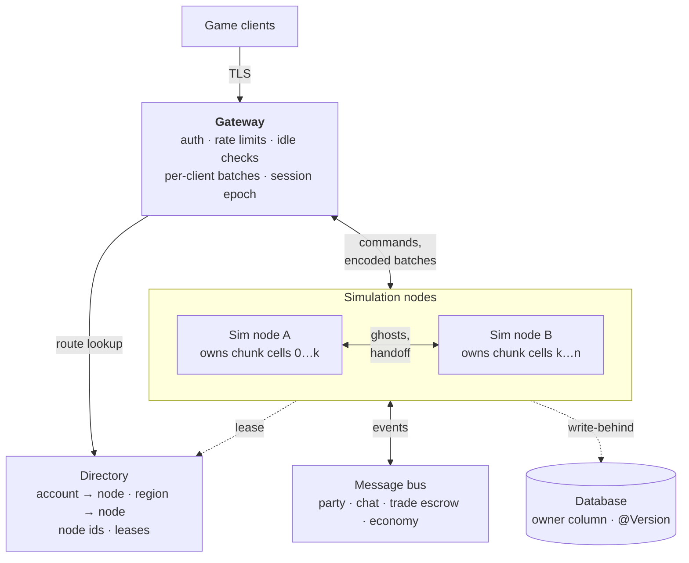



One process owns all players, all rows and all global counters. There is no cluster infrastructure yet: no
Redis, etcd or message broker, and no link between two zones. The only link between processes is the login
server calling a zone over HTTP to kick an account. Some seams already help, and a few pieces of state stand in
the way.

# A target shape

This is a target shape, not a spec. The boxes are roles, not processes: the first version runs the gateway
role inside every zone node. Clients only talk to the gateway, so an entity can move between nodes without a
reconnect. Each node is the single writer for its chunk cells. Neighbours see border entities as read-only
ghosts, and they replicate and hand over directly between nodes, not through a broker. Party, chat, trade and
economy leave the World and talk over a bus. [Spatial Cells](/docs/server/spatial-cells) explains the nodes,
the gateway role and the handoff.

# What blocks it today

Each row is state that assumes one process. The last column says which way to grow needs it fixed. A realm is
one node with its own database, so state that stays inside one node is fine there.

| State                                                                                                    | Problem                                                                                                                                                                                                                                                                                                                                                        | Change                                                                                   | Paths |
| -------------------------------------------------------------------------------------------------------- | -------------------------------------------------------------------------------------------------------------------------------------------------------------------------------------------------------------------------------------------------------------------------------------------------------------------------------------------------------------- | ---------------------------------------------------------------------------------------- | ----- |
| **World** `World`                                                                                     | The tick thread is the only writer, but a World belongs to one process. Nothing copies or moves a whole entity to another process. There is no ghost, no region and no silent removal.                                                                                                                                                                         | One single-writer World per region, with a [handoff](/docs/server/spatial-cells#handoff) | Cells |
| **Sessions** `ConnectionInfoService`                                                                  | A per-process map decides which entity an account controls. It has no epoch. A stale teardown is stopped only by channel identity in `ChannelRegistry`.                                                                                                                                                                                                        | Directory with lease and session epoch                                                   | Cells |
| **Channels, tickets, zone list** `ChannelRegistry`, `HttpTicketService`, login server `ZoneDirectory` | "One connection per account" holds only inside one node. The login server has a static list of zones and kicks an account on every one of them, because it cannot see where the player is.                                                                                                                                                                     | Gateway role; the directory answers "which node"                                         | Cells |
| **Party, trade, whisper** `PartyService`, `TradeService`, `ChatHandler`                               | State sits in per-process maps. Each one reads and writes both players in the local World.                                                                                                                                                                                                                                                                     | Bus service; trade as two-phase escrow                                                   | Cells |
| **World coin reserve** `WorldReserve`                                                                 | The balance lives in memory and is saved as one absolute value. With two nodes, the last writer wins.                                                                                                                                                                                                                                                          | Atomic SQL deltas, or one owner                                                          | Cells |
| **Rumour ids** `RumourRegistry`                                                                       | The next id is `max(id) + 1` at boot. Two nodes collide.                                                                                                                                                                                                                                                                                                       | DB sequence or snowflake                                                                 | Cells |
| **Terrain edits** `ChunkService`                                                                      | Held in a `MemoryBlobStore`: node-local and lost on restart. See [Storage](/docs/server/world-generation/#storage-voxels-chunks-player-edits-and-regeneration).                                                                                                                                                                                                | Shared durable delta store with revisions                                                | Both  |
| **Boot loading and cleanup** `EntityLoaderBootRunner`, `TradeReservationCleanupBootRunner`            | Every node loads all rows: the mob, loot and script persisters read their whole kind at boot, with no owner or region filter. The cleanup frees the trade reservations of the whole table.                                                                                                                                                                     | Owner and region columns; one coordinator                                                | Cells |
| **Entity ids** `EcsConfiguration`                                                                     | The node part is `zone.shard-id`, a static `1` in the config. It is clamped to 0–255 without an error, and nothing checks that nodes differ. Two nodes from one config mint the same ids.                                                                                                                                                                      | Lease node ids; fail fast at boot                                                        | Cells |
| **Login token** `LoginTokenValidator`                                                                 | The audience is just `zone`, so any zone accepts it. Single-use ids are kept per process, so each node accepts the same token once. The key is a shared HMAC secret, so a zone could mint tokens.                                                                                                                                                              | Zone claim; one place for the single-use check; asymmetric keys                          | Both  |
| **Global sweeps** `SettlementEconomySystem` and six more                                              | Seven systems work on the whole world or a whole table, wherever the players are: `SettlementEconomySystem` (`catchUpAll` every 30 s), `RumourExpirySystem`, `IndoorEmergenceSystem`, `MacroGraphMaintenanceSystem`, `GroundLevelDecaySystem`, `ScorchRegrowthSystem` and `GroundFireSystem`. Each node would run every sweep, over state that is not its own. | An owner for each sweep, best sharded by settlement region                               | Cells |
| **World-wide facts** `SharedMemoryService`, `MacroGraphService`                                       | The AI keeps one world blackboard and one per faction. The macro graph has one version counter. The spawner and townsfolk residency maps are per process too. With several nodes a world-wide fact stops being world-wide, and a pack that a border splits gets two boards.                                                                                    | An owner for each fact; boards scoped to a region                                        | Cells |

# Seams that already help

- **Entity ids** are 64-bit snowflakes (`timestamp | node | sequence`). The node part is 8 bits, so 256 nodes
  can mint ids with no coordination. A master gets its id when it is created and keeps it across sessions.
- **Interest** is already "who holds this chunk". `ChunkSubscriptionService` keeps chunk → accounts, and
  `ChunkEntityVisibility` keeps chunk → resident entities and answers `observersOf`. A chunk cell is the
  natural unit of ownership.
- **Audiences are declared, not computed.** Each syncable component returns `SyncTargets`: `PublicInRange`,
  `OwnerOnly` or `Accounts(ids)`. Two of the three name their audience by account id, so they stay correct
  across nodes as soon as message routing exists.
- **Output has one seam.** All game output goes through `OutMessageProcessor` to `OutMessageHandler`.
  `ChannelRegistry` is its one production implementation, and only `socket/` knows Netty channels.
- **Terrain needs no sharing.** A chunk is a base plus player edits. The base is a pure function of the world
  seed, so every node can generate any chunk. Only the edits have to travel.
- **Persister snapshots** are plain data, copied out with the world to itself. They are a start for moving an
  entity between nodes, but they only carry mutable state such as position and HP. A handoff needs more.
- **One writer per World.** The tick thread owns the World, and handlers reach it through the inbox. See
  [Threads and the Tick](/docs/server/threading).
- **Login and zone** share no database, only a token. The login server already calls zones over HTTP.

# Two ways to grow

**Realm shards.** Run many separate copies of the world, one node each, with one database per realm. Players
connect straight to their realm, as they do today, so this path needs no gateway process. What is missing:

- The login server must know the realm list and hand out the right socket endpoint. `ZoneDirectory` is a
  static list of zone HTTP addresses for kicks today.
- The login token must name its realm.
- Terrain edits must survive a restart.

The last two points are the rows marked "Both" above. This is the cheaper path.

**Spatial cells.** Run one large world across many nodes. You need every row above, plus ghost entities, a
handoff and cross-node global services. The design is on [Spatial Cells](/docs/server/spatial-cells).

The single writer per World is done. Measure before you choose: a load test with simulated clients shows how
many players one node holds. If one node carries the players you expect, realm shards are enough.

# Order of work

Each step can ship on its own, and each one also helps a single node.

## Already in the code

- One writer per World: the tick thread, the inbox and leases.
- Inbound messages run off the Netty event loops (`AccountInbox`).
- One batch per account per tick (`TickOutbox`).
- Audiences follow chunk subscriptions (`EntityAudience`, `sendToObserversOf`).
- Player bestias are saved when their owner leaves (`PlayerBestiaEntityPersister`).
- Login tokens are single use, per process.

## Both paths

1. Put a zone claim in the login token, check single use in one place, and sign with an asymmetric key.
2. Persist terrain edits in a durable store.
3. Run a load test with simulated clients, and choose.

## Realm shards

1. Give the login server a realm list with the socket endpoint of each realm.
2. Run one database per realm.

## Spatial cells

1. Make the gameplay layer toroidal (`Vec3L.distance`, `AreaOfInterestService`, `SpawnerCellIndex`). Do this
   first, on its own, with tests. It needs no cluster technology.
2. Move the last radius sender, `BestiaTrapSystem`, to `sendToObserversOf`, and delete the radius path. Then
   encode entity updates once per audience, as chunk data already is.
3. Make healing an intent, like damage. `Heal`, restorative items and regeneration still write `Health`
   directly, and a remote caster must be able to heal through a message.
4. Add `World.evict` beside `destroy`, and a negative term on `Query`.
5. Give `ChunkStreamSystem` an explicit anchor source. It finds the anchor with a local query today.
6. Write the full-entity codec for the handoff, with a boot check that covers every component type.
7. Check `zone.shard-id` at boot. Then lease node ids.
8. Give each global sweep and each world-wide fact an owner. Move party, chat, trade and economy onto a bus.
9. Build the gateway role, the direct node-to-node link and the directory. Then ghosts, then the handoff.
