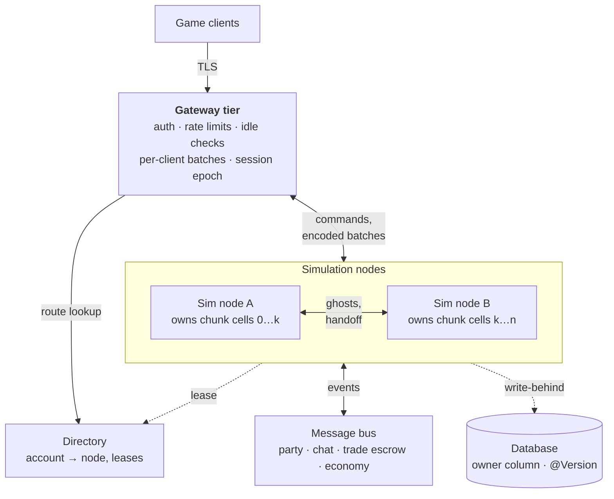



One process owns all players, all rows and all global counters. There is no cluster infrastructure yet.
Some seams already help, and a few pieces of state stand in the way.

# A target shape

This is a target shape, not a spec. Clients only talk to the gateway, so an entity can move between nodes
without a reconnect. Each node is the single writer for its chunk cells. Neighbours see border entities as
read-only ghosts. Party, chat, trade and economy leave the World and talk over a bus.

# What blocks it today

Each row is state that assumes one process.

| State                                                                                         | Problem                                                                                                                                                              | Change                                                          |
| --------------------------------------------------------------------------------------------- | -------------------------------------------------------------------------------------------------------------------------------------------------------------------- | --------------------------------------------------------------- |
| **World** `World`                                                                          | The tick thread is the single writer, but the World belongs to one process. An entity cannot move to another one.                                                    | One single-writer World per region, with a handoff              |
| **Sessions** `ConnectionInfoService`                                                       | A per-process map decides which entity an account controls.                                                                                                          | Directory with lease and session epoch                          |
| **Channels, HTTP tickets** `ChannelRegistry`, `HttpTicketService`                          | "One connection per account" holds only inside one node.                                                                                                             | Gateway tier                                                    |
| **Party, trade, whisper** `PartyService`, `TradeService`, `ChatHandler`                    | State sits in per-process maps. Each reads and writes both players in the local World.                                                                               | Bus service; trade as two-phase escrow                          |
| **World coin reserve** `WorldReserve`                                                      | The balance lives in memory and is saved as one absolute value. With two nodes, the last writer wins.                                                                | Atomic SQL deltas, or one owner                                 |
| **Rumour ids** `RumourRegistry`                                                            | The next id is `max(id) + 1` at boot. Two nodes collide.                                                                                                             | DB sequence or snowflake                                        |
| **Terrain edits** `ChunkService`                                                           | Held in a `MemoryBlobStore`: node-local and lost on restart. See [Storage](/docs/server/world-generation/#storage-voxels-chunks-player-edits-and-regeneration).      | Shared durable delta store with revisions                       |
| **Boot loading and cleanup** `EntityLoaderBootRunner`, `TradeReservationCleanupBootRunner` | Every node loads all rows. The cleanup frees the trade reservations of the whole table.                                                                              | Owner and region columns; one coordinator                       |
| **Entity ids** `EcsConfiguration`                                                          | The node part is `zone.shard-id`, set to a static `1`. A value above 255 is clamped without an error. Two nodes from one config mint the same ids.                   | Lease node ids; fail fast at boot                               |
| **Login token** `LoginTokenValidator`                                                      | The audience is just `zone`, so any zone accepts it. Single-use ids are kept per process, so each node accepts the same token once. The key is a shared HMAC secret. | Zone claim; one place for the single-use check; asymmetric keys |

# Seams that already help

- Entity ids are 64-bit snowflakes with a node part, and a master keeps its id across sessions.
- All game output goes through `OutMessageProcessor`, addressed by account. Only `socket/` knows Netty
  channels.
- Interest is already "who holds this chunk" (`ChunkSubscriptionService`). A chunk cell is the natural unit of
  ownership.
- Persister snapshots are plain data, copied out with the world to itself. They are a start for moving an
  entity between nodes, but they only carry mutable state such as position and HP. A handoff needs more.
- Login and zone share no database, only a token.
- The tick thread owns the World, and handlers reach it through the inbox. See [Threads and the Tick](/docs/server/threading).

# Two ways to grow

**Realm shards.** Run many separate copies of the world, one node each. You need the gateway, a directory,
node-id leases and one database per realm. This is the cheaper path.

**Spatial cells.** Run one large world across many nodes. You need everything above, plus ghost entities, a
handoff protocol and cross-node global services.

Both paths need the same two things first: a single writer per World, and a gateway that owns the
connections. The first is done. The second is next. Then measure with a load test of simulated clients
before you choose.
