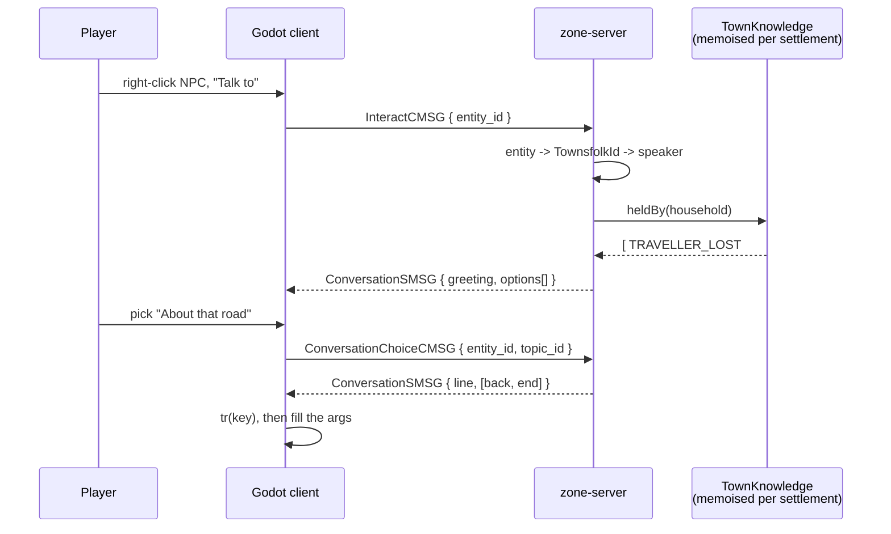



A village is generated down to the doorsteps, its history is simulated for a thousand years, and
nobody in it can say a word. This page is about closing that.

The whole design is measured against one sentence:

> A player asks the innkeeper what has been happening, hears about a master who came through four
> days ago, and then has to find the one old fisherman who still knows what happened on the road
> out of Karth — in Polish.

Four things are packed in there, and each one rules out an obvious design. It has to be **rooted in
the generated history**, so it cannot be authored. It has to hold **recent, dynamic events**, so it
cannot be purely derived. It has to be **derived per NPC rather than stored**, because a world has
hundreds of thousands of people in it. And it has to be **translatable**, which forbids sentences on
the wire.

A note on spelling before anything else: the prose here says *dialogue*, the code says `dialog` —
the package is `zone-server/.../dialog/`, the catalog is `dialogs.yml`, the translation source is
`dialogs.csv`. That is not a typo in either direction.

# What already runs

More than you would expect. The one-shot popup path is complete, and it is complete in exactly the
shape this design needs: **the server sends an id and typed arguments, and the client owns the
text.**



| Piece | Where | What it does |
| ----- | ----- | ------------ |
| `DialogService` | `zone-server/.../dialog/` | The only builder of a dialog message. Rejects a send whose argument keys do not match the catalog |
| `dialogs.yml` | `zone-server/src/main/resources/` | The catalog: numeric id, identifier, type, declared argument names. No text |
| `DialogCatalogBootValidator` | `zone-server/.../dialog/` | Fails the boot on catalog ↔ `DialogId` drift, in **both** directions |
| `DialogSMSG` | `bnet-messages/.../system/` | `dialog_id`, type, `map<string, DialogArg>`, an informative `source_entity_id` |
| `DialogArg` | both sides | A `oneof` — `text`, `number`, `entity_id`, `item_id`, `skill_id` |
| `DialogManager` | `bestia-client/src/Manager/` | Autoload queue, one dialog at a time, holds behind a loading screen |
| `DialogText` | `bestia-client/src/Game/UI/Dialog/` | Resolves `DIALOG_<id>_TEXT` through `tr()`, then fills `{named}` placeholders |
| `dialogs.csv` | `bestia-client/src/Localization/` | The text, per locale, compiled to a `.translation` at import |



Two properties of that path are load-bearing here and are worth naming, because the rest of this
page leans on both.

**Arguments are typed, not rendered.** An item argument crosses the wire as an item id and the
client resolves it through its own item database, so the item's name stays localised. `DialogArg.Text` exists for values that genuinely have no client-side representation — another
player's chosen master name — and its KDoc calls it the last resort. That is the correct instinct and this design
extends it rather than working around it.

**The client is the only place text exists.** Nothing about a sentence is on the server. This is
already the difference between the dialog path and the [chat path](/docs/server/networking/), where
`ChatSMSG` carries a literal string and every server-composed chat line is therefore English
forever.

The wire even reserved the next step: `envelope.proto` held field **126** for a `DialogChoiceCMSG`,
and the `DialogType` enum called a choice dialog *"planned but out of scope"*. Conversation took that
field rather than building beside it.

What has been added since, all of it running on the server:



| Piece | Where | What it does |
| ----- | ----- | ------------ |
| `KnowledgeService` | `zone-server/.../ai/knowledge/` | Who in a town holds which memory, built lazily per settlement |
| `ConversationService` | `zone-server/.../dialog/conversation/` | The only builder of a conversation node; samples the root |
| `DialogTopicProvider` | same | The extension point — standing, knowledge, occupation, small talk, farewell |
| `HistoryLineCatalogue` | `zone-server/.../ai/knowledge/` | How many ways each `EventKind` can be said, and with which slots |
| `SmallTalkCatalogue` | `zone-server/.../dialog/conversation/smalltalk/` | The mundane pool and the one knob that rations it |
| `RumourRegistry` | `zone-server/.../ai/rumour/` | What each town has heard lately, the only durable table here |
| `ConversationSMSG` | `bnet-messages/.../system/` | Speaker, a speech `Line`, `repeated Option` |



The client end is a stub in the chat window — see
[Building the conversation UI](#building-the-conversation-ui).

# A conversation is a function, not a tree

The naive model is a dialogue tree per NPC: nodes, edges, and a cursor into it. That model fails
this world on the first requirement. A generated world has hundreds of settlements and hundreds of
thousands of inhabitants, and storing a tree for each is the table
[townsfolk](/docs/server/townsfolk/#persistence) already refuses to write for a much smaller reason.

So there is no tree. There is a function.

```text
node(speaker, topic, now) -> (a line to say, a list of options)
```

Every part of that is derived. Nothing about a conversation is stored anywhere, and two players
talking to the same NPC on the same day get the same conversation because they are evaluating the
same function.

## Who is speaking

A speaker is a `TownsfolkId`: `(settlementIndex, householdIndex, memberIndex)` packed into a long.
That is the durable identity [townsfolk](/docs/server/townsfolk/#homes-workplaces-and-doors) already
argues for, for the reason a prop needs one — a re-materialised entity draws a fresh snowflake
entity id, so nothing durable may be keyed on one.

Everything else follows from it as a pure function:

```text
personSeed = GenRng.hash(worldSeed, townsfolkId, DIALOG_SALT)
household  = Households.one(summary, householdIndex)   // without expanding the town
member     = household.members[memberIndex]            // age, kinship
```

`Households.one` is built for exactly this: *"household 400 is the same household whether or not
households 0 to 399 were expanded first"*. The house RNG convention applies unchanged — **keyed
rolls with a named salt per question, never a draw from a stream.** `AmbientSiteLattice` is the
model already in zone-server.

## Why it is stateless

An option's id **is** a topic id, not a position in a list. `choose(npc, topicId)` therefore needs no
session table, no expiry sweep and no cleanup on disconnect, and a conversation survives a
reconnect or a server restart untouched.

```text
open(player, npc)            -> Node
choose(player, npc, topicId) -> Node

Node  (speech: Line, options: List<Option>)
Line  (key: String, args: Map<String, DialogArg>)
Option(topicId: Int, line: Line, kind: TALK | ACTION | BACK | END)
```

Depth comes from topics that offer sub-topics rather than from a stored cursor. Two levels covers
everything here: a root of a handful of options, and a leaf that says one thing and offers *back*.

The only per-conversation state is a component on the **player** entity, and it exists for one
reason: walking away ends the conversation. It is not on the NPC, because an NPC may be talking to
several people at once and has no business tracking any of them.

# Where the options come from

Root options are assembled from injected providers, collected the way chat commands already are — a
`List<DialogTopicProvider>` in a constructor, and a new one is a Spring component and nothing else.
**This is the extension mechanism**: shops, quests, faction standing and guild business all arrive
as providers without touching anything below.



| Provider | Pinned | Source |
| -------- | ------ | ------ |
| Occupation actions | yes, first | `occupations.yml`, a `dialog.topics:` list |
| Standing topics | yes | This town; directions to a trade |
| Knowledge | sampled | The chronicle, assigned as below |
| Small talk | sampled, at most one | Conditions true of this speaker and this place |
| Rumours | sampled | The rumour ledger and derived facts |
| Farewell | yes, last | Voice-flavoured |



Everything after the pinned entries is sampled down to a root of about five, because a wall of
options is not a conversation.

## The occupation's options are never sampled

A merchant always has *buy* and *sell*. This is not a special case bolted onto a random system, it
is the point of the pinned tier: an option a player cannot rely on is an option they will not learn.
The occupation catalog gains one block per trade, beside the shift and rest hours it already
carries, and the boot check that already refuses an unstaffed trade grows a second clause refusing
a topic with no provider behind it.

The action tier ships **stubbed**: a merchant's *show me your wares* appears and answers "not yet".
That is deliberate. Reserving the slot now costs one enum value, and it means wiring the shop to the
[settlement ledger](/docs/server/townsfolk/#the-settlement-ledger) later is a new provider rather
than a redesign of the node model.

## Rotation, and why it is per day

Sampling is `hash(personSeed, dayIndex, slot)`. So an NPC's optional topics are **fixed for the
game day** and rotate across days.

Rerolling on every open would be easy and would be wrong. Asking the same person the same thing
twice in a row and getting a different answer does not read as variety, it reads as a bug — and it
lets a player reroll a village until it produces the topic they wanted, which turns a conversation
into a slot machine. A day is long enough to be a stable fact about a person and short enough that
a town is worth revisiting.

# What a person knows

This is the part that has to be got right, because it is where the design can quietly destroy its
own gameplay.

## Why not a reach gradient

The obvious model is a per-occupation reach multiplier — an innkeeper hears travellers, so ×3; a
priest gets word from other temples, ×2; a farmer hears the next valley, ×0.7; a child, ×0.4.

It is wrong, and the failure is structural rather than a matter of tuning. **A multiplier is a total
order.** Whatever the numbers, one trade ends up a wholesale replacement for every other, a player
works that out inside one village, and from then on every town in the world is one conversation with
the innkeeper. The rest of the population becomes scenery that happens to have a dialogue box.

One warning about how that is *checked*, learned by writing the check wrong first. The obvious test —
no trade's memories are a superset of another's — does not measure a gradient at all. It measures
trade sizes: a village with forty farming households and two priests will always have the farmers
holding more between them, whatever the weights, and the check fires on a perfectly flat model. The
property has to be stated per household, as a bound on the **mean** number of contested memories one
trade's households hold against another's. `TownKnowledgeTest` states it that way; the worst observed
across three worlds is about 1.8×, against a bound of 2.5. The famous tier is excluded, because
everybody holds it by construction and it flattens any comparison it is included in.

Occupation has to bias **who holds what**, not gate **what is reachable**. So the model splits in
two, and the split is the whole idea.

## The town decides the pool

What could be known in this settlement at all: its own chronicle events, plus events whose position
falls within a news range, plus anything famous enough to be known everywhere.

Both halves of that query already exist and neither is reached from zone-server.
`SettlementLoreService.loreOf` finds a
town's own events by actor **and** the ones it merely witnessed by distance — which is the only way
to find an eruption, because an eruption happens to a mountain and carries no settlement actor at
all. `Households.knowledgeOf` supplies the other axis: within a lifetime plus forty years of
inherited story, within twenty-five kilometres, *or* important enough that everybody knows it.

This is a property of the **town** — where it stands, what roads reach it, how old it is. No
individual is involved yet.

## The town's people are assigned it

For each candidate memory, a **holder set**: which households actually carry it.

```text
spread(e)   = the share of the town that holds e
weight(h,e) = interest(occupation(h), e.kind)
            * curiosity(occupation(h))
            * ageAffinity(oldest member of h, e.year)
            * jitter(personSeed(h))
holders(e)  = the top ceil(spread(e) * households) households,
              ranked by hashUnit(worldSeed, settlement, e.id, h) * weight(h, e)
```

**`spread` is decided by the memory; `weight` is decided by the person.** Keeping those two apart
is what stops the model collapsing back into a gradient — no property of an individual can put a
memory into a town that the town does not have, and no property of a trade can guarantee its
holder.

`spread` falls with importance, with distance, and with age. A first calibration, against a village
of about a hundred households:



| The memory | Share | Holders in a village |
| ---------- | ----- | -------------------- |
| Famous — importance ≥ 70 | all | everyone |
| This town's own, major — a founding, a sacking | 0.6 | ~60 |
| This town's own, lesser | 0.3 | ~30 |
| Within news range, importance ≥ 50 | 0.15 | ~15 |
| Within news range, lesser | 0.04 | ~4 |
| Within news range, lesser, and older than anyone living | — | exactly 1 |



The count is floored at one, so a hamlet of twelve households still has somebody who remembers.

Three things fall out of this that a gradient cannot give.

**Exclusive knowledge exists.** At the bottom of the table, exactly one person in the town holds
that memory, and finding them is the gameplay. Note the choice of a weighted **argmax** over a
probability threshold: a per-person coin flip at *p = 1/n* is a binomial draw, so it would sometimes
leave nobody at all holding a thing — and a hook that cannot be told to anyone is a dead end a
player has no way to distinguish from a bug.

**The priest is only *likely* to be the one.** `weight` biases the ranking; it does not filter it.
And `jitter` is drawn per **person**, not per trade, so this particular farmer is unusually
well-travelled and that particular innkeeper is incurious. There is no NPC a player can route to
and skip the town.

**Interests still read as characterful in aggregate.** Weight a guard toward `BATTLE`, `SIEGE` and
`FORT_BUILT`, a priest toward `SHRINE_RAISED`, `RITE_PERFORMED` and `SEER_VANISHED`, and across a
whole town they will hold roughly the memories they ought to — without any single one of them being
guaranteed. The trade is a tendency, which is what a trade actually is.

Age is the fourth term in `weight` and it earns its place on the bottom row. A memory older than
anyone living reaches the town only as an inherited story, and the person most likely to be
carrying it is the oldest one in it — which is both true and the sort of thing a player works out
for themselves after the second village. `Household.Member` already carries an age.

Note also what the bottom row is *not*: a trade's interest never admits a memory to the pool, it
only reorders the ranking inside one. Interest is a bias, not a back door — otherwise a priest
would end up knowing things that never reached the town at all.

One consequence to keep in view: events below the history stage's importance floor of 40 are
already sampled one in twenty-four by the pruner, so the log arrives thinned at the bottom. This
table decides who holds what survived that, not how much survived.

## What it costs

Building the assignment is one pass of candidates × households — a few tens of thousands of hashes
for a city, once. So it is built lazily per settlement and memoised in a field, exactly as
`SettlementLoreService` already memoises its position map and `WildSpawnerService` its dens. A
conversation is then a set lookup.

Nothing is persisted. A reseed rebuilds it, which is the only correct behaviour: **a settlement
index means nothing across two worlds**, and a stored copy is the silent-corruption trap
`SettlementLoreService` warns about in its own KDoc.

# Small talk

Knowledge makes a town informative. It does not make anybody a person, and a village where every
line is a chronicle entry reads like a library.

So: a provider contributing **at most one** mundane topic, on a per-day roll. One knob, `chance` in
`townsfolk/small-talk.yml` and currently 0.45, is the entire boredom control. It is a leaf — one line, no sub-tree — and because
it occupies one of the sampled root slots it displaces a rumour sometimes, which is self-limiting.

What keeps it from being generic filler is that every line is **gated on something that is actually
true** of this speaker in this place. The conditions do the characterisation work, so the pool stays
small:



| Gate | Read from | The sort of thing it unlocks |
| ---- | --------- | ---------------------------- |
| Occupation | `Occupation` | A farmer on how the barley is coming |
| Age and kinship | `Household.Member`, `Kinship` | A child, an elder, an apprentice's complaint about the work |
| Terrain | `PlaceRegion.dominantBiome`, `RegionKind`, whether the town is coastal | Fishing off the point — and only in a town that has a point |
| Season and weather | The world clock and the weather system | Both already derived, both free |
| The town itself | `SettlementRecord` wealth, wall year, times sacked | Living behind walls somebody's grandfather paid for |



Which line, today, comes off the speaker's own seed and the day. **Two rolls rather than one**, and
that is not an accident: a single roll over the eligible lines would make the chance depend on how
many a speaker happened to qualify for, so adding a line about the coast would quietly make every
fisherman chattier. One roll decides whether they have anything to say, a second decides what.

A given farmer therefore has *their* topic, about *their* fields, in this valley, this season — and
it is the same one all day. A late click is still answered as long as the line's gates still hold:
what makes a click stale is a clock rather than anything the player did.

The real constraint here is authoring rather than engineering: every line is a hand-written row that
a translator is later paid for. The budget is roughly three lines per occupation plus a dozen shared
terrain and season lines — 33 topics as shipped, which is 66 rows, because a topic is the thing the
player clicks *and* the answer. It is worth writing that number down, because a flavour pool with no
ceiling is how a localisation bill quietly triples, and `SmallTalkCatalogueTest` asserts the ceiling
rather than trusting the comment.

One boot check earns its place here, and it took planting a fault to get right. **Every trade must
have at least one line that holds regardless of place and season**, or it falls silent wherever the
conditions happen not to be met — a farmer with only rainy-day lines says nothing on a clear day, in
a season nobody tested, and looks exactly like a working feature. Every gate but the trade itself
counts towards that: a line only an elder can say is not a fallback for everybody, which the first
version of the check got wrong.

# Recent events: the rumour ledger

History covers everything up to the present year and nothing after it. A boss killed outside the
walls last night, a rift that opened in the woods, a master who rode through four days ago — none of
that is in the chronicle and none of it can be derived from the seed.

One small table, shaped like the scorch and prop-divergence registries and **carrying their world
shape and pipeline version columns for the reason given above**, plus a `deleteAll()` in the world
recreation path:

```text
id, settlementIndex, kind, slots, postedOnDay, expiresOnDay, strength
```

A row per town that heard a thing, **not per thing**. That is deliberately the opposite of
normalising: a shared event row plus a join table would be one truth about *where* news reached, and
the only question anyone ever asks is "what does this town know", which this answers with a
primary-key scan.

`RumourService.post(kind, at, strength, slots)` fans a structured event out to the settlements within
a strength-scaled radius — news travels at walking pace here as it does in the generator. The reach
ceiling is `SettlementLoreService.NEARBY_RANGE`, and deliberately the same number: that is already
the distance at which the chronicle considers a town to have witnessed something, and two answers to
"near enough to have heard" would surface as a village that knows about the battle in its history but
not the one last night.

Rows are deleted at expiry, so a world nobody has disturbed holds none at all. That sweep needs to be
*driven* by something — it shipped reachable only from a GM command at first, which is the kind of
gap with no visible symptom: a conversation filters spent news out on the way past, so a player sees
exactly the right lines while the table fills behind them forever. `RumourExpirySystem` runs it every
few minutes.

The slots are one encoded column rather than a column per name. Which arguments a kind wants is
decided by a yml file expected to grow, and the type tag is part of the encoding because **a name and
a token are both strings and mean opposite things** — one is translated, one must never be, and a
decoder that lost the tag would still round-trip a string and still look right.

A `RumourKind` is added only once something posts it. A kind with no producer is a translated line
nobody can ever reach, which is the same mistake as an event class no townsperson can mention and the
more expensive half of it. The first real producer is a notable kill: `NotableKillReporter` gates on
the species' level, because without a threshold every rat killed outside a village is news and the
single-holder memory a player was meant to hunt for is buried under vermin.

The join that makes this cheap is that **a rumour ages into the same shape as a chronicle memory**.
Both become a `Knowledge`: a key, typed slots, an importance, a time, a locality. The dialogue layer
never learns which producer a memory came from, and the assignment model above applies to a rumour
unchanged — so a rumour can have exactly one holder too, and *somebody saw it happen* falls out for
free. Share is read off the rumour's **current** importance, which decays, so the whole arc comes for
nothing: the town is talking the morning after something large, a handful of people a week later, and
finally one household who happened to see it.

Two details that only appear once this is real code. A rumour's weight in the draw is curiosity and
character only — **no interest term**, because a trade's interests are `EventKind`s and a beast has
no kind in that vocabulary, and no age term, because nobody inherited last night from their
grandmother. And the topic ids have to be disjoint from the chronicle's *and* stay inside their
provider's range: the first attempt negated the row id, which is disjoint and puts the conversation
option in the neighbouring provider's range, where it is claimed by something that has never heard of
it and answered with silence. They are offset above the chronicle instead.

A third producer stores nothing at all: facts already durable elsewhere. Burnt fields come from the
scorch registry, a destroyed workplace from the prop divergence map, a town in distress from the
settlement ledger when that exists. Those are read, never copied, because a copy is a second
disagreeing world model.

# Saying it in another language

`SettlementLoreService` records generated prose as **untranslatable by construction**, and within
its own terms that is correct. This design escapes it by changing the terms.

## Nothing on the wire is a sentence

`HistoryEvent.detail` is a rendered English line, baked at generation time. It is deliberately
stored — a reader should not need a second copy of every name and relationship — and it stays,
for the chronicle tool and for logs. **Dialogue does not use it.**

A memory is re-derived from the parts instead:

```text
key  = HISTORY_<EVENT_KIND>_<variant>
args = { place: Name(…), civ: Name(…), figure: Name(…), ago: Token(…) }
```

```text
HISTORY_SETTLEMENT_BURIED_2,"The mountain took {place}, {ago}. You can still walk into what is left of it."
```

Every ingredient is present already: the event's actors are typed indices into five tables, the kind
is an enum, and `Names` renders any of them from a seed. The variant is `hash(personSeed, e.id)`, so
two people in one town phrase the same event differently — for nothing, since the rows exist anyway.

**Proper nouns cross as literals, and that is correct rather than a concession.** `Names.place`,
`Names.civ` and `Names.person` build words out of invented stems that belong to no language;
"Karth" is Karth in every locale. Only the *connective* words need tokens, and separating the two is
precisely what the slot-filled form does.

## Two new argument kinds



| Kind | Payload | Why |
| ---- | ------- | --- |
| `Token` | A translation key | The client resolves it with `tr()` and substitutes the result. Lets a template say `{who} spoke of {what}` where `{what}` is itself localised. The single most important addition |
| `Name` | A string | A proper noun. Same payload as `Text`, kept distinct so the client can style it and so a reviewer can see at a glance that no sentence slipped through as `Text` |



`Token` is what makes the whole approach work. Without it, any composed phrase has to be either one
enormous key per combination or an English fragment glued on the server.

## Time is a bucket, not a number

`AGO_TODAY`, `AGO_DAYS`, `AGO_SEASON`, `AGO_YEARS`, `AGO_LIFETIME`, `AGO_GENERATIONS`, `AGO_AGES` —
a `Token`, never a count.

Two reasons, and the second is the better one. Godot's CSV translation importer carries no plural
forms, so "{n} days ago" is a bug waiting for the first Slavic locale. And a bucket is the decision
`Memory` deliberately declines to make on the caller's behalf: *"how recent something feels is a
decision for whoever is speaking — a grandmother and a chronicler place the same year
differently."* A speaker's own sense of time is a property of the speaker.

## Voice

`hash(personSeed, VOICE_SALT)` picks one of about five — curt, warm, weary, wary, talkative — and it
suffixes the key for **greetings, farewells and the I-do-not-know line only**.

Not knowledge lines. Applying voice there would multiply the largest part of the translation file by
five and buy almost nothing, because the interesting half of a knowledge line is its content. The
greeting is where a player forms an impression of a person, and it is three rows.

## Why conversation is not `DialogSMSG`

`DialogSMSG` identifies its text by a **numeric id** from a catalog, which is right for a
hand-authored popup with a Kotlin call site: the id is short, the catalog is checked at boot, and
`DialogId` gives the call site a name.

It is wrong for a line whose key is *computed*. A history line's key derives from an `EventKind`
name, and the only numeric mapping available would be an ordinal — which this codebase forbids
storing anywhere, by rule and with digest tests to enforce it, because a reorder would silently
rewrite every reference. There are also on the order of a hundred and fifty generated line keys
before any small talk, and a hand-maintained numeric catalog of those is a merge conflict per pull
request.

So conversation is its own message pair, **reusing `DialogArg` and nothing else**. `DialogSMSG`
stays exactly what it is: the one-shot catalogued popup.

This absorbs the planned `CHOICE` dialog rather than building beside it. A second "ask the player
something" mechanism would need its own queue interaction, its own answer routing and its own
reasoning about what happens when both are on screen, and neither would be used enough to stay
correct. One mechanism for a question, and it is this one.

# The wire



| Message | Field | Carries |
| ------- | ----- | ------- |
| `InteractCMSG` | new | `entity_id`. "Talk to that" — the *server* decides what interacting with an entity means |
| `ConversationSMSG` | new | The speaker, a speech `Line`, and a repeated option list of `(topicId, Line, kind)` |
| `ConversationChoiceCMSG` | **126**, already reserved | `entity_id` and `topic_id`. The entity rather than a session id, so the server re-checks range on every step |
| `DialogArg` | extended | `token` and `name` added to the existing `oneof` |



A `Line` is a translation key plus the same `map<string, DialogArg>` the existing dialog already
carries, so the client's placeholder formatter is reused verbatim.

On the client, two small additions to things that already exist. The right-click context menu — which
today holds exactly one action — grows a *Talk to* entry. And the message dialog grows buttons,
which its own source comment already anticipates: *"Player-choice dialogs will add buttons here and
send the answer back… the queue and text resolution above and below this node do not change."*

# Worked example: the mountain that took Karth

Three hundred years ago the volcano across the water buried the town of Karth in ash. The chronicle
holds two things about it, and they land in opposite rows of the spread table — which is the point
of the example.



| The memory | Importance | Row it lands in | Holders |
| ---------- | ---------- | --------------- | ------- |
| `SETTLEMENT_BURIED` — the mountain took Karth | 80 | famous | everyone |
| `TRAVELLER_LOST` — somebody ran to warn the next village and died on the road | 45 | near, lesser, older than anyone living | exactly one |





1. The player asks the **innkeeper**, because that is what everyone does. She has the burial: it is
   above the fame floor, so every adult in the world has it and she is no better a source than the
   child outside. She gives the headline and a rumour about the master who came through on the
   fourth.
2. So the player goes asking who remembers anything *more* about that night. Nobody does — not the
   guard, and **not the priest**, who is weighted for exactly this kind of memory and simply did
   not win the ranking.
3. An elderly **fisherman** has it. His trade is weighted low for news, but the memory is older than
   anyone living, his age affinity is the highest in the village, and the hash put him first for
   event 412. He is the only person in the settlement who can say what happened on that road.
4. Choosing his topic sends `ConversationChoiceCMSG { entity_id, topic_id }`. The server re-checks
   that the player is still in range, reads the memoised assignment, and renders:

```text
key  = HISTORY_TRAVELLER_LOST_2
args = { figure: Name("Aelred Ashfoot"), place: Name("Karth"), ago: Token("AGO_AGES") }
```

5. The client resolves `HISTORY_TRAVELLER_LOST_2` through `tr()` against its Polish translation,
   resolves the nested `AGO_AGES` token the same way, and substitutes the two names unchanged —
   producing a Polish sentence about a Karthian place name and a Karthian person, which is exactly
   right, because neither of those words belongs to English either.

Nothing in that exchange was written down, and running it again tomorrow finds the same fisherman.
Ask the innkeeper again tomorrow and the master who rode through will have decayed a little further
out of her rumour list, because that half of it *is* stored.

# Boot checks

Each of these is a boot failure or a build failure, never a comment — the house pattern the dialog
catalog validator and the occupation coverage check already follow. All of them run today.

**At boot**, so the server refuses to start rather than showing a player a raw key:

1. **Every `EventKind` is voiced** in `townsfolk/dialogue.yml`. Without it an NPC can *know*
   something it cannot *say*. This is the `LIGHTHOUSE_LIT` mistake in a new place: a thing that
   exists in the world with nothing anywhere able to account for it, found by a player rather than
   by a build.
2. **Every `RumourKind` is voiced** in `townsfolk/rumours.yml`, or news arrives, ages and expires
   without a single person ever mentioning it.
3. **Every trade has small talk that holds anywhere**, or it falls silent in some village nobody
   tested.

**At build time**, through `./gradlew checkDialogDb`, which cross-checks the server's three catalogs
against the client's `dialogs.csv` in both directions — a declared line with no text, and a text row
belonging to nothing:

4. **Every declared key has a row**, for all three namespaces (`DIALOG_…`, `HISTORY_…`,
   `RUMOUR_…` and `TALK_SMALL_…`).
5. **No phrasing uses a placeholder its producer cannot supply.** One-directional on purpose: a
   sentence is allowed to ignore a slot its kind offers — not every line about a battle wants the
   year — but using one nothing sends renders a literal brace at a player, in one locale, on one
   seed in twenty. Small talk is checked the other way round: it takes no arguments at all, so any
   placeholder in one of its rows is an error.

**In tests**, for the things a catalog cannot know:

6. **Every declared slot is filled from real chronicles.** `HistoryLineTest` sweeps generated worlds
   rather than a fixture, which is what found that an eruption happens to a *mountain* and names no
   settlement, nobody and nowhere — so a line about one cannot say where it was, however much it
   would like to.

A note for whoever adds the next check: verify it by planting the fault. Two of the checks above
passed a broken catalog when first written, and only breaking the input on purpose showed it.

# Building the conversation UI

Everything below is verified against the client as it stands, and is written for a machine with Godot
on it — there is none here, so this half was deliberately stopped at a stub rather than guessed at.
What ships today is `conversation_stub.gd`: the speech and numbered options go into the chat window
and `/pick <n>` answers them. It closes the loop for a developer and it is not a UI.

**Keep `MessageDialog` as the presenter.** Add a `%Choices: VBoxContainer` under `%Body` in
`MessageDialog.tscn`, populate it with plain `Button`s freed at the top of `show_dialog`, and hide the
OK button when the option list is non-empty. `DialogManager` holds a **single presenter slot**, so a
second scene means two presenters and a duplicated `confirmed`/`canceled`/`_current`-guard dance for
no gain. `message_dialog.gd`'s own comment already says the queue and the text resolution do not
change.

**`_on_closed` is idempotent through its `_current == null` guard, and must stay so.** Closing raises
both `confirmed` and `canceled`, and a double call silently skips the next queued dialog.

**Carry the option list and the speaker through `DialogContent.of_message`**, leaving them empty in
`of_local`. That is why `MessageDialog` never has to ask which kind of thing it is holding.

**Add `resolve_option()` beside `DialogText.resolve()`.** Option labels need the same `tr()` plus
`String.format` treatment as speech; a raw server string must never reach a label.

**`DialogText._resolve_arg` already handles the two new argument kinds** — `token` resolves through a
nested `tr()`, `name` is deliberately not looked up at all. That nested lookup is the whole reason a
sentence built out of generated history can be read in another language, and a second copy of that
logic would drift. The C# side sets `KindName` from `EnumName.Of(kind)` because GDScript cannot see
C# enum members.

**The context menu is 46 lines.** A `Talk to` entry is a `const`, an `add_item` in the right
`is`-branch and a `match` arm. The real cost is blocker 2 above: either add a `VisualKind.NPC` and an
`NpcVisual` scene, which mirrors the existing dispatch in `entity.gd`, or a talkable flag on
`VisualComponentSMSG` exposed as a duck-typed `has_dialog()`. Existing menu labels are hardcoded
English; new ones must go through `tr()`.

**Translations need Godot run once.** Edit `dialogs.csv`, open the project so the importer regenerates
`dialogs.en.translation`, and commit both. A new locale also needs its `.translation` appended to
`project.godot`'s `locale/translations` array — a column on its own changes nothing.

**Nothing about the server should need to change.** An option id is a topic id, the server keeps no
conversation state, and a stale click resolves to whatever it would have resolved to anyway. If the
panel seems to want a session, that is a sign it is being built wrong.

# Known blockers

The first one is now the real one; townsfolk identity, which used to head this list, is done.

1. **There is no conversation panel.** The server half is complete and reaches a player only through
   a GM command that prints the speech and numbered options into the chat window. See
   [Building the conversation UI](#building-the-conversation-ui) below, which is written to be
   picked up on a machine with Godot on it.
2. **The client cannot tell an NPC from a wolf.** Identification is by visual node class and there
   is no NPC kind on the wire, so the context menu offers "Talk to" on any creature. The server
   answers nothing for a target that cannot talk, so the cost is a wasted message rather than a
   wrong answer — but it is the thing to fix before the panel is polished.
3. **Entities have no display name on the wire.** The AI agent's name is the archetype string —
   every townsperson is `townsfolk_commoner` — so `ConversationSMSG` carries a speaker name of its
   own. That field should go the day a real display name exists.
4. **Some generated names bake English into themselves.** Settlement, civilisation and person names
   are invented stems and translate for free. But a site is rendered as "the barrow of X", a region
   as "X Downs", an artifact as "the Hammer of X" — the form word is English. Those names are only
   half-translatable until the form becomes a `Token` beside a `Name`. Mechanical to fix, and it
   should be fixed before a site is quoted in dialogue.
5. **There is only one locale.** All four translation sources are `keys,en`. Adding a language means
   a column *and* appending the compiled `.translation` to the client's translation array — the
   first without the second silently changes nothing.
6. **Chat is not translated**, so an NPC line must never be delivered through it, however convenient
   that looks during development.
7. **The chronicle has no spatial index.** The nearby-event query is a linear scan over the whole
   log. That is fine once per settlement and wrong once per conversation, which is why the
   assignment is memoised rather than computed on open.
8. **The settlement door lookup has a latent unit bug.** The townsfolk spawn command compares
   building doors in metres against a position in tiles, skipping the voxel-size conversion its two
   sibling call sites both apply. Harmless only while the voxel size is exactly one metre. Dialogue
   will reuse the same lookup for directions, so it should be fixed first.
