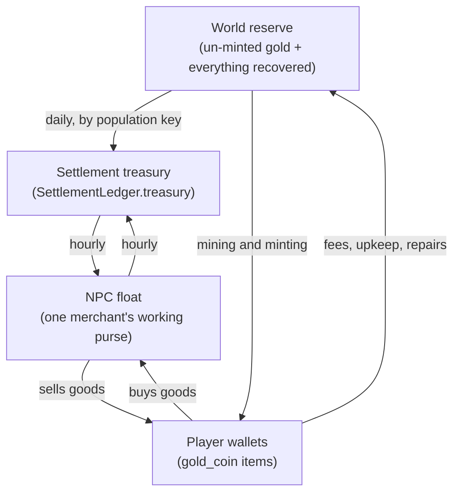



The [Economy Simulation](/docs/server/economy/) page states the rule: NPCs never conjure money. This page answers the
question that rule implies but does not settle — **how much money is there in the first place?**

Bestia's answer is unusually literal. The world generator already places gold deposits with real tonnages, and those
tonnages already reconcile with the ore voxels a player can actually break. So the money supply is not a tuning
constant somebody picked. It is **the amount of gold in the ground**, and this page derives it.

# Sizing the supply

A fixed money supply has to be sized against something, and the honest anchor is **how many players the world is
meant to hold**. Everything else follows from that.

Genesis — the 128 km world `zone-server` ships with — targets **300 concurrent players**. That sets a total supply of
**300,000,000 coins**, half of it minted into NPC hands when the world is created. The calibration constant is
therefore:

```text
1,000,000 coins of supply per concurrent player
```

Working from a player count rather than toward one matters. Sizing the supply first and asking afterwards how many
players it supports is how a world ends up with either five players' worth of coin or a thousand times more than it
will ever need.

## What the generator already fixes

Three numbers come out of `worldgen` and are not ours to choose:



| Quantity                        | Value                | Source                                        |
| ------------------------------- | -------------------- | --------------------------------------------- |
| `GOLD_LODE` abundance           | 0.49 t per 1,000 km² | `MinableOre` in `resource/Deposits.kt`        |
| Guaranteed deposits, floored at | 3 × 8 t              | `guaranteedDeposits`, `MIN_DEPOSIT_TONS`      |
| Metal per ore voxel             | 1.1667 kg            | `GradeMix.meanYieldKg`, `resource/OreBody.kt` |



That last figure is the important one: **857 ore voxels make a ton of metal**, and the generator enforces the
relationship to within 0.1% (`Invariants.kt`, the tonnage tolerance check). A deposit's stated tonnage and the number
of ore blocks a player can dig out of it are the same fact expressed twice.

Genesis holds roughly **35 t** of gold — 24 t of lode, because the three-deposit floor dominates the 8 t the abundance
alone would give, plus about 11 t of placer traced downstream of those lodes. That is **~30,000 ore voxels**.

## The one free parameter

Thirty thousand voxels have to mint three hundred million coins. That fixes everything else:

```text
1 gold ore voxel      = 10,000 coins
1 gold_ore item       = one voxel's yield
2 gold_ore + 1 coal  -> 1 gold_bar          (mirrors the existing IRON_INGOT recipe)
1 gold_bar            = 20,000 gold_coin    (one way only)
```

30,000 × 10,000 = 300,000,000. The chain is a recipe rather than a special case precisely so that it is inspectable by
the same boot checks as every other recipe.

## What that gives at each world size



| World             | Area          | Gold in ground | Coin supply | NPC share at creation | Players |
| ----------------- | ------------- | -------------- | ----------- | --------------------- | ------- |
| 128 km (Genesis)  | 16,384 km²    | ~35 t          | ~300 M      | 150 M                 | **300** |
| 512 km (target)   | 262,144 km²   | ~204 t         | ~1.75 G     | 875 M                 | ~1,750  |
| 1024 km (ceiling) | 1,048,576 km² | ~757 t         | ~6.5 G      | 3.25 G                | ~6,500  |



**Small worlds are over-provisioned, and deliberately so.** Genesis gets 24 t of lode gold against an abundance that
asks for 8 t, because the three guaranteed deposits are each floored at 8 t. Any function that derives a world size
from a player count has to model that floor rather than assume gold scales linearly with area — below roughly 375 km
it does not.

At 300 players holding around 100,000 coins each, players circulate about 30 M, a tenth of the supply, with some
120 M still unmined. That headroom is the room the world has to grow into.

# The three-tier purse

Gold is not a single global number. It sits in three places, and it only ever moves between them.



- **The world reserve** holds gold that has not been minted yet, plus everything the world has taken back. It is the
  counterparty that makes the loop closed rather than notional.
- **Settlement treasuries** already exist and already work. What changes is where their income comes from: today they
  revert toward a derived target out of nowhere, which is the one place in the running code where gold is created.
- **The NPC float** is what one merchant carries. It is refilled from the town's treasury and returned to it, so a
  shopkeeper can genuinely run out of coin on a busy afternoon while the town behind them is still solvent.

**Big settlements get more.** The daily distribution is weighted by population rather than split evenly, because a city
of twenty thousand does more trade in a day than a hamlet of forty does in a season.

## Nothing is burned

This is a change from the earlier design, and it is the point of the whole structure. Auction listing fees, the
commission posting tax, repair costs, the gold on a merchant who is killed — **all of it returns to the world reserve**.
Nothing is deleted from the world.

The effect is the same as burning in the short run: the coin leaves circulation and stops pushing prices up. The
difference is that it comes back, slowly, through the settlements, which means a busy economy is also a liquid one. A
burn would make the supply monotonically decreasing, and a world whose money supply only ever shrinks has a very
specific ending.

## Minting yield is a recovery rate, not a bonus

The [Minting](/docs/mechanics/master/#skill-minting) skill grants what its table calls a yield of `+10%` to `+50%`.
Read as a multiplier on the coins a bar produces, **that skill would create gold out of nothing** and break the
invariant this page exists to state.

So it is not a multiplier. A bar contains a fixed amount of gold, and minting recovers a _share_ of it: an unskilled
master wastes most of the bar, and Minting Lv. 5 wastes almost none. The waste goes back to the world reserve rather
than vanishing. The skill therefore makes a player better at extracting value from gold they already hold, which is
what the skill is _for_, without letting them print.

# Invariants

These continue the numbering used by the [settlement simulation](/docs/server/townsfolk/).

- **I23 — Conservation.** The world reserve, every settlement treasury, every NPC float and every `gold_coin` item held
  by a player sum to a constant, and that constant is the configured supply. A drift is a bug, not a balance issue.
- **I24 — Minting is one way.** No path converts a `gold_coin` back into a `gold_bar`. A coin is money for good.
- **I25 — Treasuries are capped.** No settlement treasury exceeds its ceiling; the overflow returns to the reserve
  rather than accumulating where it landed.
- **I26 — A float is bounded.** Killing a merchant yields pocket change, never a payday, because a float is a working
  purse and not a bank.

## Two places the arithmetic can quietly leak

Both are in code that already runs, and both are easy to get wrong while changing something else.

- **Long catch-ups discard time.** A settlement left alone for a year is simulated as thirty days, deliberately. With a
  reserve as counterparty, the discarded interval must not silently create or destroy gold — the reserve has to be
  reconciled against what was actually simulated, not against what was skipped.
- **Ledger rows delete themselves.** A settlement's row disappears once it has decayed back to its reference, which is
  what keeps the table small. That stays correct only if the same reversion that erases the row has already made the
  reserve whole.

# The end of the gold

A finite supply mined out of finite deposits has a terminal state. Once the last gold voxel in the world is broken, no
new coin can ever enter, and the economy becomes purely redistributive. At Genesis scale that is thirty thousand
voxels, and three hundred players will get there.

**This is an open question and the honest thing to do is say so.** The candidates, none yet chosen:

- **Recycling.** Gold recovered from destroyed items returns to the reserve, so the supply is finite but circulates
  indefinitely. Closest to the rest of the design, since nothing is burned already.
- **Slow replenishment.** Deposits refill far below the rate they are worked. Preserves scarcity, weakens the fiction.
- **New ground.** The world grows, and new territory arrives with its own deposits.
- **Accept it.** Exhaustion is an intended late-game condition, and a world where gold cannot be made any more is a
  world where gold is genuinely precious.

The choice has to be made before mining ships, because it is the one decision that becomes permanent in the data.

# Prior art

The three-tier purse is taken almost directly from **Wurm Online**, which is the one MMO to have shipped a genuinely
closed currency at scale. Gold flows from players into kingdom coffers through purchases and settlement upkeep, and the
coffers periodically [distribute money to NPC traders](https://www.wurmonline.com/2013/09/20/money-distribution/),
which is the only route back to players. A Wurm trader has a finite purse that refills over time, and there is a hard
cap on how much a single player can earn from one per hour. Both mechanisms are here: the float is the purse, and the
payout cap is what stops a closed loop being drained by whoever grinds hardest.

A fuller comparison against Ultima Online, RuneScape, EVE, Albion and Star Wars Galaxies — and the failure modes each
of them found — lives on the [Economy Simulation](/docs/server/economy/#prior-art) page.
