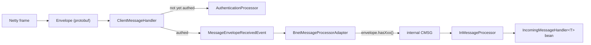

`zone-server` owns a raw TCP socket (Netty, not WebSocket). Every message, in both directions, is
one `Envelope` protobuf message — a big `oneof` covering every leaf message type — wrapped in a
4-byte big-endian length prefix. The client-side half of this same protocol is documented in
[Networking](/docs/client/networking); this page covers the server side.

# The wire format

`bnet-messages/src/main/proto/` is the single source of truth for every message. `envelope.proto`
imports every leaf `.proto` file and multiplexes them into one `oneof`, with field numbers grouped
into manually maintained ranges per domain:

```protobuf
message Envelope {
  oneof message {
    // SYSTEM & ACCOUNT 100
    Authentication authentication = 100;
    AuthenticationSuccess authentication_success = 102;
    Ping ping = 120;
    ChatCMSG chat_cmsg = 122;

    // MAP 200
    WorldInfoSMSG world_info = 200;
    ChunkDataSMSG chunk_data = 203;

    // INVENTORY 300 · MASTER & BESTIA 400 · ENTITY & COMPONENTS 500 · SOCIAL & PARTY 600
    ...
  }
}
```

Naming convention: client → server messages end in `CMSG` (`AttackEntityCMSG`), server → client
messages end in `SMSG` (`DamageEntitySMSG`); a handful of bidirectional/shared messages have no
suffix (`Master`, `Ping`/`Pong`). Field numbers within a range are hand-assigned sequentially —
adding a message means taking the highest number in its block and adding one, never reusing or
leaving a gap.

Codegen is two separate pipelines that both have to run after editing a `.proto` file: Kotlin
classes regenerate automatically on the next Gradle build; the C# classes consumed by the Godot
client are generated by a **manual** step, `bnet-messages/gen-protobuf.bat`, and the output is
committed to the repo alongside the `.proto` change.

# The Netty pipeline

Built in `SocketServer.kt`, one `ClientMessageHandler` instance per connection:

```kotlin
ch.pipeline().addLast(
  LengthFieldBasedFrameDecoder(MAX_FRAME_LENGTH, 0, 4, 0, 4), // 4-byte length prefix, 1 MB max frame
  ProtobufDecoder(EnvelopeProto.Envelope.getDefaultInstance()),
  ProtobufEncoder(),
  BigEndianLengthFieldPrepender(),                            // outbound length prefix
  ClientMessageHandler(handlerContext)
)
```

The socket binds to `socket.ip-address`/`socket.port` (`127.0.0.1:8090` in dev,
`zone-server/src/main/resources/application.yml`), started by `SocketServerBootRunner` as the very
last boot step (see [Architecture](/docs/server/architecture#boot-sequence)).

# Inbound: socket → Envelope → CMSG → handler



1. **`ClientMessageHandler.channelRead0`** — if the channel isn't authenticated yet, the first
   message must be an `Authentication` envelope, routed to `authenticateChannel`. Once
   authenticated, every further message is wrapped in a `MessageEnvelopeReceivedEvent` and published
   as a plain Spring `ApplicationEvent`.
2. **`BnetMessageProcessorAdapter.handleMessageEnvelopeReceived`** (an `@EventListener`)
   pattern-matches the `oneof` and converts the raw protobuf into an internal `CMSG` object:

   ```kotlin
   val internalMessage = when {
     envelope.hasAttackEntity() -> AttackEntityCMSG.fromBnet(accountId, envelope.attackEntity)
     envelope.hasUseItem() -> UseItemCMSG.fromBnet(accountId, envelope.useItem)
     ...
     else -> throw UnknownBnetMessageException(envelope)
   }
   ```

   Adding a new incoming message type means adding a branch here — this is the one place
   registration is manual; everything downstream auto-wires through Spring. A `fromBnet` that
   returns `null` (a well-formed but semantically invalid payload, e.g. an equip slot ordinal this
   server version doesn't know) drops the message with a warning rather than tearing down the
   connection.
3. **`InMessageProcessor.process()`** looks up handlers by the message's Kotlin class from a
   `Map<KClass<*>, List<IncomingMessageHandler<*>>>` built from every Spring-injected
   `IncomingMessageHandler<*>` bean — dispatch is by class, not a string or int tag:

   ```kotlin
   @Component
   class AttackEntityHandler(...) : InMessageProcessor.IncomingMessageHandler<AttackEntityCMSG> {
     override val handles = AttackEntityCMSG::class
     override fun handle(msg: AttackEntityCMSG): Boolean { ... }
   }
   ```

   Handlers resolve the entity to act on via `ConnectionInfoService.getActiveEntityId(accountId)` —
   never a client-supplied entity id — so a handler always acts on behalf of whatever entity the
   account currently has selected (master or an owned Bestia), with no separate ownership check
   needed.

# Outbound: SMSG → OutMessageProcessor → channel

An `SMSG` implementation provides `toBnetEnvelope(): EnvelopeProto.Envelope`. `OutMessageProcessor`
offers two shapes:

```kotlin
fun sendToPlayer(playerId: Long, msg: SMSG)               // one specific account
fun sendToAllPlayersInRange(pos: Vec3L, msg: SMSG)        // everyone in AOI range of pos
```

`sendToAllPlayersInRange` queries `ActivePlayerAOIService` (see [ECS](/docs/server/ecs#area-of-interest))
for the account ids within a fixed range (100 m) of `pos`, then sends to each individually.
Delivery itself is `ChannelRegistry.sendMessage`, which looks up the Netty `Channel` for an account
id and calls `writeAndFlush` — there is no queuing or batching at this layer.

`ChannelRegistry` (account id → `Channel`) and `ConnectionInfoService` (account id → session:
selected master, owned entities, currently active entity) are the two session maps; there is no
single unified `Session` object combining them.

# Dirty-component sync, not full-state broadcast

`zone-server` doesn't broadcast full entity state every tick. Every syncable ECS component
implements `Dirtyable` (tracks its own dirty flag — mutating it through its own setters marks it
dirty) and reports who should receive it via `SyncTargets` (`PublicInRange`, `OwnerOnly`, or an
explicit `Accounts` set). After each tick, `ZoneEngine` scans every dirty component, builds its
`toEntityMessage()`, and routes it through exactly the two functions above — so e.g. `Position` is
broadcast to everyone in range while `Inventory` or skill points go only to the owning account. See
[ECS](/docs/server/ecs#dirty-components-and-sync) for the mechanism in full.

# Adding a new message type end-to-end

Worked through once already for `ActivateSkillCMSG`/`ActivateSkillHandler`
(`zone-server/.../battle/attack/`) — use those as a template.

1. **Proto**: new file under `bnet-messages/src/main/proto/messages/<domain>/` (`*_cmsg.proto` /
   `*_smsg.proto`), then wire it into `envelope.proto`: an `import` line plus a field in the
   `oneof` inside the correct numbered range.
2. **Kotlin CMSG** (incoming): `data class XyzCMSG(...) : CMSG` with a companion
   `fun fromBnet(accountId: Long, proto: ...): XyzCMSG`.
3. **Dispatch branch**: add `envelope.hasXyz() -> XyzCMSG.fromBnet(...)` to
   `BnetMessageProcessorAdapter`'s `when`.
4. **Handler**: `@Component class XyzHandler(...) : InMessageProcessor.IncomingMessageHandler<XyzCMSG>`
   — auto-discovered, no manual registry entry.
5. **Kotlin SMSG** (outgoing), if a reply/broadcast is needed: implement `toBnetEnvelope()`. Use the
   one-off broadcast shape (`DamageEntitySMSG`, sent via `sendToAllPlayersInRange`) for events, or
   the `Dirtyable`-backed entity-state shape (`SkillPointsSMSG`) for actual persistent component
   state that should auto-sync on change — don't use the state shape for one-off events.
6. **C# client wrappers + regenerate**: see the client-side steps and the `gen-protobuf.bat` note in
   [client Networking](/docs/client/networking#adding-a-new-message-type).
