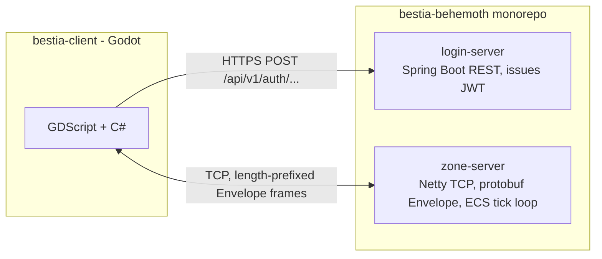

The server side of Bestia is **not** Godot — Godot only exists on the client
([bestia-client](/docs/client/overview)). The backend is two independent **Kotlin / Spring Boot**
JVM services with no shared database, talking to the client and to each other over two very
different protocols:

- **`login-server`** — a stateless REST service. Its only job is turning proof of identity (a
  wallet signature, or a dev static token) into a signed JWT. It never touches game state.
- **`zone-server`** — the actual game: a Netty TCP socket, a hand-rolled ECS running a fixed-tick
  simulation loop, world generation/streaming, AI, combat, inventory, party and chat.

Trust between the two servers is carried entirely in a signed JWT — there is no RPC call, shared
database, or service discovery between `login-server` and `zone-server`. See
[Authentication](/docs/server/authentication) for the full handoff.

# Tech stack

| Concern | Technology |
| --- | --- |
| Language / runtime | Kotlin on the JVM, both servers are Spring Boot applications |
| Client transport | Raw TCP (Netty), length-prefixed [Protocol Buffers](/docs/server/networking) |
| Login transport | HTTPS REST + JSON |
| Persistence | H2, in-memory, schema recreated on every boot (`ddl-auto: create`) — no migration tooling, dev-only today |
| Game loop | Custom [ECS](/docs/server/ecs), single dedicated tick thread, default 20 Hz |
| World generation | Standalone `worldgen` Gradle module, invoked at boot — see [World Generation](/docs/server/world-generation) |
| Wire protocol source of truth | `bnet-messages`, a Gradle module generating both the Kotlin (server) and C# (client) protobuf classes from the same `.proto` files |

This corrects an older version of these docs, which described an Akka actor-cluster with a
Cassandra/MariaDB backend. That design was abandoned; nothing in the current codebase uses Akka,
Cassandra, or a graph database.

# Repository layout

The server code lives in the `bestia-behemoth` monorepo (Gradle multi-module,
`settings.gradle`), alongside the client:

| Module | Role |
| --- | --- |
| `zone-server` | The game server: sockets, ECS, AI, combat, world |
| `login-server` | Stateless REST auth service |
| `bnet-messages` | Protobuf message contracts — the wire format shared by client and server |
| `shared` | A handful of Kotlin types shared by both servers (`Role`, `Authority`, EIP-712 DTOs) — **not** a shared database |
| `worldgen` | Standalone terrain/world generation pipeline, consumed by `zone-server` at boot |
| `cli-client` | Headless Kotlin dev/test client — exercises the socket + REST protocol without Godot |
| `bestia-client` | The Godot (C#/GDScript) game client — see the [client docs](/docs/client/overview) |

# Subsystems

| Page | Covers |
| --- | --- |
| [Architecture](/docs/server/architecture) | Module layout, the boot sequence, and how the pieces below fit together |
| [Networking](/docs/server/networking) | The Netty pipeline, the `Envelope` protobuf wire format, and inbound/outbound message dispatch |
| [Authentication](/docs/server/authentication) | `login-server`'s two login paths, JWT issuance, and the zone-side handoff |
| [Entity Component System](/docs/server/ecs) | The hand-rolled ECS: `World`, component stores, the parallel-wave scheduler, and area-of-interest sync |
| [Artificial Intelligence](/docs/server/ai) | The live Utility AI → GOAP → Behavior Tree pipeline that drives NPCs |
| [Battle System](/docs/server/battle) | Attack resolution, damage calculators, status effects, and the skill/status scripting hooks |
| [Questing](/docs/server/quests) | Design document for a quest system — **not implemented** in `zone-server` yet |
| [Economy Simulation](/docs/server/economy) | Design document for an NPC-side economy — **not implemented** yet |
| [World Generation](/docs/server/world-generation) | The `worldgen` pipeline (tectonics through settlements) and chunk streaming to clients |
| [Scripting](/docs/server/scripting) | The real skill/status-effect/equipment script registries |

A few smaller systems exist and work but don't have their own page yet: **party** and **chat**
(`zone-server/.../party/`, `.../chat/`) follow the same CMSG/handler pattern as everything else, and
**items/inventory/equipment/loot** (`.../item/`) back the battle and economy pages without a
dedicated write-up.

# Known gaps

Worth knowing before you go looking for something that isn't there:

- **Quests and player/NPC economy don't exist in code.** The design docs for both are kept because
  the design work is good, but no quest, trade, or currency system exists in `zone-server` today.
- `AuthenticationSuccess.permissions` is defined in the protobuf schema but never populated — there's
  an explicit `TODO` for it in `ClientMessageHandler`.
- Account ban status (`AccountStatus`, `bannedUntil` on `login-server`) is modeled but never checked
  during login.
- `ai/goap2` is a second, more generic GOAP framework living alongside the live AI pipeline. It's
  exercised only by tests and is not wired into the running game — see [AI](/docs/server/ai).
- Both servers' JWT secrets (and login-server's Ethereum RPC/contract config) are still the
  development placeholder values in `application.yml` — not a concern for local dev, but not
  something to carry into a real deployment unexamined.
