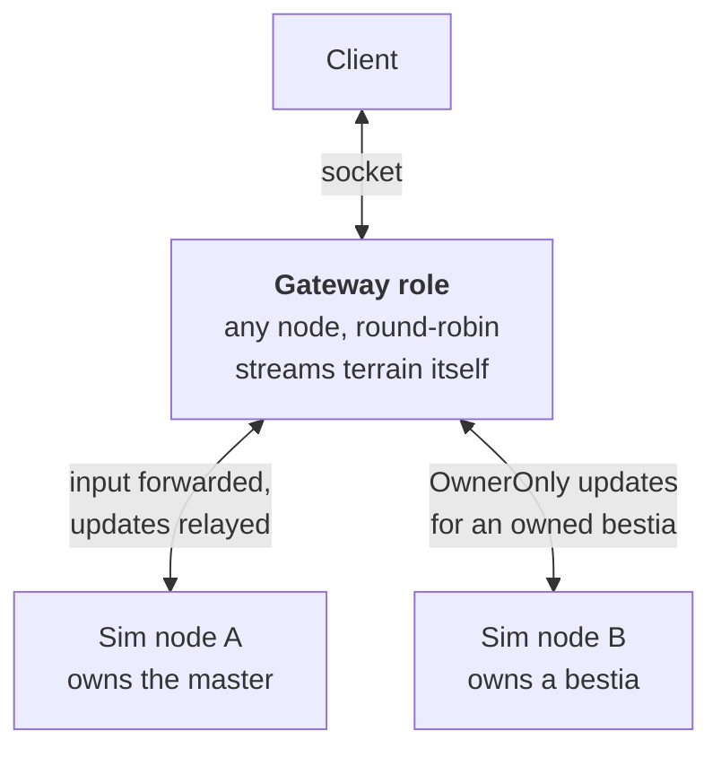



One world, several processes. The world is one 128 km torus. There are no instances, dungeons or maps to split
along, so the only axis is **coordinates**. Each node simulates a fixed region of the surface. A player
connects to any node, and their entities are simulated wherever the map puts them.

This is the second of two ways to grow. [Path to a Cluster](/docs/server/cluster-path) lists what blocks it,
what already helps, and the order of work. Read it first.

# The partition

The surface is divided into a fixed grid of square regions. The grid never moves. Which node owns which
region is **data**: a table that changes at a chosen moment, not continuously.

Boundaries do not move on their own, on purpose. The whole interest layer is keyed on a stable `ChunkPos`.
Moving a boundary invalidates `announced`, `sent`, `subscribers` and `residents` for every chunk that changes
hands, on both nodes at once, and it needs a mass handoff of everything inside. That is fine in a maintenance
window. Done continuously, it is a handoff storm.

## Region size

A region needs a **ghost band** along its border: the strip in which it must know about the entities of its
neighbours. The band is 7 chunks, 224 m. A client can hold chunks up to 6 chunks away (the view radius of 5
plus a release margin of 1), and one more chunk is the margin for interactions.

With a region edge `E` and a band `b`, the share of a region that lies in the band is `1 - ((E - 2b) / E)²`.

| Region edge | Regions in 128 km | Share in the band |
| ----------- | ----------------- | ----------------- |
| 2 km        | 4096              | 40%               |
| 4 km        | 1024              | 21%               |
| 8 km        | 256               | 11%               |
| 16 km       | 64                | 6%                |

8 km is the knee. Smaller regions spend too much on borders, and larger ones give less room to spread load.

## The torus is not a detail

`worldgen.wrap-x` and `worldgen.wrap-y` are both true, so the surface has no edge. Every region has neighbours
on all sides, a node can be its own neighbour, and the same peer can appear twice with two different
coordinate offsets. No region gets to skip the wrap case.

The terrain layer already handles this: `ChunkService.normalise` says which chunk a coordinate really is, and
`ChunkEntityVisibility` keys its chunks through it. **The gameplay layer does not wrap.**

- `Vec3L.distance` is plain Euclid on raw coordinates.
- `AreaOfInterestService` keys its grid cells on raw coordinates, with no modulo.
- `SpawnerCellIndex.keyOf` does not wrap.

`WorldWrap` in the worldgen module has `deltaX`, `deltaY` and `distance` for this, but no gameplay code calls
them. The gap never shows today. The seam sits inside the 2.5 km forced ocean margin, which is far wider than
the 208 m a client can hold. Splitting by coordinate makes the seam reachable from everywhere. **A toroidal
gameplay layer is a prerequisite, not a follow-up.** It is worth doing on its own, with tests, before any
distributed work starts.

# Who owns an entity

> The node that owns the region containing an entity's `Position` is the only writer of that entity. Every
> other node holds, at most, a read-only replica.

Authority is **derived, never stored**. Given a position and the region table, any node can compute the owner
without a lookup. A table from entity to node would have one row per entity, and it would have to stay
consistent across the whole cluster. A table of regions is small, can be cached on every node, and changes
rarely. Only the few entities in the middle of a handoff need an override.

# The gateway role

A player connects to any node, round-robin. That node is their **gateway**. It is usually not the node that
simulates their master.

This is on purpose. The alternative is to pin the socket to the node that owns the master and move it on
every border crossing. On a seamless world that means either a reconnect hitch every few minutes, or a relay
that is torn down and rebuilt all the time. Round-robin keeps one connection for the whole session. It also
gives one code path: to the simulation, **every** player is remote. No fast path exists to rot while the slow
path carries production traffic. The cost is one hop inside the data centre on player input, which is small
against a 50 ms tick.



What the gateway does:

- **Owns the socket.** Authentication, rate limits, idle checks and the one batch per client per tick
  (`TickOutbox`) already live in `socket/` and `message/`. It also receives every message addressed to that
  account, from anywhere in the cluster.
- **Serves terrain itself.** A chunk is a base plus player edits. The base is a pure function of the world
  seed, so every node can generate any chunk. The gateway streams the player's view volume out of its own
  `ChunkService`, whoever owns those regions. Only the edits have to travel.
- **Holds a ghost of the player's own master**, as the anchor for that streaming. `ChunkStreamSystem` finds
  each client's anchor with a local query over `Position`, `Account` and `ActivePlayer`, so an anchor must
  exist locally in some form. An explicit anchor source would remove that need.
- **Keeps the session epoch.** The directory maps an account to its gateway and to the node that owns its
  master, with a lease. Each new connection bumps the epoch. Late messages from an old gateway are dropped.
  Today only channel identity guards this (`ChannelRegistry` removes a channel only if it is still the
  current one), and that works only inside one node.

The gateway is a **role first, a process later**. The first version runs the role inside every zone node. That
reuses the Netty pipeline, `ChunkService` and `TickOutbox` as they are. A standalone gateway process would
need its own chunk streaming stack (chunk generation, subscriptions and the anchor), and that is the costly
part. Split it off only if measurements ask for it.

# Ghost proxies

A node needs to know about entities it does not own, to draw them for its own clients and so its own
creatures can notice them. Ghosts come in two tiers, because these are two problems with very different
prices. A client holds chunks up to about 208 m away, but interaction reach (sight, talk, trade, skills) is
about 10 m.

## Render ghost: not an ECS entity

This is the cheap tier. It covers the whole ghost band. A render ghost is an entry in a replica store,
`EntityId → Map<ComponentType, EntitySMSG>`, holding the **last message per component type, as sent**.

Everything a node does with a foreign entity is already message-shaped:

1. Index it so `observersOf` finds it. This needs only its `Position`, through `ChunkEntityVisibility.reindex`.
2. Forward its updates to local sockets. The update is already an `EntitySMSG`.
3. Send the "appeared" burst to a client that just subscribed. `EntitySnapshotBuilder` already returns a list
   of `EntitySMSG` for each viewer.

So the replica's state is the list of messages. There is no decoding into components, no component stores,
and no way for a system to write to a ghost by accident.

**Which components replicate needs no new rule.** Replicate those whose `syncTargets` resolves to
`PublicInRange`. That is what a stranger may see, and it is the filter the snapshot builder already applies.
`OwnerOnly` components never replicate. Components addressed to `Accounts(ids)` reach their accounts through
routing (below), not through a ghost.

`Health` shows that the rule is right. It returns `PublicInRange` for an entity with no `Account` and
`Accounts(party + owner)` for one with an owner. A mob ghost carries HP, and a player ghost does not. That is
what happens in one process today.

## Simulation ghost: a real, marked entity

The replica store is invisible to `world.query`. That is the point, but it means perception cannot see a
player who stands a few metres across a border, and creatures would stand idle at the line.

So inside the **interaction band** only, about one chunk deep, promote the replica to a real entity. Create it
with the same id through `World.createEntity(id) { … }`, give it a small set of components and a `Ghost`
marker, and register it in `EntityAOIService`, so perception and area effects find it. It must be
**excluded from every system's query**.

That needs a negative term on `Query`. Today `World.query` only takes positive types, and callers filter with
`world.has` inside `each`. The addition is small but touches every system, so it lands on its own.

The band is about 2% of an 8 km region, against 11% for the render band. So most ghosts stay cheap message
relays.

# Node-level chunk subscription

This is how a node learns about entities it does not own. The protocol is `ChunkSubscriptionService` with a
node id where the account id goes, and it attaches to hooks that exist today.

| Single process today                                                      | Between nodes                                       |
| ------------------------------------------------------------------------- | --------------------------------------------------- |
| `subscribers: chunk → Set<accountId>`, plus a count per column            | `chunk → Set<nodeId>`, held by the owner            |
| `markSent` / `unsend`, counted                                            | The same, counted per node                          |
| `onChunkSent` / `onChunkUnsent`, `onFirstSubscriber` / `onLastSubscriber` | The same hooks, with a second listener pair         |
| `residents: chunk → Set<EntityId>`, `residentsOf(chunk)`                  | Unchanged. The owner walks it to answer a subscribe |
| `observersOf(entityId)`                                                   | Returns the local accounts and the remote nodes     |
| `EntityVisibility.Delivery(accountId, appeared, vanished)`                | `NodeDelivery(nodeId, appeared, vanished)`          |

**Subscribe by chunk, not by entity.** An entity subscription has a discovery problem. A node must know an
entity exists before it can subscribe, which costs a round trip for every mob that walks into view. A chunk is
a static address and needs no discovery. The number of subscriptions follows the view volume, not the
number of entities.

The flow: the observing node listens on `onChunkSent` and `onChunkUnsent`, keeps the chunks it does not own,
counts them per owning node, and sends a batched subscribe. The owner records `chunk → nodeId`, walks
`residentsOf(chunk)` and sends a snapshot burst. After that it sends each entity's broadcast to the
subscribed nodes, one message per node and not one per account.

On the observer, the messages go into the replica store and the entity goes to `reindex`. **From there on,
nothing knows a ghost exists.** `observersOf`, `drain()`, `Delivery` and the per-account appear and vanish
folding all treat it like a local entity.

# Routing messages by account

`OutMessageHandler` is the seam. It is an interface, `ChannelRegistry` is its one production implementation,
and `OutMessageProcessor` sits in front of it and is injected in many places. A routing implementation slots
in behind it, and **no call site changes**.

```text
OutMessageProcessor                    (unchanged)
  └── RoutingOutMessageHandler         (new)
        ├── local account  → ChannelRegistry   (unchanged, no added latency)
        ├── remote account → cluster link, forwarding already-framed bytes
        └── unknown        → dropped, as today
```

`ChannelRegistry` keeps its meaning: _local sockets_. That includes the atomic displacement that settles two
clients racing to log in as the same account.

How each audience resolves:

- **`OwnerOnly`** is one account id, taken from the entity's `Account` component, and handed to the router.
  This works without any change. **It alone makes a bestia that is simulated on another node update its
  owner's client.** No ghost, no subscription, nothing spatial is involved.
- **`Accounts(ids)`** works the same, per account. Group them by node, so a party spread over three nodes
  costs three messages and not five.
- **`PublicInRange`** is the one that changes. Locally it fans out to `subscribersOf(chunk)` as today. Remotely
  it goes **once per subscribed node**, and each node resolves its own local observers. Thirty players on one
  node who watch a boss on another cost the owner one message.

Two things must be fixed first.

- **One audience resolver.** `sendToObserversOf` already follows the chunk subscriptions. One radius sender is
  left, `sendToAllPlayersInRange`, and its only production caller is `BestiaTrapSystem`. Move it over, then
  delete the radius path.
- **Encode once per audience.** Chunk data is framed once and shared (`NettyChunkFanOut`).
  `ChannelRegistry.broadcast` does the same, but no production code calls it. Entity updates and events still
  loop over `sendToPlayer` and are encoded for every recipient. For a remote node, a message must be
  encoded once and sent once.

# Handoff

This is what happens when an entity crosses into a neighbour's region.

**Trigger.** `ZoneEngine.reindexMoved()` already drains the log of moved entities and calls
`entityVisibility.moved`. The check belongs there. Hand over when the entity is about a chunk _past_ the line,
not at it. Without that margin, a player who paces on the border is handed over 20 times a second. The chunk
stream uses the same idea, with `release-margin-chunks`.

**Protocol.** Freeze (a marker that takes the entity out of every system), snapshot, transfer, and the target
creates the entity with the **same id**. Then the target acknowledges, and the source evicts.

There are three traps.

> **Do not reuse `EntityPersister.snapshot`.** By contract it is lossy: "a snapshot only needs to carry
> mutable state", and everything else is rebuilt from templates on load.

> **Do not build the handoff from `toEntityMessage()` either.** That method makes a message for the client,
> not a copy of the component. The snapshot builder also skips `OwnerOnly` components, such as `Inventory`,
> `Equipment` and `Exp`. Examples of what a message leaves out:
>
> - `Casting` sends the seconds left, not the skill, its level or the target.
> - `Crafting` sends seconds, not the recipe.
> - `StatusEffects` drops the source entity, and `Path` drops `groundResolved`.
> - `AiAgent` is not synced at all: its goal, plan and memory exist only on the server.
> - About two dozen more components have no sync, among them `TakenDamage`, `AttackTarget`, `InCombat`,
>   `Trading`, `PartyMembership` and `KnownSkills`.
>
> A handoff needs its own codec over the full component set. A boot check that fails when a component has no
> codec and no "not handed over" mark would keep a new component from being forgotten.

> **Do not use `World.destroy`.** It runs the destroy listeners, and the `ZoneEngine` listener sends a
> `VanishEntitySMSG` to every observer. Every client on both sides would see the entity blink out and back in
> at each crossing. A handoff needs `World.evict(id)`: it removes the entity from the stores and indices with
> no vanish, and puts a replica in its place, because the old node is now very likely an observer of its own
> former entity.

**Fencing.** Each entity has an epoch that goes up on every transfer. A replication message or command with a
stale epoch is dropped. That is one `int`, and it makes the protocol safe against a link flap or a relay
that arrives late. It is a different counter from the session epoch at the gateway.

**Why the client sees nothing.** The id never changes. The handoff takes a couple of ticks, and `MoveSystem`
sends a position only every 8th step anyway (`POSITION_RESYNC_STEPS`). The client animates from `Path` and
`Speed` and already accepts gaps of several steps. A gap of about 100 ms in authority is below the detail that
the protocol carries.

# Transport

There are four jobs with different needs. Do not use one mechanism for all of them. zone-server has no
dependency for any of this today. The only link between processes is the login server calling a zone over
HTTP to kick an account.

| Job                                   | Needs                              | Suggested choice                                       |
| ------------------------------------- | ---------------------------------- | ------------------------------------------------------ |
| Replication and relay of messages     | High rate, low latency             | Direct node-to-node Netty with protobuf                |
| Handoff and calls between nodes       | Rare, reliable, in order           | A second stream on the same link, plus the epoch fence |
| Region table, node ids and membership | Rare, and **consistent**           | etcd with leases                                       |
| Session directory, account to node    | Frequent reads, may be a bit stale | Redis                                                  |
| Party, chat, trade escrow, economy    | Low rate, must arrive              | Open. A broker fits, because the rate is low           |

Netty, the framed protobuf codec and the fan-out are in the repository, so the first two jobs need no new
dependency. A broker is not advised for them. It adds a hop on exactly the path that is being sped up, in
exchange for subscriptions that `ChunkSubscriptionService` already does. Ordering inside one TCP connection
is also exactly the guarantee needed, and a broker cannot give it.

The region table and the session directory must not share a store. **etcd holds a lock.** The region
assignment is the fence that makes two writers of one entity impossible, and that is the one failure this
design cannot absorb, because two writers duplicate a player's items. The same lease can give each node its
`zone.shard-id`, so two nodes never mint the same snowflake node part. **Redis holds a cache.** A stale
`account → node` entry costs one extra hop or one dropped message, which is what an unknown account costs
today.

# Open problems

These are listed, not hidden. None has a cheap answer. Each needs a decision before the feature it governs
can cross a border. The blockers that are not about space, such as global sweeps, are in
[Path to a Cluster](/docs/server/cluster-path).

- **Trade across a border.** `TradeService` keeps its sessions in per-process maps. The paired `putIfAbsent`
  in `claim()` is the only thing that stops a player being in two trades. Across nodes it guarantees nothing,
  and a player in two trades is the classic way to duplicate items. `TradeRangeSystem` also ends a trade with
  `PARTNER_GONE` when it cannot find the partner's `Position`. The trade range is 10 m, so a trade can only
  cross a border inside the ghost band. That makes it a small, closed problem.
- **A mob that is fought from two nodes.** `TakenDamage` is one component on the victim. It feeds EXP and
  aggro. With two writers there are two damage tables and no place to merge them, because death destroys the
  entity in the same tick. `DeathSystem` finds the attacker's account through the `Account` component, so a
  remote attacker has none and is counted as a creature without an owner.
- **Aggro ends at the border.** `PerceptionSystem.recentAttacker` drops an attacker that is not alive in the
  local world. A player can reset a fight by stepping over the line.
- **Dens are stocked twice.** `WildSpawnerBootRunner` creates the den entities on every boot, with new ids.
  `SpawnerSystem` fills a den when local players are near. Two nodes that see the same den on a border
  will both stock it, with different entity ids. Authority over a den has to follow authority over the region.
- **Navigation stops at the border.** Local pathfinding treats chunks that are not resident as impassable, and
  residency follows chunk subscription, so the far side of a border reads as unwalkable. `MacroGraphService`
  is one graph with one version counter, so a bridge that is destroyed on one node stays walkable on the
  others.
