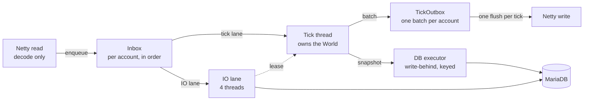
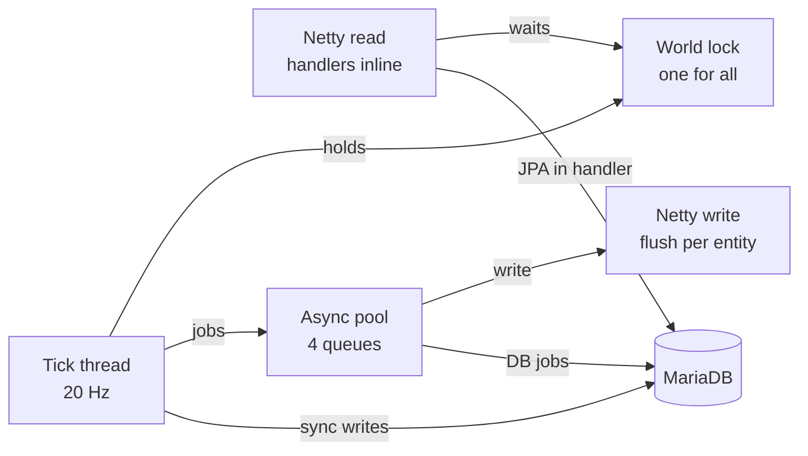

# The rule

**The tick thread owns the `World`.** It runs every system and touches components with no lock at all.
Every other thread either hands work to the tick thread, or borrows the world for a moment between two
ticks. Nothing on the tick thread waits for the network or the database.

# How a message flows



A Netty thread only decodes a frame and puts the message into the sender's **inbox**. The inbox hands
it to one of two lanes. Gameplay messages run on the tick thread; handlers that need the database run
on the IO lane and reach the world through a short **lease**. Whatever the tick sends is collected in
the **outbox** and leaves as one batch per account. Durable changes leave as snapshots through the
**DB executor**.

This replaced a design in which every thread shared one lock:



There, the tick held the lock for its whole run, and handlers ran on the Netty event loop. So every
connection on that event loop stalled while a tick ran, and three paths called the database, two of them
while the world was locked.

# The threads

| Thread                | How many   | What it does                                                      | Touches the World    |
| --------------------- | ---------- | ----------------------------------------------------------------- | -------------------- |
| `zone-tick`           | 1          | systems, client sync, tick-lane messages, posted work             | yes, without a lock  |
| Netty event loops     | 1 per core | decode frames, put them into the inbox, write bytes               | no                   |
| `zone-io-lane-N`      | 4          | IO-lane messages and connection events                            | only through a lease |
| `zone-db-job-N`       | 4          | database writes, ordered per owner                                | only through a lease |
| `zone-chunk-worker-N` | 2          | generate, encode and compress terrain; results return on the tick | no                   |

# The inbox and its two lanes

`AccountInbox` keeps one mailbox per account. A mailbox runs one item at a time, in the order the items
arrived, and holds at most 256. A message runs on the lane its handler declares:

- **`HandlerLane.TICK`** (the default) runs on the tick thread, between two ticks or at the start of the
  next one. The handler has the world to itself and needs no scope. It must not touch the database.
- **`HandlerLane.IO`** runs on one of the IO threads. The handler may use the database and reaches the
  world only through a `WorldView` scope.

Order holds across lanes: an account's `SelectMaster` (IO) finishes before its next `MoveActiveEntity`
(tick) starts. Connection and disconnection events go through the same inbox on the IO lane, so a new
connection's session is never announced before the old one's teardown.

A full inbox, or a handler that throws, closes the connection with `INBOX_OVERFLOW` or
`INTERNAL_SERVER_ERROR:<code>`. Dropping a message instead would leave the client and the server
disagreeing about a trade or an equipped item.

# Leases instead of a lock

`WorldView.read`, `modify` and `createEntity` called from a thread that is not the tick thread take a
**lease**: the caller posts a request, the tick thread lends it the world between two tasks and waits
until the block is done. The block runs on the caller's own thread, inside its own transaction, and
never at the same time as the tick. A nested scope inside a lease runs inline. A borrower that is not
granted the world within 5 s gets an exception.

Only a scope borrows. A single accessor such as `world.get` called from any other thread throws an
`IllegalStateException` instead of taking a lease of its own. Two accessors in a row would otherwise be
two leases, with a whole tick in between, so a check and the action that depends on it belong in one
scope:

```kotlin
// One lease: nothing can change between the check and the remove.
worldView.modify(entityId) { id ->
  if (has(id, LogoutIntent::class)) remove(id, LogoutIntent::class)
}
```

A scope returns values, not components. A component that leaves the scope can be changed by the tick
while the caller still reads it.

Before the engine starts (at boot, and in unit tests that tick by hand) there is no tick thread, and
all callers share a plain monitor instead.

`WorldView.post { }` runs a block on the tick thread without waiting for it. Skill resolution and the
cleanup after a disconnect use it.

# What keeps the tick free of I/O

- **`TickOutbox`.** A send made on the tick joins the account's batch and is flushed once when the tick
  ends. `channel.write` only queues onto the event loop.
- **`EntityWriteBehind` and `AsyncJobExecutor`.** The tick takes a snapshot; the write runs on the DB
  executor, keyed by its owner. See [Architecture](/docs/server/architecture#how-the-zone-writes).
- **In-memory catalogues.** Items, species, loot tables, skills and commodity ids are loaded once at boot.
- **`TickSqlGuard`.** Hibernate shows it every statement. A statement on the tick thread, or inside a
  lease, is logged (`zone.sql-on-tick: log`); in tests it fails (`fail`).

# Adding code

- A new message handler runs on the tick unless it says `override val lane = HandlerLane.IO`. Pick IO as
  soon as anything it calls reaches the database.
- Never wait for another thread inside a scope: the tick thread is waiting for you.
- To change the world from a background job, call `world.post { }`, or take a scope if you need the
  answer right away.
