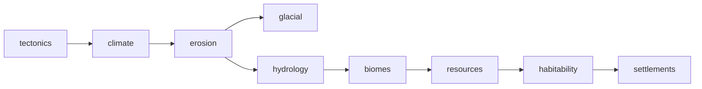

World generation lives in its own Gradle module, `worldgen/` — a pure-function pipeline over data,
with no Spring, no JPA, and no I/O (the one exception, `viewer/`, is dev tooling for inspecting a
generated world, not part of the running server). `zone-server` links it and owns the one thing
`worldgen` deliberately doesn't: a running world with a database row and a socket to serve it over.

The module has its own deep design document, `worldgen-architecture.md`, at the root of the
`bestia-behemoth` repo — written as a design spec with an implementation-status ledger kept
alongside it rather than folded in. This page is the docs-site summary; that file is the
authoritative source for anyone extending the pipeline itself.

# Implementation status

Most of the pipeline is real and running. What isn't:

| Stage | Status |
| --- | --- |
| Tectonics, climate, erosion, hydrology, biomes, glacial features | **Implemented** |
| Resources, habitability, settlements, roads | **Implemented** |
| Town layout & buildings (streets, lots, zoning, structures) | **Not started** |
| Economy & NPC distribution | **Not started** |
| History/story simulation | **Not started** |
| Chunk materialization, streaming to clients, delta+bake persistence | **Implemented** |

Town layout, economy, and history are deliberately deferred as one unit: buildings need zoning,
zoning needs an economy, and the economy's shape comes out of simulated history — building any one
without the other two means inventing throwaway placeholders for them.

This corrects the previous version of this page, which described resource distribution as "not
implemented" (it is: `resource/ResourceStage.kt`) and proposed a Neo4j-backed navigation graph for
NPC pathing. There is no graph database anywhere in the codebase — NPC pathing is a separate,
unrelated stack (`zone-server/.../navigation/`, a 2.5D `NavGrid` + `AStarPathfinder`), and it isn't
even wired to the terrain described here yet; `worldgen`'s own `derived/WalkableTile` structures are
what a future pathing system should query instead.

# The pipeline



Every stage is a pure function `f(seed, region, upstream layers) → layer data`, declaring exactly
what it reads (`Stage.dependencies`) and produces (`Stage.outputs`). `WorldGenPipeline` topologically
sorts the stage list, computes a version vector per stage (its own version folded with every
upstream version — so tuning erosion invalidates erosion-and-downstream but leaves tectonics, the
expensive part, untouched), and — for tests and tooling — verifies a stage never emits a layer or
feature kind it didn't declare.

| Stage | Emits | Notable code |
| --- | --- | --- |
| Tectonics | Elevation, plate id, rock hardness, crust age + fault lines | `geo/TectonicsStage.kt`, `geo/Plates.kt` |
| Climate | Temperature, precipitation (orographic), distance to ocean | `climate/ClimateStage.kt`, `climate/Winds.kt` |
| Erosion | Elevation, sediment (stream-power + thermal relaxation) | `geo/ErosionStage.kt` |
| Glacial | Ice thickness + troughs, fjords, cirques, moraines | `geo/GlacialStage.kt` |
| Hydrology | Flow direction/accumulation, discharge, lakes + river channels | `hydro/FlowRouting.kt`, `hydro/Lakes.kt`, `hydro/RiverNetwork.kt` |
| Biomes | Biome classification, soil fertility/depth | `bio/BiomeStage.kt` |
| Resources | Fourteen resource types (ore, coal, salt, placer gold, ...) | `resource/ResourceStage.kt`, `resource/Deposits.kt` |
| Habitability | A weighted suitability score per culture | `civ/HabitabilityStage.kt`, `civ/Terms.kt` |
| Settlements | Settlement placement + a pruned road network | `civ/SettlementStage.kt`, `civ/RouteFinder.kt` |

# Three representations, not two

The design's central idea, and the reason the pipeline isn't just a stack of noise maps: anything
narrower than ~3 coarse cells (river channels, glacial troughs, roads, coastlines) can't survive
being represented on a ~1 km raster grid without losing the shape that makes it recognizable. So the
world is stored as three complementary things:

- **Raster fields** — elevation, temperature, biome, soil: dense arrays, ~1 km cells, immutable
  after world creation.
- **Vector features** — rivers, troughs, roads, faults, settlement footprints: polylines/points with
  per-station attributes, resolution-independent, spatially indexed.
- **Voxel chunks** — the actual materialized blocks a client sees: 32×32×256, generated on demand.

A voxel carries a **material and an occupancy fraction** (0–255), not just a material — a surface at
40.3 m is genuinely 30% of the voxel spanning 40–41 m, and the client's Surface Nets mesher (see
[World & Terrain](/docs/client/world-terrain)) reconstructs that height to a fraction of a
centimetre rather than snapping to the nearest whole voxel.

# World size, wrapping, and scale

Genesis (the server's first/default world) is 128 km across, generated in well under a second —
terrain is a pure function of seed + config, so it's **regenerated at boot, not stored**; only what
players change is persisted. `WorldConfig.detailScale` compensates for a genuinely small world:
features like rivers and glacial troughs are gated on absolute size (a river needs real catchment
area before it cuts a channel), so a small world scaled 1:1 against the pipeline's tuning constants
comes out as a plain with a stream on it. `detailScale` divides length/area thresholds so a small
world still earns its features — deliberately unphysical, and computed fresh from the config every
time rather than stored, since a stored value goes stale the moment a world's dimensions change.

The world wraps on X by default. Wrapping Y (north-south) is trickier — temperature derives from a
linear latitude ramp, so a Y-wrap walks one pole into the other — but Genesis turns it on anyway
(`zone-server`'s `worldgen.wrap-y`) because the alternative is a hard wall a player can walk into.
Both seams are hidden inside a fixed 2.5 km underwater ocean margin forced around all four edges
(`geo/OceanBorder.kt`), wider than any client's view distance.

# Chunk materialization and streaming

At request time (`core/ChunkHeightSampler.kt` → `voxel/ChunkMaterializer.kt`): sample the base
raster, apply any vector feature profiles (river channels, trough cross-sections, settlement
grading) in priority order, then stratify into voxels using rock hardness and soil depth. Player
edits are a sparse delta on top (`derived/ChunkDelta.kt`); a chunk read is always
`base ⊕ delta` (`store/ChunkStore.merged()`) — there's no API that hands out an unmerged base,
because the server needs its own merged view for anything it's authoritative over (line of sight,
movement validation) and a client-authoritative alternative is the single most exploited class of
bug in multiplayer voxel games.

Heavily-edited chunks get **baked**: past ~30% of the chunk edited (or a raw delta bigger than the
merged, RLE-encoded chunk), the merged result becomes the new base and the delta is dropped — so
heavily-built areas get *cheaper* to serve, not more expensive, and baking doubles as the migration
path when the pipeline version changes (bake everything with a delta, then ship the new version;
untouched chunks just regenerate against it).

`world/stream/` on the zone-server side owns the running world's one `ChunkStore` and streams merged
RLE chunks to clients over dedicated `bnet-messages` (see [Networking](/docs/server/networking)):
a `ChunkManifestSMSG` announces `(position, revision)` pairs for a player's view volume, the client
asks only for what it doesn't already hold, and edits travel afterward as small `ChunkPatchSMSG`
diffs fanned out to that chunk's subscribers. Base-plus-delta (sending only a hash plus the edit list
for an untouched chunk, rather than the full terrain) is designed for but deliberately deferred — it
requires the client to regenerate bit-identical base terrain, and the Godot client is C#, exactly the
"different floating-point path" case that makes that dangerous without real bandwidth numbers to
justify it first.

Alongside the voxels, `derived/` maintains cheap, incrementally-updated structures so hot paths never
touch raw voxels: `WalkableTile` (per-column walkable surface spans for a given agent profile) and
`OpacityGrid` (a downsampled, occupancy-weighted occlusion grid for line-of-sight). Both are kept
fresh on every edit via a per-tick rebuild budget (`DerivedStore`, drained by `ChunkStreamSystem`) —
but nothing queries them yet; movement, line-of-sight and pathing are still separate, unconnected
code today.

# Tooling

The `worldgen` module ships its own offline tooling, useful when debugging generation issues
independently of a running server:

```text
./gradlew :worldgen:viewer -Pgenesis        # interactive layer/feature inspector, on the server's actual world
./gradlew :worldgen:viewerExport -Pout=...  # same, rendered to PNGs (works over SSH/CI)
./gradlew :worldgen:invariants -Pseeds=200  # seed-sweep regression harness against generation invariants
./gradlew :worldgen:probe -Pchannels=1      # inspect a single small window at voxel resolution as text
```

`-Pgenesis` reads `zone-server`'s actual `worldgen:` configuration block rather than a demo config,
so the tools inspect the real world the server would boot, not merely one with the same seed.
